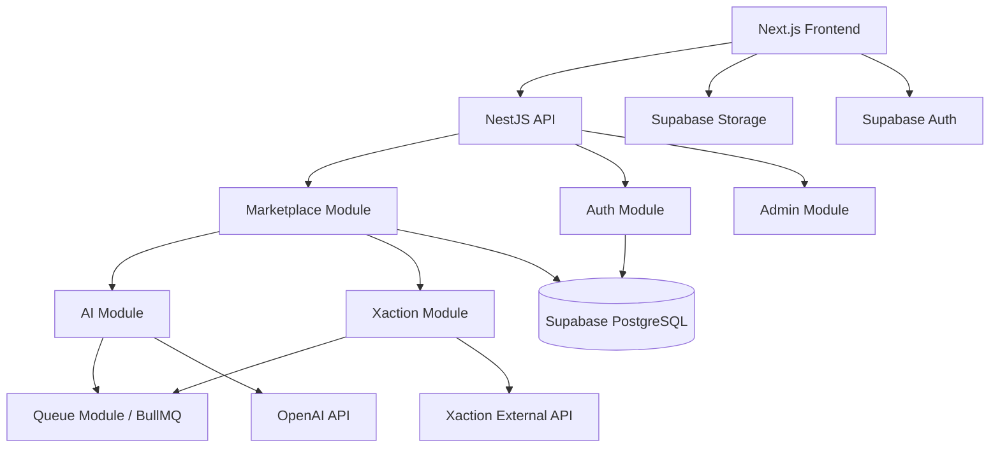
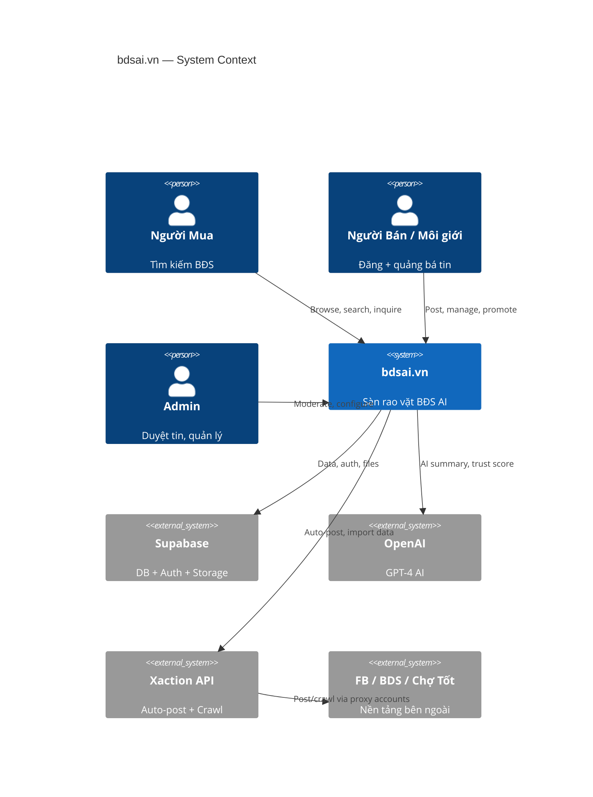
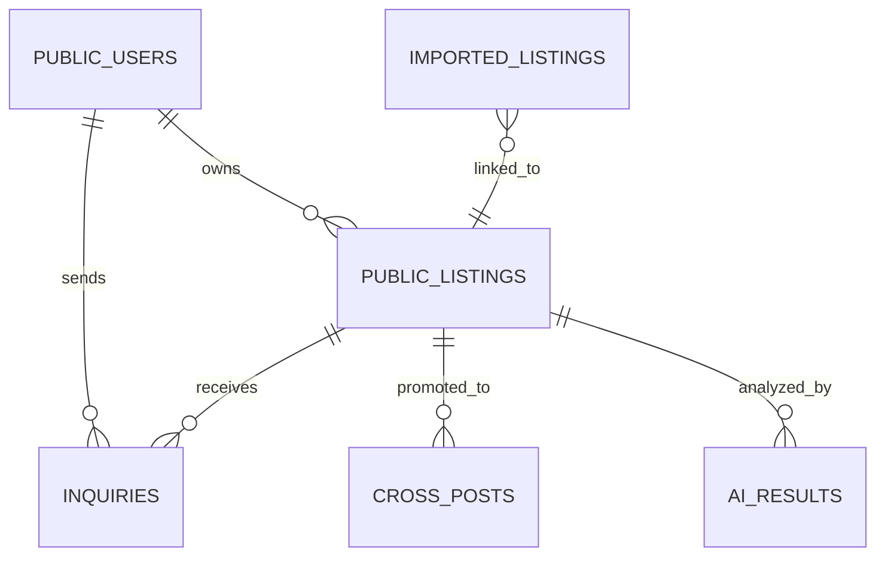
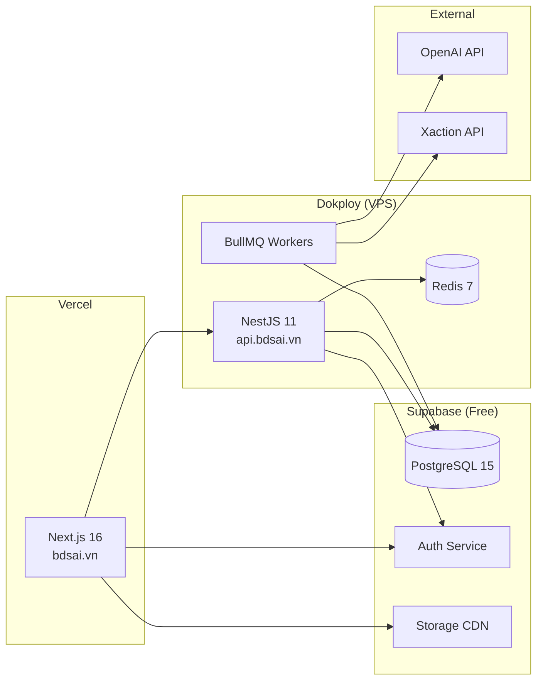

# Architecture Spine — bdsai.vn

## Design Paradigm

**Layered-Modular** — 3 tầng cố định, modules tách biệt theo domain.

```
┌─────────────────────────────────────┐
│  Presentation    (Next.js 16)       │  ← SSR pages, API routes, UI
├─────────────────────────────────────┤
│  Application     (NestJS 11)        │  ← Business logic, modules, jobs
├─────────────────────────────────────┤
│  Data            (Supabase + Redis) │  ← PostgreSQL, Storage, Auth, Cache
└─────────────────────────────────────┘
```

Layer rules:
- Presentation → Application (REST API calls, never direct DB)
- Application → Data (Drizzle ORM, Supabase client)
- Presentation ✗→ Data (forbidden: no direct Supabase from SSR pages — server actions proxy through Application)

## Invariants & Rules

### AD-1 — Module Isolation [ADOPTED]

- **Binds:** all backend modules
- **Prevents:** spaghetti dependencies between domain modules
- **Rule:** Each NestJS module exposes a public service interface only. Cross-module calls go through injected services, never direct repository/entity access. Module boundaries: `marketplace`, `auth`, `ai`, `xaction`, `admin`, `queue`.

### AD-2 — Single Data Mutation Path [ADOPTED]

- **Binds:** all write operations
- **Prevents:** inconsistent state from multiple write paths (frontend direct writes vs backend)
- **Rule:** All mutations flow through NestJS API → Service → Drizzle. Supabase client in frontend is READ-ONLY (auth + storage uploads excepted). No direct `supabase.from().insert()` from frontend for business entities. **Exception được phép (không vi phạm AD-2):** Supabase Auth flows (`auth.*` — signup/login/OTP/session refresh) và Storage upload trực tiếp tới bucket. Đây KHÔNG phải business-entity write; chúng đi qua Supabase service riêng (xem AD-5). Mọi entity nghiệp vụ (listing, inquiry, cross_post...) vẫn BẮT BUỘC qua NestJS.

### AD-3 — Xaction as External Service [ADOPTED]

- **Binds:** M5 (Xaction Integration)
- **Prevents:** tight coupling to Xaction internals, cascading failures
- **Rule:** Xaction calls are ALWAYS async via BullMQ jobs. Never synchronous in request path. Failures retry 3x with exponential backoff, then mark as `failed` — never block user flow. XactionModule owns all Xaction communication. Mỗi platform (FB/BDS/Chợ Tốt) là một **PROVIDER độc lập** implement interface chung `IPromotionProvider`. Provider có thể bật/tắt qua config và fail độc lập — 1 kênh fail KHÔNG kéo sập cả promotion. Hỗ trợ thay Xaction bằng official-API provider mà không sửa marketplace module (tránh single point of failure).

### AD-4 — SSR Boundary

- **Binds:** M3, M6 (public-facing pages)
- **Prevents:** SEO-critical pages rendering client-side only
- **Rule:** Pages under `/listings`, `/listings/[id]`, sitemap.xml MUST be server-rendered (Next.js `generateMetadata` + server components). Client interactivity via `'use client'` islands only where needed (forms, maps). Lighthouse SEO target: >90. CI pipeline chạy **Lighthouse CI** trên các public pages mỗi PR; gate FAIL nếu SEO score < 90 (verify NFR3, không chỉ là mục tiêu).

### AD-5 — Auth Separation

- **Binds:** M2 (User Management)
- **Prevents:** conflicting auth strategies between public users and admin
- **Rule:** Public users authenticate via Supabase Auth (JWT). Admin users authenticate via separate NestJS guard with role check. Two distinct auth flows, shared user table with `role` column discriminator.

### AD-6 — AI Cost Control

- **Binds:** M4 (AI Features)
- **Prevents:** runaway OpenAI costs
- **Rule:** AI calls (GPT-4) are async background jobs via BullMQ. Results cached in DB (never re-generate for same listing unless content changes). Rate limit: max 100 AI calls/hour globally. Fallback: GPT-3.5-turbo if GPT-4 quota exceeded.

### AD-7 — Image Storage Convention

- **Binds:** M3 (Listings)
- **Prevents:** scattered image storage, broken URLs
- **Rule:** All listing images go to Supabase Storage bucket `listings/{listingId}/{index}.webp`. Max 10MB/image, auto-convert to WebP server-side (Sharp). Public URLs via Supabase CDN. Never store images in DB — only URL references.

### AD-8 — Data Privacy & PII Handling [ADOPTED]

- **Binds:** M5 (imported listings), M2 (user data)
- **Prevents:** vi phạm Nghị định 13/2023/NĐ-CP, lưu trữ PII trái phép từ nguồn crawl
- **Rule:** KHÔNG lưu `sellerPhone`/`sellerName` raw từ nguồn crawl. Phone → `sha256` hash (chỉ phục vụ dedup). Mọi PII hiển thị công khai phải có cơ sở pháp lý hoặc bị ẩn. Hỗ trợ xóa theo yêu cầu (data subject request). Audit log mọi truy cập PII.

### AD-9 — Cross-Post Lifecycle Integrity [ADOPTED]

- **Binds:** M3 (listing lifecycle), M5 (cross-posts)
- **Prevents:** tin bị reject/xóa/sold/expire vẫn còn live trên platform ngoài (stale external state)
- **Rule:** Khi listing chuyển trạng thái (reject/delete/sold/expire), MỌI `cross_post` liên quan PHẢI được enqueue job **best-effort** gỡ/cập nhật trên platform ngoài. Vì external platforms (FB/BDS/Chợ Tốt) nằm ngoài quyền kiểm soát, job gỡ có thể fail vĩnh viễn (bài bị khóa, account proxy chết, platform đổi API) — KHÔNG hứa "không orphan". Thay vào đó: retry theo backoff, nếu hết retry → set `cross_posts.status = 'removal_failed'` và hiển thị cho user ("bài trên FB chưa gỡ được — gỡ thủ công"). `cross_posts.status` luôn phản ánh trạng thái thực, kể cả khi đó là trạng thái lỗi.

### AD-10 — Next.js API Route Boundary [ADOPTED]

- **Binds:** all backend logic (chống rò rỉ nghiệp vụ ra frontend tier)
- **Prevents:** business logic bị nhét vào Next.js API routes "cho nhanh" → 2 backend song song, phá vỡ AD-1 (module isolation) và AD-2 (single mutation path)
- **Rule:** Next.js API routes (`apps/web/app/api/`) chỉ được làm: (1) SSR data-fetch proxy tới NestJS, (2) forward auth token (Bearer), (3) Supabase Auth/Storage callbacks. **ZERO business logic** — không validation nghiệp vụ, không truy cập DB trực tiếp, không gọi OpenAI/Xaction. Mọi nghiệp vụ sống ở NestJS module. Next API route là BFF mỏng (thin pass-through), không phải nơi chứa logic.

### Dependency Direction



## Consistency Conventions

| Concern | Convention |
| --- | --- |
| **Naming: files** | kebab-case (`listing.service.ts`, `create-listing.dto.ts`) |
| **Naming: entities** | PascalCase singular (`PublicListing`, `CrossPost`) |
| **Naming: DB tables** | snake_case plural (`public_listings`, `cross_posts`) |
| **Naming: API routes** | REST kebab-case (`/api/listings`, `/api/cross-posts`) |
| **IDs** | UUID v4 (Supabase `gen_random_uuid()`) |
| **Dates** | ISO 8601, stored as `timestamp with time zone`, serialized UTC |
| **Error shape** | `{ statusCode, message, error?, details? }` — NestJS exception filter |
| **Validation** | Zod schemas shared between FE/BE (packages/shared), class-validator on DTOs |
| **Config** | Environment variables via `.env`, accessed through NestJS ConfigModule |
| **Auth token** | Supabase JWT in `Authorization: Bearer` header, verified server-side |
| **Logging** | NestJS Logger (Winston transport in prod), structured JSON |
| **State (frontend)** | Zustand for client state, TanStack Query for server state (cache) |

## Stack

| Name | Version | Note |
| --- | --- | --- |
| Node.js | 22 LTS | Runtime |
| TypeScript | 5.x | Language |
| Next.js | 16.x | Frontend framework, SSR |
| React | 19 | UI library |
| Tailwind CSS | 4.x | Styling |
| shadcn/ui | latest | Component library |
| Zustand | 5.x | Client state |
| TanStack Query | 5.x | Server state / cache |
| React Hook Form | 7.x | Forms |
| Zod | 3.x | Validation (shared) |
| NestJS | 11.x | Backend framework |
| Drizzle ORM | 0.36.x | Database ORM |
| BullMQ | 5.x | Job queue |
| Redis | 7.x | Cache + queue backend |
| Supabase | Free tier | PostgreSQL 15 + Auth + Storage |
| OpenAI | GPT-4 API | AI features |
| Sharp | 0.33.x | Image processing |
| Vercel | - | Frontend deploy |
| Dokploy | 0.18.x | Backend deploy (Docker) |
| GitHub Actions | - | CI/CD |
| Sentry | latest | Error tracking |

## Structural Seed

```text
bdsai/
├── apps/
│   ├── web/                        # Next.js 16 (Vercel)
│   │   ├── app/
│   │   │   ├── (public)/           # Public routes (SSR)
│   │   │   │   ├── page.tsx        # Homepage
│   │   │   │   ├── listings/
│   │   │   │   │   ├── page.tsx    # Browse/search
│   │   │   │   │   └── [id]/page.tsx  # Detail (SSR + SEO)
│   │   │   │   └── auth/
│   │   │   ├── (dashboard)/        # Seller dashboard (client)
│   │   │   │   ├── my-listings/
│   │   │   │   ├── inquiries/
│   │   │   │   └── promote/       # Xaction promotion UI
│   │   │   ├── (admin)/           # Admin panel
│   │   │   │   ├── moderation/
│   │   │   │   ├── users/
│   │   │   │   └── imports/
│   │   │   ├── api/               # API routes (proxy to backend)
│   │   │   └── layout.tsx
│   │   ├── components/
│   │   │   ├── ui/                # shadcn/ui
│   │   │   ├── listings/
│   │   │   ├── promotion/
│   │   │   └── shared/
│   │   └── lib/
│   │       ├── supabase/
│   │       │   ├── client.ts      # Browser client (read-only + auth)
│   │       │   └── server.ts      # Server client (SSR data fetch)
│   │       └── api.ts             # Backend API client
│   │
│   └── api/                        # NestJS 11 (Dokploy)
│       ├── src/
│       │   ├── modules/
│       │   │   ├── marketplace/    # Listings CRUD, search, status
│       │   │   ├── auth/           # Supabase Auth + admin guards
│       │   │   ├── ai/            # GPT-4 summary, trust score, spam
│       │   │   ├── xaction/       # Xaction API client, auto-post/import
│       │   │   ├── admin/         # Moderation, user mgmt, reports
│       │   │   └── queue/         # BullMQ jobs config
│       │   ├── common/
│       │   │   ├── guards/
│       │   │   ├── filters/
│       │   │   ├── interceptors/
│       │   │   └── decorators/
│       │   ├── db/
│       │   │   ├── schema/        # Drizzle schema files
│       │   │   ├── migrations/
│       │   │   └── drizzle.config.ts
│       │   └── main.ts
│       └── Dockerfile
│
├── packages/
│   └── shared/                    # Shared Zod schemas, types, constants
│       ├── schemas/
│       ├── types/
│       └── constants/
│
├── .github/
│   └── workflows/
│       ├── deploy-web.yml         # Vercel (auto via git)
│       └── deploy-api.yml         # Build + push to Dokploy
│
├── docker-compose.dev.yml         # Local: Redis + Supabase (optional)
├── turbo.json                     # Monorepo task runner
└── package.json                   # Workspace root
```

### System Context



### Core Entity Relationships



### Deployment



## Capability → Architecture Map

| Capability | Lives in | Governed by |
| --- | --- | --- |
| M1: Foundation | `apps/web`, `apps/api`, CI/CD | AD-1, AD-2, AD-10 |
| M2: User Management | `auth` module, Supabase Auth | AD-5, AD-8 |
| M3: Listing Management | `marketplace` module, `(public)` routes | AD-2, AD-4, AD-7, AD-9 |
| M4: AI Features | `ai` module, `queue` module | AD-6, AD-3 |
| M5: Xaction Integration | `xaction` module, `queue` module | AD-3, AD-8, AD-9 |
| M6: Inquiry & SEO | `marketplace` module, `(public)` routes | AD-4 |

## Deferred

| Decision | Why it can wait |
| --- | --- |
| **Subscription/payment (Freemium)** | Post-MVP (Month 4+). No payment logic in MVP. |
| **Mobile app** | Desktop-first MVP. Responsive web covers mobile initially. |
| **Internal CRM (Epic 1-7 old)** | Postponed until marketplace has traction. Separate architecture run. |
| **Microservices split** | Monolith sufficient for MVP scale (200 users). Split when >10K users. |
| **CDN / Edge caching** | Vercel edge handles static. Explicit CDN layer when traffic >50K/mo. |
| **Multi-region** | Single region (Singapore) sufficient for Vietnam market. |
| **Real-time notifications** | Supabase Realtime deferred — email/SMS notifications first. |
| **SMS notifications** | MVP dùng **email-first** (Supabase/Resend). SMS brandname VN (eSMS.vn/FPT) hoãn post-MVP — tránh phụ thuộc + chờ duyệt brandname. Trigger thêm SMS: seller phản hồi cần kênh nhanh hơn email. |
| **Search engine (Elasticsearch)** | PostgreSQL FTS (`unaccent` + `pg_trgm`, AD: story M1.5) đủ cho MVP. **Lưu ý rủi ro:** FTS tiếng Việt trên Postgres có giới hạn thật (ranking yếu với từ ghép, không hiểu ngữ nghĩa "căn hộ"≈"chung cư"). Trigger migrate KHÔNG chỉ là >10K listings mà còn là **user complaint về relevance** — có thể đến sớm hơn dự kiến. Không build ES bây giờ (Rule of Three), nhưng theo dõi tín hiệu chất lượng search. |
| **Supabase Pro upgrade** | Free tier sufficient for MVP. Upgrade trigger: 500MB DB or 1GB storage reached. |
