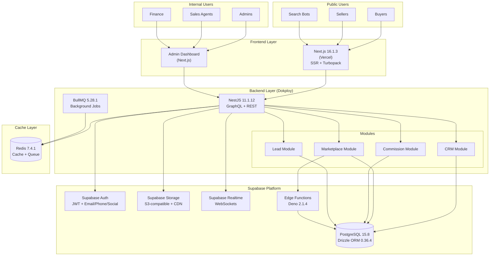

# PRD v1.0: Nền tảng Phân phối Bất động sản
## Full Supabase Stack Architecture

---

## 📋 Thông tin Tài liệu

- **Phiên bản**: 1.0
- **Ngày tạo**: 09/02/2026
- **Người tạo**: Luis (Dev Team) + Winston (Architect)
- **Trạng thái**: Draft - Full Supabase Architecture
- **Business Feasibility**: ✅ CONFIRMED (81/100 - Highly Feasible)
- **Dự án**: Real Estate Sales Distribution Platform + Public Marketplace + Mobile Apps
- **Kiến trúc**: Custom Build (NestJS + Next.js + Full Supabase Stack + React Native)

### Changelog v1.0

**MAJOR UPDATES: Mobile App Development & Market Competition Strategy**

**Architecture Decision**:
- ✅ **Custom Build** với NestJS + Next.js 16 + Full Supabase Ecosystem
- ✅ **Tận dụng tối đa Supabase**: Auth, Storage, Realtime, Edge Functions, Row Level Security
- ✅ **Drizzle ORM**: Lightweight, SQL-first, perfect cho Supabase
- ✅ **React Native**: Cross-platform mobile apps (iOS + Android)

**Tech Stack Updates (Latest Stable)**:
- ✅ **Frontend**: Next.js 16.1.3 + React 19 (Jan 2026)
- ✅ **Backend**: NestJS 11.1.12 (Jan 2026)
- ✅ **Mobile**: React Native 0.73+ + TypeScript
- ✅ **Database**: Supabase PostgreSQL 15.8
- ✅ **ORM**: Drizzle ORM 0.36.4 (lightweight, SQL-first)
- ✅ **Auth**: Supabase Auth (email/phone/social login + biometric)
- ✅ **Storage**: Supabase Storage (S3-compatible, CDN)
- ✅ **Realtime**: Supabase Realtime (WebSockets)
- ✅ **Edge Functions**: Supabase Edge Functions (Deno 2.1.4)
- ✅ **Queue**: BullMQ 5.28.1
- ✅ **Cache**: Redis 7.4.1
- ✅ **Mobile Services**: Firebase (Push, Analytics, Crashlytics)

**New Features v1.0**:
- 🚀 **Mobile App Development** (Phase 5-8): iOS + Android native apps
- 🎯 **Market Competition Strategy**: Cạnh tranh trực tiếp với Batdongsan.com.vn & Chợ Tốt Nhà Đất
- 📱 **Mobile-First Features**: AR, Voice Search, Image Search, In-app Chat
- 🌍 **Geographic Expansion**: Long Thành → Đồng Nai → Southern Vietnam → Nationwide
- 🤖 **Advanced AI**: Computer Vision, NLP, Predictive Analytics
- 🔗 **Ecosystem Integration**: Banking, Legal, Moving, Insurance services
- 💰 **Revenue Model**: Subscriptions, Featured Listings, Lead Gen, Commission, Ads

**Cost Impact (3 Years)**:
- Total Investment: 16.29B VNĐ
- Expected Revenue (Year 3): 17.75B VNĐ
- Break-even: Month 18
- Profit Margin (Year 3): 50%

**Timeline**:
- Phase 1-4: Web Platform (7 months)
- Phase 5-8: Mobile Apps + Market Leadership (29 months)
- Total: 36 months (3 years)

**Target Metrics (Year 3)**:
- 2M+ mobile app downloads
- 600K+ monthly active users
- #1 real estate app in Long Thành region
- 80% market share in target area

**Status**: **READY FOR DEVELOPMENT** ✅

---

## 1. Tổng quan Sản phẩm

### 1.1. Giới thiệu

Nền tảng Phân phối Bất động sản là một hệ thống **dual-purpose platform** được xây dựng từ đầu với kiến trúc **Full Supabase Stack**, bao gồm:

1. **Internal CRM** (Epic 1-7): Quản lý 1000+ sales agents, properties, deals, commissions
2. **Public Marketplace** (Epic 8): AI-powered platform cho buyers, sellers, brokers

**Tech Stack**:
- **Frontend**: Next.js 16.1.3 + React 19
- **Backend**: NestJS 11.1.12 (TypeScript)
- **Database**: Supabase PostgreSQL 15.8
- **ORM**: Drizzle ORM 0.36.4
- **Auth**: Supabase Auth
- **Storage**: Supabase Storage
- **Realtime**: Supabase Realtime
- **Edge Functions**: Supabase Edge Functions (Deno 2.1.4)
- **Queue**: BullMQ 5.28.1
- **Cache**: Redis 7.4.1
- **AI**: OpenAI GPT-4 + Perplexica API

### 1.2. Mục tiêu Kinh doanh

**Internal CRM**:
- Quản lý hiệu quả 1000+ sales agents làm việc bán thời gian
- Theo dõi real-time tồn kho bất động sản qua nhiều dự án
- Tự động hóa quy trình phân phối leads và tính toán hoa hồng
- Minh bạch hóa doanh số và thu nhập của từng sales agent

**Public Marketplace**:
- Generate 500 qualified leads/month by Month 12
- Attract 5,000 registered public users Year 1
- Achieve 10-15% lead conversion rate
- Break-even Month 8-10

### 1.3. Giá trị Cốt lõi

- **Transparency**: Mọi giao dịch và hoa hồng được theo dõi minh bạch
- **Automation**: AI-powered features (Research, Summary, Trust Score, Spam Filter)
- **Scalability**: Supabase auto-scaling, horizontal scaling
- **Performance**: Next.js 16 Turbopack, Supabase Realtime, Redis caching
- **SEO-First**: Native SSR cho public marketplace, Lighthouse score >90
- **Security**: Supabase Row Level Security (RLS) at database level

---

## 2. Bối cảnh Kinh doanh

### 2.1. Thị trường Mục tiêu

**Internal (Sales Agents)**:
- **Khu vực**: Long Thành, Đồng Nai
- **Sản phẩm**: Đất nền (land plots) trong các dự án phân lô
- **Quy mô**: 1000+ sales agents làm việc bán thời gian

**External (Public Marketplace)**:
- **Target**: Buyers, sellers, small brokers
- **Scope**: Toàn quốc (focus Đồng Nai, TP.HCM)
- **Users**: 5,000 Year 1, 50,000 Year 3

### 2.2. Vấn đề Cần Giải quyết

**Internal CRM**:
1. Quản lý tồn kho: Khó theo dõi real-time lô đất available/sold
2. Phân phối leads: Thủ công, không công bằng
3. Tính hoa hồng: Dễ nhầm lẫn, chậm thanh toán
4. Giữ chỗ (Reservation): Không có hệ thống tự động release sau 24h
5. Double-booking: Nguy cơ nhiều sales book cùng một lô

**Public Marketplace**:
1. Spam listings: Nhiều tin ảo, giá không thực
2. Scams: Khó verify tính xác thực của listings
3. Low trust: Buyers không tin tưởng sellers
4. Poor SEO: Khó tìm kiếm trên Google
5. No lead generation: Không có nguồn leads chất lượng

### 2.3. Giải pháp

**Full Supabase Stack Architecture**:

**Internal CRM**:
- NestJS backend với Drizzle ORM
- GraphQL API cho internal operations
- BullMQ cho background jobs (auto-release, lead assignment)
- Supabase Realtime cho live updates
- Supabase Row Level Security cho authorization

**Public Marketplace**:
- Next.js 16 với native SSR + Turbopack cho SEO
- Supabase Auth cho public user authentication
- Supabase Storage cho file uploads (images, documents)
- AI-powered features (Research, Summary, Trust Score, Spam Filter)
- Supabase Edge Functions cho serverless AI workloads

---

## 3. Người dùng & Personas

### 3.1. Sales Agent (Nhân viên Kinh doanh)

- **Vai trò**: Bán hàng bán thời gian
- **Số lượng**: 1000+ users
- **Nhiệm vụ**:
  - Xem danh sách projects và lô đất available
  - Giữ chỗ (reserve) lô đất cho khách hàng (tối đa 24h)
  - Quản lý leads được giao
  - Theo dõi doanh số và hoa hồng cá nhân
- **Quyền hạn**: Supabase RLS policies (chỉ xem/edit leads của mình)
- **Interface**: Admin dashboard (GraphQL API)

### 3.2. Admin (Quản trị Hệ thống)

- **Vai trò**: Quản lý toàn bộ hệ thống
- **Số lượng**: 5-10 users
- **Nhiệm vụ**:
  - Tạo và quản lý projects
  - Upload sơ đồ mặt bằng (Supabase Storage), thêm properties
  - Phê duyệt hoa hồng (commission approval)
  - Quản lý danh sách sales agents
  - Approve/reject public listings
- **Quyền hạn**: Full access (Supabase RLS admin role)
- **Interface**: Admin dashboard (GraphQL API)

### 3.3. Finance (Kế toán)

- **Vai trò**: Xử lý thanh toán hoa hồng
- **Số lượng**: 2-3 users
- **Nhiệm vụ**:
  - Xem danh sách hoa hồng đã được approve
  - Đánh dấu trạng thái Paid
  - Export CSV để chuyển khoản hàng loạt
- **Quyền hạn**: Supabase RLS (chỉ access Commission module)
- **Interface**: Admin dashboard (GraphQL API)

### 3.4. Customer/Buyer (Khách hàng Mua)

- **Vai trò**: Khách hàng mua bất động sản
- **Số lượng**: Unlimited (external users)
- **Tương tác**:
  - Được sales agent tạo Contact record trong hệ thống
  - KHÔNG có quyền truy cập trực tiếp vào hệ thống (Phase 1)
  - Thông tin được quản lý bởi sales agent
- **Thông tin lưu trữ**: Name, phone, email, ID number (encrypted), address, budget, timeline
- **Quyền hạn**: None (data subject only)

### 3.5. Public Buyer/Renter (Khách hàng Công khai) ⭐

- **Vai trò**: External user tìm kiếm bất động sản trên public marketplace
- **Số lượng**: Target 5,000 Year 1
- **Nhiệm vụ**:
  - Browse và search public listings
  - View listing details với AI summary
  - Send inquiries to sellers
  - Save favorite listings
  - View trust scores và verified badges
- **Quyền hạn**:
  - Browse listings (no auth required)
  - Post inquiries (no auth required)
  - Save favorites (requires Supabase Auth)
- **Interface**: Next.js public pages (REST API)
- **Authentication**: Supabase Auth (email/phone/social login)

### 3.6. Public Seller/Broker (Người bán Công khai) ⭐

- **Vai trò**: External user đăng tin bán/cho thuê bất động sản
- **Số lượng**: Target 500-1,000 active sellers Year 1
- **Nhiệm vụ**:
  - Register account (Supabase Auth: email + phone verification)
  - Post property listings (free tier: 3 listings)
  - Upload images (Supabase Storage)
  - Manage own listings
  - Receive và respond to inquiries
  - View performance analytics (views, contacts)
- **Quyền hạn**:
  - Create/edit/delete own listings (Supabase RLS)
  - View own inquiries
  - Access seller dashboard
  - Upgrade subscription tier
- **Interface**: Next.js seller dashboard (REST API)
- **Subscription Tiers**:
  - FREE: 3 listings, 30 days, 5 photos
  - BASIC (99k/month): 10 listings, 60 days, 10 photos
  - PRO (299k/month): Unlimited, 90 days, 20 photos, featured listings

### 3.7. Small Broker (Môi giới Nhỏ) ⭐

- **Vai trò**: Independent broker sử dụng platform để manage listings
- **Số lượng**: Target 100-200 brokers Year 1
- **Nhiệm vụ**:
  - Manage 5-20 property listings
  - Professional branding (verified badge)
  - Lead management tools
  - Performance tracking
- **Quyền hạn**: Same as Public Seller + Professional features
- **Subscription**: Typically PRO or ENTERPRISE tier
- **Interface**: Next.js broker dashboard (REST API)

---

## 4. Yêu cầu Chức năng

### 4.1. Module 1: Quản lý Dự án (Projects)

#### 4.1.1. Mô tả

Module quản lý các dự án bất động sản (Real Estate Projects). Mỗi project chứa nhiều lô đất (properties).

#### 4.1.2. Database Schema (Drizzle ORM)

```typescript
// schema/projects.ts
import { pgTable, uuid, varchar, text, integer, decimal, timestamp, pgEnum } from 'drizzle-orm/pg-core';

export const projectStatusEnum = pgEnum('project_status', [
  'PLANNING',
  'ACTIVE',
  'SOLD_OUT',
  'SUSPENDED'
]);

export const projects = pgTable('projects', {
  id: uuid('id').primaryKey().defaultRandom(),
  name: varchar('name', { length: 255 }).notNull(),
  developer: varchar('developer', { length: 255 }),
  location: varchar('location', { length: 500 }),
  area: varchar('area', { length: 255 }),
  totalPlots: integer('total_plots'),
  status: projectStatusEnum('status').notNull(),
  legalStatus: varchar('legal_status', { length: 255 }),
  description: text('description'),
  masterPlanImageUrl: varchar('master_plan_image_url', { length: 500 }),
  galleryUrls: text('gallery_urls').array(),
  startDate: timestamp('start_date'),
  completionDate: timestamp('completion_date'),
  priceMin: decimal('price_min', { precision: 15, scale: 2 }),
  priceMax: decimal('price_max', { precision: 15, scale: 2 }),
  commissionRate: decimal('commission_rate', { precision: 5, scale: 2 }),
  createdAt: timestamp('created_at').defaultNow().notNull(),
  updatedAt: timestamp('updated_at').defaultNow().notNull(),
});
```

#### 4.1.3. API Endpoints

**GraphQL (Internal)**:
```graphql
type Query {
  projects(filter: ProjectFilter, pagination: Pagination): ProjectConnection!
  project(id: ID!): Project
}

type Mutation {
  createProject(input: CreateProjectInput!): Project!
  updateProject(id: ID!, input: UpdateProjectInput!): Project!
  deleteProject(id: ID!): Boolean!
}
```

#### 4.1.4. Business Rules

1. **Computed Field**: `availablePlots` = COUNT(properties WHERE status = 'AVAILABLE')
2. **Auto-update**: Khi property status thay đổi → trigger update `availablePlots`
3. **Validation**: `priceMax` >= `priceMin`
4. **File Storage**: Supabase Storage cho masterPlanImage và gallery

#### 4.1.5. Supabase Storage Integration

```typescript
// Upload master plan image
const uploadMasterPlan = async (file: File, projectId: string) => {
  const { data, error } = await supabase.storage
    .from('project-images')
    .upload(`${projectId}/master-plan.png`, file, {
      cacheControl: '3600',
      upsert: true,
    });

  if (error) throw error;

  // Get public URL
  const { data: { publicUrl } } = supabase.storage
    .from('project-images')
    .getPublicUrl(data.path);

  return publicUrl;
};
```

---

### 4.2. Module 2: Quản lý Bất động sản (Properties)

#### 4.2.1. Mô tả

Module quản lý từng lô đất (land plot) trong các dự án. Đây là module quan trọng nhất với business logic phức tạp nhất.

#### 4.2.2. Database Schema (Drizzle ORM)

```typescript
// schema/properties.ts
import { pgTable, uuid, varchar, decimal, timestamp, pgEnum } from 'drizzle-orm/pg-core';
import { projects } from './projects';
import { users } from './users';
import { contacts } from './contacts';

export const propertyStatusEnum = pgEnum('property_status', [
  'AVAILABLE',
  'RESERVED',
  'DEPOSIT_PAID',
  'CONTRACTED',
  'SOLD'
]);

export const properties = pgTable('properties', {
  id: uuid('id').primaryKey().defaultRandom(),
  projectId: uuid('project_id').notNull().references(() => projects.id),
  plotNumber: varchar('plot_number', { length: 50 }).notNull(),
  area: decimal('area', { precision: 10, scale: 2 }).notNull(),
  price: decimal('price', { precision: 15, scale: 2 }).notNull(),
  pricePerSqm: decimal('price_per_sqm', { precision: 15, scale: 2 }),
  status: propertyStatusEnum('status').notNull().default('AVAILABLE'),
  direction: varchar('direction', { length: 50 }),
  roadWidth: decimal('road_width', { precision: 5, scale: 2 }),
  legalDoc: varchar('legal_doc', { length: 255 }),
  location: varchar('location', { length: 500 }),

  // Reservation
  reservedById: uuid('reserved_by_id').references(() => users.id),
  reservedUntil: timestamp('reserved_until'),

  // Sale
  soldToId: uuid('sold_to_id').references(() => contacts.id),
  soldDate: timestamp('sold_date'),

  notes: text('notes'),
  commissionAmount: decimal('commission_amount', { precision: 15, scale: 2 }),

  createdAt: timestamp('created_at').defaultNow().notNull(),
  updatedAt: timestamp('updated_at').defaultNow().notNull(),
});

// Unique constraint
export const propertyUniqueConstraint = unique('property_project_plot')
  .on(properties.projectId, properties.plotNumber);
```

#### 4.2.3. Business Rules

**Status Workflow**:
```
Available → Reserved (sales giữ chỗ) → Deposit Paid (khách đặt cọc) → Contracted → Sold
         ↓ (24h timeout)
      Available (auto-release)
```

**Reservation Logic**:
- Sales agent có thể reserve lô status = 'Available'
- Khi reserve: Set `reservedBy` = current user, `reservedUntil` = NOW + 24 hours
- Sau 24h nếu không chuyển sang Deposit Paid → tự động chuyển về 'Available' (BullMQ job)

**Double-booking Prevention**:
- Drizzle transaction với row-level locking
- Chỉ 1 sales có thể reserve 1 lô tại 1 thời điểm

#### 4.2.4. Implementation (NestJS + Drizzle)

```typescript
// properties.service.ts
import { Injectable } from '@nestjs/common';
import { db } from '@/db';
import { properties } from '@/schema';
import { eq, and } from 'drizzle-orm';
import { Queue } from 'bullmq';

@Injectable()
export class PropertiesService {
  constructor(private queue: Queue) {}

  async reserveProperty(propertyId: string, userId: string) {
    return db.transaction(async (tx) => {
      // Row-level lock
      const [property] = await tx
        .select()
        .from(properties)
        .where(eq(properties.id, propertyId))
        .for('update');

      if (!property) {
        throw new NotFoundException('Property not found');
      }

      if (property.status !== 'AVAILABLE') {
        throw new BadRequestException(
          `Property is ${property.status}, cannot reserve`,
        );
      }

      // Update property
      const [updated] = await tx
        .update(properties)
        .set({
          status: 'RESERVED',
          reservedById: userId,
          reservedUntil: new Date(Date.now() + 24 * 60 * 60 * 1000),
          updatedAt: new Date(),
        })
        .where(eq(properties.id, propertyId))
        .returning();

      // Schedule auto-release job (BullMQ)
      await this.queue.add(
        'release-reservation',
        { propertyId },
        {
          delay: 24 * 60 * 60 * 1000, // 24 hours
          jobId: `release-${propertyId}`,
        },
      );

      return updated;
    });
  }
}
```

#### 4.2.5. Supabase Realtime Integration

```typescript
// Listen to property status changes (Frontend)
const channel = supabase
  .channel('property-changes')
  .on(
    'postgres_changes',
    {
      event: 'UPDATE',
      schema: 'public',
      table: 'properties',
      filter: `project_id=eq.${projectId}`,
    },
    (payload) => {
      console.log('Property updated:', payload.new);
      // Update UI in real-time
      updatePropertyInUI(payload.new);
    },
  )
  .subscribe();
```

---

### 4.3. Module 2.5: Quản lý Khách hàng (Contact/Customer Management)

#### 4.3.1. Database Schema (Drizzle ORM)

```typescript
// schema/contacts.ts
export const contactStatusEnum = pgEnum('contact_status', [
  'LEAD',
  'PROSPECT',
  'CUSTOMER',
  'INACTIVE'
]);

export const contacts = pgTable('contacts', {
  id: uuid('id').primaryKey().defaultRandom(),
  name: varchar('name', { length: 255 }).notNull(),
  phone: varchar('phone', { length: 20 }).notNull(),
  email: varchar('email', { length: 255 }),
  idNumber: text('id_number'), // Encrypted
  idType: varchar('id_type', { length: 50 }),
  address: text('address'),
  occupation: varchar('occupation', { length: 255 }),
  budget: decimal('budget', { precision: 15, scale: 2 }),
  timeline: varchar('timeline', { length: 100 }),
  source: varchar('source', { length: 100 }),
  status: contactStatusEnum('status').notNull().default('LEAD'),
  notes: text('notes'),
  assignedSalesId: uuid('assigned_sales_id').references(() => users.id),
  createdAt: timestamp('created_at').defaultNow().notNull(),
  updatedAt: timestamp('updated_at').defaultNow().notNull(),
});
```

#### 4.3.2. Data Privacy với Supabase

- **Encryption**: `idNumber` (CCCD) encrypted at rest
- **Access Control**: Supabase RLS policies
- **Audit Log**: All access to sensitive fields logged

```sql
-- RLS Policy: Sales agents can only view their assigned contacts
CREATE POLICY "sales_view_own_contacts"
ON contacts FOR SELECT
USING (
  auth.uid() = assigned_sales_id
  OR
  EXISTS (
    SELECT 1 FROM users
    WHERE users.id = auth.uid()
    AND users.role IN ('ADMIN', 'MANAGER')
  )
);
```

---

### 4.4. Module 8: Public Marketplace (Thị trường Công khai) ⭐

#### 4.4.1. Tổng quan

**Vision**: "AI-Powered Real Estate Intelligence Platform That Generates Unlimited Quality Leads Through Trust & Automation"

**Architecture**: Next.js 16 + Full Supabase Stack

**Core Features**:
1. Public user management (Supabase Auth)
2. Public listing management (CRUD, approval workflow)
3. AI Research Agent (web scraping, price verification)
4. AI Summary Generation (GPT-4)
5. Trust Score Calculation
6. Smart Spam Filter
7. Inquiry system & lead conversion
8. Subscription tiers & monetization

#### 4.4.2. Database Schema (Drizzle ORM)

```typescript
// schema/public-users.ts
export const publicUserTypeEnum = pgEnum('public_user_type', [
  'BUYER',
  'SELLER',
  'BROKER'
]);

export const subscriptionTierEnum = pgEnum('subscription_tier', [
  'FREE',
  'BASIC',
  'PRO',
  'ENTERPRISE'
]);

export const publicUsers = pgTable('public_users', {
  id: uuid('id').primaryKey().defaultRandom(),
  email: varchar('email', { length: 255 }).notNull().unique(),
  phone: varchar('phone', { length: 20 }).notNull(),
  fullName: varchar('full_name', { length: 255 }).notNull(),
  userType: publicUserTypeEnum('user_type').notNull(),
  verified: boolean('verified').default(false),
  emailVerified: boolean('email_verified').default(false),
  phoneVerified: boolean('phone_verified').default(false),
  verifiedAt: timestamp('verified_at'),
  subscriptionTier: subscriptionTierEnum('subscription_tier').default('FREE'),
  subscriptionExpiresAt: timestamp('subscription_expires_at'),

  // Computed fields
  totalListings: integer('total_listings').default(0),
  activeListings: integer('active_listings').default(0),
  responseRate: decimal('response_rate', { precision: 5, scale: 2 }).default('0'),
  avgResponseTime: decimal('avg_response_time', { precision: 10, scale: 2 }).default('0'),

  createdAt: timestamp('created_at').defaultNow().notNull(),
  updatedAt: timestamp('updated_at').defaultNow().notNull(),
});

// schema/public-listings.ts
export const listingTypeEnum = pgEnum('listing_type', ['SALE', 'RENT']);
export const propertyTypeEnum = pgEnum('property_type', [
  'APARTMENT',
  'HOUSE',
  'LAND',
  'VILLA',
  'TOWNHOUSE',
  'OFFICE'
]);
export const listingStatusEnum = pgEnum('listing_status', [
  'DRAFT',
  'PENDING_REVIEW',
  'APPROVED',
  'REJECTED',
  'EXPIRED',
  'SOLD'
]);

export const publicListings = pgTable('public_listings', {
  id: uuid('id').primaryKey().defaultRandom(),
  ownerId: uuid('owner_id').notNull().references(() => publicUsers.id),
  propertyId: uuid('property_id').references(() => properties.id),

  // Basic info
  title: varchar('title', { length: 500 }).notNull(),
  description: text('description').notNull(),
  listingType: listingTypeEnum('listing_type').notNull(),
  propertyType: propertyTypeEnum('property_type').notNull(),
  price: decimal('price', { precision: 15, scale: 2 }).notNull(),
  area: decimal('area', { precision: 10, scale: 2 }).notNull(),

  // Location
  address: varchar('address', { length: 500 }).notNull(),
  province: varchar('province', { length: 100 }).notNull(),
  district: varchar('district', { length: 100 }).notNull(),
  ward: varchar('ward', { length: 100 }),
  latitude: decimal('latitude', { precision: 10, scale: 8 }),
  longitude: decimal('longitude', { precision: 11, scale: 8 }),

  // Property details
  bedrooms: integer('bedrooms'),
  bathrooms: integer('bathrooms'),
  floor: integer('floor'),
  orientation: varchar('orientation', { length: 50 }),

  // Status
  status: listingStatusEnum('status').notNull().default('DRAFT'),
  verified: boolean('verified').default(false),
  featured: boolean('featured').default(false),

  // Metrics
  viewCount: integer('view_count').default(0),
  contactCount: integer('contact_count').default(0),
  trustScore: decimal('trust_score', { precision: 5, scale: 2 }).default('0'),
  spamScore: decimal('spam_score', { precision: 5, scale: 2 }).default('0'),

  // Dates
  publishedAt: timestamp('published_at'),
  expiresAt: timestamp('expires_at'),
  approvedAt: timestamp('approved_at'),
  rejectedReason: text('rejected_reason'),

  // AI-generated
  aiSummary: text('ai_summary'),

  // Images (Supabase Storage URLs)
  imageUrls: text('image_urls').array(),

  createdAt: timestamp('created_at').defaultNow().notNull(),
  updatedAt: timestamp('updated_at').defaultNow().notNull(),
});
```

#### 4.4.3. Next.js 16 SSR Implementation

**Listing Detail Page với SSR**:

```typescript
// app/(public)/listings/[id]/page.tsx
import { Metadata } from 'next';
import { createClient } from '@/lib/supabase/server';
import { notFound } from 'next/navigation';

interface Props {
  params: Promise<{ id: string }>;
}

// Generate metadata for SEO
export async function generateMetadata({ params }: Props): Promise<Metadata> {
  const { id } = await params;
  const supabase = await createClient();

  const { data: listing } = await supabase
    .from('public_listings')
    .select('*')
    .eq('id', id)
    .single();

  if (!listing) {
    return { title: 'Listing Not Found' };
  }

  return {
    title: `${listing.title} - ${listing.province}`,
    description: listing.description.substring(0, 160),
    openGraph: {
      title: listing.title,
      description: listing.description,
      images: [listing.image_urls[0]],
      type: 'website',
    },
    twitter: {
      card: 'summary_large_image',
      title: listing.title,
      description: listing.description,
      images: [listing.image_urls[0]],
    },
  };
}

// Server-side rendering
export default async function ListingDetailPage({ params }: Props) {
  const { id } = await params;
  const supabase = await createClient();

  const { data: listing } = await supabase
    .from('public_listings')
    .select(`
      *,
      owner:public_users(*),
      research_result:ai_research_results(*)
    `)
    .eq('id', id)
    .eq('status', 'APPROVED')
    .single();

  if (!listing) {
    notFound();
  }

  return <ListingDetail listing={listing} />;
}
```

#### 4.4.4. Supabase Auth Integration

```typescript
// app/auth/register/page.tsx
'use client';

import { useState } from 'react';
import { createClient } from '@/lib/supabase/client';

export default function RegisterPage() {
  const [email, setEmail] = useState('');
  const [password, setPassword] = useState('');
  const [phone, setPhone] = useState('');
  const supabase = createClient();

  const handleRegister = async () => {
    // Sign up with Supabase Auth
    const { data, error } = await supabase.auth.signUp({
      email,
      password,
      phone,
      options: {
        emailRedirectTo: `${window.location.origin}/auth/callback`,
        data: {
          phone,
        },
      },
    });

    if (error) {
      console.error('Registration error:', error);
      return;
    }

    // Create public user record
    const { error: dbError } = await supabase
      .from('public_users')
      .insert({
        id: data.user!.id,
        email,
        phone,
        full_name: '',
        user_type: 'SELLER',
      });

    if (dbError) {
      console.error('DB error:', dbError);
    }
  };

  return (
    <form onSubmit={(e) => { e.preventDefault(); handleRegister(); }}>
      <input
        type="email"
        value={email}
        onChange={(e) => setEmail(e.target.value)}
        placeholder="Email"
      />
      <input
        type="password"
        value={password}
        onChange={(e) => setPassword(e.target.value)}
        placeholder="Password"
      />
      <input
        type="tel"
        value={phone}
        onChange={(e) => setPhone(e.target.value)}
        placeholder="Phone"
      />
      <button type="submit">Register</button>
    </form>
  );
}
```

#### 4.4.5. Supabase Storage cho Image Uploads

```typescript
// Upload listing images
const uploadListingImages = async (files: File[], listingId: string) => {
  const uploadPromises = files.map(async (file, index) => {
    const fileName = `${listingId}/${index}-${Date.now()}.${file.name.split('.').pop()}`;

    const { data, error } = await supabase.storage
      .from('listing-images')
      .upload(fileName, file, {
        cacheControl: '3600',
        upsert: false,
      });

    if (error) throw error;

    // Get public URL
    const { data: { publicUrl } } = supabase.storage
      .from('listing-images')
      .getPublicUrl(data.path);

    return publicUrl;
  });

  return Promise.all(uploadPromises);
};
```

#### 4.4.6. AI Research Agent (Supabase Edge Function)

```typescript
// supabase/functions/ai-research/index.ts
import { serve } from 'https://deno.land/std@0.168.0/http/server.ts';
import { createClient } from 'https://esm.sh/@supabase/supabase-js@2';

serve(async (req) => {
  const { listingId } = await req.json();

  const supabase = createClient(
    Deno.env.get('SUPABASE_URL')!,
    Deno.env.get('SUPABASE_SERVICE_ROLE_KEY')!,
  );

  // Fetch listing
  const { data: listing } = await supabase
    .from('public_listings')
    .select('*')
    .eq('id', listingId)
    .single();

  if (!listing) {
    return new Response(JSON.stringify({ error: 'Listing not found' }), {
      status: 404,
    });
  }

  // Research from multiple sources (Perplexica API)
  const results = await Promise.all([
    searchBatDongSan(listing),
    searchChoTot(listing),
    searchGoogle(listing),
  ]);

  // Calculate confidence score
  const similarListings = results.flat();
  const confidenceScore = calculateConfidence(similarListings, listing);

  // Save results
  const { error } = await supabase
    .from('ai_research_results')
    .upsert({
      listing_id: listingId,
      sources_checked: ['batdongsan', 'chotot', 'google'],
      similar_listings_found: similarListings,
      price_range: {
        min: Math.min(...similarListings.map((r) => r.price)),
        max: Math.max(...similarListings.map((r) => r.price)),
        avg: average(similarListings.map((r) => r.price)),
      },
      duplicate_detected: similarListings.some(
        (r) =>
          r.address === listing.address &&
          Math.abs(r.price - listing.price) < 1000000,
      ),
      confidence_score: confidenceScore,
      status: 'COMPLETED',
      completed_at: new Date().toISOString(),
    });

  if (error) throw error;

  return new Response(
    JSON.stringify({
      success: true,
      confidenceScore,
    }),
    {
      headers: { 'Content-Type': 'application/json' },
    },
  );
});
```

#### 4.4.7. Supabase Row Level Security (RLS)

```sql
-- Enable RLS on public_listings
ALTER TABLE public_listings ENABLE ROW LEVEL SECURITY;

-- Public can view approved listings
CREATE POLICY "view_approved_listings"
ON public_listings FOR SELECT
USING (status = 'APPROVED');

-- Owners can view own listings
CREATE POLICY "view_own_listings"
ON public_listings FOR SELECT
USING (auth.uid() = owner_id);

-- Owners can update own listings
CREATE POLICY "update_own_listings"
ON public_listings FOR UPDATE
USING (auth.uid() = owner_id);

-- Owners can insert own listings
CREATE POLICY "insert_own_listings"
ON public_listings FOR INSERT
WITH CHECK (auth.uid() = owner_id);

-- Admins can view all
CREATE POLICY "admins_view_all"
ON public_listings FOR SELECT
USING (
  EXISTS (
    SELECT 1 FROM users
    WHERE users.id = auth.uid()
    AND users.role = 'ADMIN'
  )
);

-- Admins can update all (for approval)
CREATE POLICY "admins_update_all"
ON public_listings FOR UPDATE
USING (
  EXISTS (
    SELECT 1 FROM users
    WHERE users.id = auth.uid()
    AND users.role = 'ADMIN'
  )
);
```

---

## 5. Yêu cầu Phi chức năng

### 5.1. Performance

- **API Response**: < 200ms (NestJS + Drizzle + Redis caching)
- **Page Load**: < 2s cho dashboard (Next.js 16 Turbopack)
- **SSR Render**: < 500ms cho public pages
- **Concurrent Users**: 1000+ (Supabase connection pooling)
- **Database**: Drizzle query optimization, indexes

### 5.2. Scalability

- **Horizontal Scaling**:
  - Next.js: Vercel Edge Network (auto-scaling)
  - NestJS: Docker containers on Dokploy (manual scaling)
- **Database**: Supabase (auto-scaling PostgreSQL)
- **Queue**: BullMQ với Redis cluster
- **CDN**: Vercel Edge + Supabase Storage CDN

### 5.3. Security

- **Authentication**:
  - Internal: JWT tokens (NestJS)
  - Public: Supabase Auth (email/phone/social verification)
- **Authorization**:
  - Internal: NestJS Guards + Decorators
  - Public: Supabase Row Level Security (RLS)
- **Data Encryption**:
  - Sensitive data (bank info, ID numbers) encrypted at rest
  - Supabase encryption at rest
- **Audit Log**: All critical actions logged (Supabase logging)

### 5.4. Availability

- **Uptime**: 99.9% (Supabase SLA + Vercel SLA)
- **Backup**:
  - Supabase: Daily automated backups (30 days retention)
  - Point-in-time recovery available
- **Disaster Recovery**: Restore within 4 hours

### 5.5. SEO Requirements (Public Marketplace)

- **Server-Side Rendering**: Next.js 16 native SSR + Turbopack
- **Meta Tags**: Dynamic per listing (generateMetadata)
- **Structured Data**: JSON-LD for rich snippets
- **Lighthouse Score**: > 90 (SEO, Performance, Accessibility)
- **Indexing Time**: < 48 hours (Google Search Console)
- **Sitemap**: Dynamic sitemap generation
- **Robots.txt**: Proper configuration

---

## 6. Kiến trúc Hệ thống

### 6.1. Tech Stack (Latest Stable Versions - Jan 2026)

#### Frontend

| Component | Technology | Version | Release Date |
|-----------|-----------|---------|--------------|
| **Framework** | Next.js | 16.1.3 | Jan 16, 2026 |
| **React** | React | 19.0.0 | Dec 2024 |
| **Runtime** | Node.js | 22.12.0 LTS | Dec 2025 |
| **Styling** | Tailwind CSS | 3.4.17 | Jan 2026 |
| **UI Library** | shadcn/ui | Latest | Jan 2026 |
| **State** | Zustand | 5.0.2 | Jan 2026 |
| **Forms** | React Hook Form | 7.54.0 | Jan 2026 |
| **Validation** | Zod | 3.24.1 | Jan 2026 |
| **Data Fetching** | TanStack Query | 5.62.7 | Jan 2026 |
| **GraphQL Client** | Apollo Client | 3.11.10 | Jan 2026 |

#### Backend

| Component | Technology | Version | Release Date |
|-----------|-----------|---------|--------------|
| **Framework** | NestJS | 11.1.12 | Jan 15, 2026 |
| **Runtime** | Node.js | 22.12.0 LTS | Dec 2025 |
| **ORM** | Drizzle ORM | 0.36.4 | Jan 2026 |
| **Queue** | BullMQ | 5.28.1 | Jan 2026 |
| **Cache** | Redis | 7.4.1 | Dec 2025 |
| **GraphQL** | Apollo Server | 4.11.2 | Dec 2025 |
| **Validation** | class-validator | 0.14.1 | Nov 2025 |
| **Validation** | Zod | 3.24.1 | Jan 2026 |

#### Supabase Stack

| Component | Technology | Version |
|-----------|-----------|---------|
| **Database** | Supabase PostgreSQL | 15.8 |
| **Auth** | Supabase Auth | Latest |
| **Storage** | Supabase Storage | Latest |
| **Realtime** | Supabase Realtime | Latest |
| **Edge Functions** | Supabase Edge Functions | Deno 2.1.4 |

#### Infrastructure

| Component | Technology | Version |
|-----------|-----------|---------|
| **Deployment (Frontend)** | Vercel | Latest |
| **Deployment (Backend)** | Dokploy | 0.18.1 |
| **CI/CD** | GitHub Actions | Latest |
| **Monitoring** | Sentry | 8.45.0 |

#### AI/ML

| Component | Technology | Version |
|-----------|-----------|---------|
| **LLM** | OpenAI GPT-4 | Latest API |
| **Web Scraping** | Perplexica | Self-hosted |

### 6.2. Architecture Diagram



### 6.3. Project Structure

```
real-estate-platform/
├── apps/
│   ├── backend/                    # NestJS 11.1.12
│   │   ├── src/
│   │   │   ├── modules/
│   │   │   │   ├── auth/
│   │   │   │   ├── crm/
│   │   │   │   │   ├── projects/
│   │   │   │   │   ├── properties/
│   │   │   │   │   ├── contacts/
│   │   │   │   │   ├── deals/
│   │   │   │   │   └── reservations/
│   │   │   │   ├── commission/
│   │   │   │   ├── lead/
│   │   │   │   └── marketplace/
│   │   │   │       ├── public-users/
│   │   │   │       ├── public-listings/
│   │   │   │       ├── inquiries/
│   │   │   │       └── subscriptions/
│   │   │   ├── common/
│   │   │   ├── config/
│   │   │   └── main.ts
│   │   ├── drizzle/
│   │   │   ├── schema/
│   │   │   │   ├── projects.ts
│   │   │   │   ├── properties.ts
│   │   │   │   ├── contacts.ts
│   │   │   │   ├── deals.ts
│   │   │   │   ├── commissions.ts
│   │   │   │   ├── public-users.ts
│   │   │   │   └── public-listings.ts
│   │   │   ├── migrations/
│   │   │   └── drizzle.config.ts
│   │   └── test/
│   │
│   └── frontend/                   # Next.js 16.1.3
│       ├── app/
│       │   ├── (public)/
│       │   │   ├── page.tsx
│       │   │   ├── listings/
│       │   │   │   ├── page.tsx
│       │   │   │   └── [id]/page.tsx
│       │   │   └── auth/
│       │   └── (admin)/
│       │       ├── admin/
│       │       └── agent/
│       ├── components/
│       │   ├── ui/              # shadcn/ui
│       │   ├── public/
│       │   └── admin/
│       └── lib/
│           ├── supabase/
│           │   ├── client.ts
│           │   └── server.ts
│           └── utils/
│
├── crawler/                     # Web Crawling System ⭐ NEW
│   ├── src/
│   │   ├── spiders/
│   │   │   ├── batdongsan_spider.py
│   │   │   ├── chototNhaDat_spider.py
│   │   │   └── news_spider.py
│   │   ├── pipelines/
│   │   │   ├── data_cleaning.py
│   │   │   ├── deduplication.py
│   │   │   └── storage.py
│   │   ├── middlewares/
│   │   │   ├── proxy_rotation.py
│   │   │   ├── user_agent.py
│   │   │   └── rate_limiter.py
│   │   ├── models/
│   │   │   ├── listing.py
│   │   │   └── news.py
│   │   └── utils/
│   │       ├── captcha_solver.py
│   │       └── validators.py
│   ├── config/
│   │   ├── scrapy.cfg
│   │   └── settings.py
│   └── requirements.txt
│
├── supabase/
│   ├── functions/               # Edge Functions
│   │   ├── ai-research/
│   │   ├── ai-summary/
│   │   ├── trust-score/
│   │   ├── spam-filter/
│   │   └── price-prediction/   # ⭐ NEW - ML model
│   ├── migrations/
│   └── config.toml
│
├── packages/
│   └── shared/
│       ├── types/
│       └── constants/
│
└── docs/
    └── real-estate-platform/
        ├── prd-v1.0.md         # This file
        ├── architecture-custom-build.md
        └── quick-start-custom-build.md
```

---

## 7. Epic 9: Web Crawling & Data Automation ⭐ MỚI

### 7.1. Tổng quan

**Mục đích**: Xây dựng hệ thống tự động thu thập dữ liệu từ các nguồn bên ngoài để:
- Tăng cường dữ liệu cho AI models (price prediction, market insights)
- Verify thông tin listings (cross-reference với competitors)
- Thu thập tin tức bất động sản
- Phân tích thị trường và đối thủ cạnh tranh
- Phát hiện gian lận và spam

**Tech Stack**:
- **Crawler Framework**: Scrapy 2.11+ (Python)
- **Dynamic Content**: Playwright 1.40+
- **Queue System**: BullMQ 5.28.1
- **Proxy Service**: Bright Data / Oxylabs
- **CAPTCHA Solver**: 2Captcha API
- **Orchestration**: Apache Airflow 2.8+
- **Storage**: Supabase Storage (raw) + PostgreSQL (processed)

### 7.2. Nguồn Dữ liệu

#### 7.2.1. Batdongsan.com.vn
**Dữ liệu thu thập**:
- Listings (title, price, area, location, description)
- Images URLs
- Seller info (name, phone - nếu public)
- Posted date, updated date
- View count, contact count

**Crawling Strategy**:
- Frequency: Mỗi 6 giờ cho listings mới
- Rate limit: 1 request/2 seconds
- Target: 10,000 listings/day
- Focus areas: Long Thành, Đồng Nai, TP.HCM

#### 7.2.2. Chợ Tốt Nhà Đất
**Dữ liệu thu thập**:
- Listings (similar to Batdongsan)
- Seller ratings & reviews
- Price history (nếu có)
- Contact info

**Crawling Strategy**:
- Frequency: Mỗi 12 giờ
- Rate limit: 1 request/3 seconds
- Target: 5,000 listings/day

#### 7.2.3. Tin tức Bất động sản
**Nguồn**:
- VnExpress Bất động sản
- Cafef Bất động sản
- Dân Trí Bất động sản
- Báo Xây dựng

**Dữ liệu thu thập**:
- Article title, content, summary
- Published date, author
- Tags, categories
- Images

**Crawling Strategy**:
- Frequency: Mỗi 1 giờ
- Target: 50-100 articles/day

#### 7.2.4. Dữ liệu Chính phủ
**Nguồn**:
- Sở Xây dựng Đồng Nai
- Bộ Xây dựng
- Cục Đăng ký Quốc gia

**Dữ liệu thu thập**:
- Quy hoạch mới
- Quy định pháp lý
- Giá đất công bố
- Dự án được phê duyệt

### 7.3. Database Schema (Drizzle ORM)

```typescript
// schema/crawled-data.ts
import { pgTable, uuid, varchar, text, decimal, timestamp, jsonb, integer, boolean } from 'drizzle-orm/pg-core';

export const crawledListings = pgTable('crawled_listings', {
  id: uuid('id').primaryKey().defaultRandom(),
  source: varchar('source', { length: 50 }).notNull(), // 'batdongsan', 'chotot'
  externalId: varchar('external_id', { length: 255 }).notNull(),
  url: varchar('url', { length: 1000 }).notNull(),

  // Listing data
  title: varchar('title', { length: 500 }),
  description: text('description'),
  price: decimal('price', { precision: 15, scale: 2 }),
  area: decimal('area', { precision: 10, scale: 2 }),
  location: varchar('location', { length: 500 }),
  propertyType: varchar('property_type', { length: 100 }),

  // Seller info
  sellerName: varchar('seller_name', { length: 255 }),
  sellerPhone: varchar('seller_phone', { length: 20 }),
  sellerType: varchar('seller_type', { length: 50 }), // 'individual', 'broker', 'agency'

  // Metadata
  images: text('images').array(),
  postedDate: timestamp('posted_date'),
  viewCount: integer('view_count'),
  contactCount: integer('contact_count'),

  // Raw data
  rawData: jsonb('raw_data'),

  // Processing
  processed: boolean('processed').default(false),
  processedAt: timestamp('processed_at'),

  // Timestamps
  crawledAt: timestamp('crawled_at').defaultNow().notNull(),
  updatedAt: timestamp('updated_at').defaultNow().notNull(),
});

export const crawledNews = pgTable('crawled_news', {
  id: uuid('id').primaryKey().defaultRandom(),
  source: varchar('source', { length: 50 }).notNull(),
  externalId: varchar('external_id', { length: 255 }),
  url: varchar('url', { length: 1000 }).notNull(),

  title: varchar('title', { length: 500 }).notNull(),
  content: text('content'),
  summary: text('summary'),
  author: varchar('author', { length: 255 }),
  category: varchar('category', { length: 100 }),
  tags: text('tags').array(),
  images: text('images').array(),

  publishedDate: timestamp('published_date'),
  crawledAt: timestamp('crawled_at').defaultNow().notNull(),
});

export const crawlJobs = pgTable('crawl_jobs', {
  id: uuid('id').primaryKey().defaultRandom(),
  jobType: varchar('job_type', { length: 50 }).notNull(), // 'listings', 'news', 'prices'
  source: varchar('source', { length: 50 }).notNull(),
  status: varchar('status', { length: 20 }).notNull(), // 'pending', 'running', 'completed', 'failed'

  startedAt: timestamp('started_at'),
  completedAt: timestamp('completed_at'),

  itemsProcessed: integer('items_processed').default(0),
  itemsFailed: integer('items_failed').default(0),

  errorMessage: text('error_message'),
  metadata: jsonb('metadata'),

  createdAt: timestamp('created_at').defaultNow().notNull(),
});

export const priceHistory = pgTable('price_history', {
  id: uuid('id').primaryKey().defaultRandom(),
  crawledListingId: uuid('crawled_listing_id').references(() => crawledListings.id),

  price: decimal('price', { precision: 15, scale: 2 }).notNull(),
  pricePerSqm: decimal('price_per_sqm', { precision: 15, scale: 2 }),

  recordedAt: timestamp('recorded_at').defaultNow().notNull(),
});
```

### 7.4. Crawling Architecture

#### 7.4.1. System Components

```
┌─────────────────────────────────────────────────────────────┐
│                     Airflow Scheduler                        │
│              (Orchestration & Job Scheduling)                │
└────────────────────┬────────────────────────────────────────┘
                     │
                     ▼
┌─────────────────────────────────────────────────────────────┐
│                    BullMQ Queue System                       │
│         (Job Queue, Priority, Retry Logic)                   │
└────────────────────┬────────────────────────────────────────┘
                     │
                     ▼
┌─────────────────────────────────────────────────────────────┐
│                  Scrapy Cluster Workers                      │
│  ┌──────────────┐  ┌──────────────┐  ┌──────────────┐     │
│  │   Worker 1   │  │   Worker 2   │  │   Worker 3   │     │
│  │  (Batdongsan)│  │   (Chotot)   │  │    (News)    │     │
│  └──────────────┘  └──────────────┘  └──────────────┘     │
└────────────────────┬────────────────────────────────────────┘
                     │
                     ▼
┌─────────────────────────────────────────────────────────────┐
│              Anti-Detection Layer                            │
│  • Proxy Rotation (Bright Data)                             │
│  • User-Agent Rotation                                       │
│  • Rate Limiting (1-3 req/sec)                              │
│  • CAPTCHA Solver (2Captcha)                                │
│  • Session Management                                        │
└────────────────────┬────────────────────────────────────────┘
                     │
                     ▼
┌─────────────────────────────────────────────────────────────┐
│                  Data Pipeline                               │
│  1. Raw Data → Supabase Storage (JSON)                      │
│  2. Data Cleaning & Normalization                           │
│  3. Deduplication (hash-based)                              │
│  4. Data Validation                                          │
│  5. Structured Storage → PostgreSQL                         │
└────────────────────┬────────────────────────────────────────┘
                     │
                     ▼
┌─────────────────────────────────────────────────────────────┐
│              AI Processing & Enhancement                     │
│  • Price Prediction Model Training                          │
│  • Image Similarity Detection                               │
│  • Fraud Detection                                          │
│  • Market Insights Generation                               │
└─────────────────────────────────────────────────────────────┘
```

#### 7.4.2. Scrapy Spider Example

```python
# spiders/batdongsan_spider.py
import scrapy
from scrapy_playwright.page import PageMethod
from datetime import datetime
import hashlib

class BatdongsanSpider(scrapy.Spider):
    name = 'batdongsan'
    allowed_domains = ['batdongsan.com.vn']

    custom_settings = {
        'CONCURRENT_REQUESTS': 1,
        'DOWNLOAD_DELAY': 2,  # 2 seconds between requests
        'PLAYWRIGHT_LAUNCH_OPTIONS': {
            'headless': True,
        },
    }

    def start_requests(self):
        # Target URLs for Long Thành, Đồng Nai
        urls = [
            'https://batdongsan.com.vn/ban-dat-nen-long-thanh-dong-nai',
            'https://batdongsan.com.vn/ban-nha-rieng-long-thanh-dong-nai',
        ]

        for url in urls:
            yield scrapy.Request(
                url=url,
                callback=self.parse_listing_page,
                meta={
                    'playwright': True,
                    'playwright_page_methods': [
                        PageMethod('wait_for_selector', '.js__product-link-for-product-id'),
                    ],
                },
            )

    def parse_listing_page(self, response):
        # Extract listing URLs
        listing_urls = response.css('.js__product-link-for-product-id::attr(href)').getall()

        for url in listing_urls:
            yield response.follow(
                url,
                callback=self.parse_listing_detail,
                meta={'playwright': True},
            )

        # Pagination
        next_page = response.css('.pagination .next::attr(href)').get()
        if next_page:
            yield response.follow(next_page, callback=self.parse_listing_page)

    def parse_listing_detail(self, response):
        # Extract listing data
        title = response.css('h1.title::text').get()
        price_text = response.css('.price::text').get()
        area_text = response.css('.area::text').get()
        location = response.css('.location::text').get()
        description = response.css('.description::text').getall()

        # Extract images
        images = response.css('.gallery img::attr(src)').getall()

        # Extract seller info
        seller_name = response.css('.seller-name::text').get()
        seller_phone = response.css('.seller-phone::text').get()

        # Generate unique ID
        external_id = response.url.split('/')[-1]

        yield {
            'source': 'batdongsan',
            'external_id': external_id,
            'url': response.url,
            'title': title,
            'price_text': price_text,
            'area_text': area_text,
            'location': location,
            'description': ' '.join(description),
            'images': images,
            'seller_name': seller_name,
            'seller_phone': seller_phone,
            'crawled_at': datetime.now().isoformat(),
            'raw_html': response.text,  # Store for debugging
        }
```

#### 7.4.3. Data Pipeline

```python
# pipelines/data_cleaning.py
import re
from decimal import Decimal

class DataCleaningPipeline:
    def process_item(self, item, spider):
        # Clean price
        if item.get('price_text'):
            price = self.extract_price(item['price_text'])
            item['price'] = price

        # Clean area
        if item.get('area_text'):
            area = self.extract_area(item['area_text'])
            item['area'] = area

            # Calculate price per sqm
            if item.get('price') and area:
                item['price_per_sqm'] = item['price'] / area

        # Clean phone number
        if item.get('seller_phone'):
            item['seller_phone'] = self.clean_phone(item['seller_phone'])

        return item

    def extract_price(self, price_text):
        # Extract number from "15 tỷ" or "1.5 tỷ" or "500 triệu"
        price_text = price_text.lower().strip()

        if 'tỷ' in price_text:
            number = float(re.findall(r'[\d.]+', price_text)[0])
            return Decimal(number * 1_000_000_000)
        elif 'triệu' in price_text:
            number = float(re.findall(r'[\d.]+', price_text)[0])
            return Decimal(number * 1_000_000)

        return None

    def extract_area(self, area_text):
        # Extract number from "150 m²" or "150m2"
        match = re.search(r'([\d.]+)', area_text)
        if match:
            return Decimal(match.group(1))
        return None

    def clean_phone(self, phone):
        # Remove spaces, dashes, parentheses
        phone = re.sub(r'[\s\-\(\)]', '', phone)
        # Ensure starts with 0 or +84
        if phone.startswith('84'):
            phone = '0' + phone[2:]
        return phone
```

```python
# pipelines/deduplication.py
import hashlib

class DeduplicationPipeline:
    def __init__(self):
        self.seen_hashes = set()

    def process_item(self, item, spider):
        # Generate hash from key fields
        hash_string = f"{item['source']}:{item['external_id']}"
        item_hash = hashlib.md5(hash_string.encode()).hexdigest()

        if item_hash in self.seen_hashes:
            raise DropItem(f"Duplicate item: {item['url']}")

        self.seen_hashes.add(item_hash)
        item['content_hash'] = item_hash

        return item
```

```python
# pipelines/storage.py
from supabase import create_client
import os

class SupabasePipeline:
    def __init__(self):
        self.supabase = create_client(
            os.getenv('SUPABASE_URL'),
            os.getenv('SUPABASE_SERVICE_KEY')
        )

    def process_item(self, item, spider):
        # Store in crawled_listings table
        data = {
            'source': item['source'],
            'external_id': item['external_id'],
            'url': item['url'],
            'title': item.get('title'),
            'description': item.get('description'),
            'price': str(item.get('price')) if item.get('price') else None,
            'area': str(item.get('area')) if item.get('area') else None,
            'location': item.get('location'),
            'seller_name': item.get('seller_name'),
            'seller_phone': item.get('seller_phone'),
            'images': item.get('images', []),
            'raw_data': item,
            'crawled_at': item['crawled_at'],
        }

        # Upsert (insert or update if exists)
        result = self.supabase.table('crawled_listings').upsert(
            data,
            on_conflict='source,external_id'
        ).execute()

        return item
```

### 7.5. AI Data Enhancement

#### 7.5.1. Price Prediction Model

```python
# ai/price_prediction.py
import pandas as pd
from sklearn.ensemble import RandomForestRegressor
from sklearn.model_selection import train_test_split
import joblib

class PricePredictionModel:
    def __init__(self):
        self.model = RandomForestRegressor(n_estimators=100, random_state=42)

    def prepare_training_data(self):
        # Fetch crawled listings from database
        query = """
            SELECT
                price,
                area,
                location,
                property_type,
                EXTRACT(YEAR FROM crawled_at) as year,
                EXTRACT(MONTH FROM crawled_at) as month
            FROM crawled_listings
            WHERE price IS NOT NULL
              AND area IS NOT NULL
              AND processed = true
        """

        df = pd.read_sql(query, self.db_connection)

        # Feature engineering
        df['price_per_sqm'] = df['price'] / df['area']
        df = pd.get_dummies(df, columns=['location', 'property_type'])

        return df

    def train(self):
        df = self.prepare_training_data()

        X = df.drop(['price'], axis=1)
        y = df['price']

        X_train, X_test, y_train, y_test = train_test_split(
            X, y, test_size=0.2, random_state=42
        )

        self.model.fit(X_train, y_train)

        # Evaluate
        score = self.model.score(X_test, y_test)
        print(f"Model R² score: {score}")

        # Save model
        joblib.dump(self.model, 'models/price_prediction.pkl')

    def predict(self, area, location, property_type):
        # Load model
        model = joblib.load('models/price_prediction.pkl')

        # Prepare input
        input_data = pd.DataFrame({
            'area': [area],
            'location': [location],
            'property_type': [property_type],
            # ... other features
        })

        prediction = model.predict(input_data)
        return prediction[0]
```

#### 7.5.2. Fraud Detection

```python
# ai/fraud_detection.py
from sklearn.ensemble import IsolationForest
import numpy as np

class FraudDetector:
    def __init__(self):
        self.model = IsolationForest(contamination=0.1, random_state=42)

    def detect_price_anomalies(self, listing):
        # Get similar listings from crawled data
        similar_listings = self.get_similar_listings(
            location=listing['location'],
            property_type=listing['property_type'],
            area_range=(listing['area'] * 0.8, listing['area'] * 1.2)
        )

        if len(similar_listings) < 10:
            return {'is_anomaly': False, 'confidence': 0}

        # Calculate price per sqm distribution
        prices_per_sqm = [l['price'] / l['area'] for l in similar_listings]
        mean_price = np.mean(prices_per_sqm)
        std_price = np.std(prices_per_sqm)

        listing_price_per_sqm = listing['price'] / listing['area']

        # Z-score
        z_score = abs((listing_price_per_sqm - mean_price) / std_price)

        is_anomaly = z_score > 3  # More than 3 standard deviations

        return {
            'is_anomaly': is_anomaly,
            'z_score': z_score,
            'market_avg_price_per_sqm': mean_price,
            'listing_price_per_sqm': listing_price_per_sqm,
            'deviation_percent': ((listing_price_per_sqm - mean_price) / mean_price) * 100
        }

    def detect_duplicate_content(self, listing):
        # Check if description matches other listings (potential copy-paste)
        from difflib import SequenceMatcher

        similar_descriptions = self.search_similar_descriptions(
            listing['description']
        )

        for similar in similar_descriptions:
            similarity = SequenceMatcher(
                None,
                listing['description'],
                similar['description']
            ).ratio()

            if similarity > 0.9:  # 90% similar
                return {
                    'is_duplicate': True,
                    'similarity': similarity,
                    'original_url': similar['url']
                }

        return {'is_duplicate': False}
```

### 7.6. API Endpoints

```typescript
// NestJS Controller
@Controller('crawled-data')
export class CrawledDataController {

  @Get('market-insights')
  async getMarketInsights(
    @Query('location') location: string,
    @Query('property_type') propertyType: string,
  ) {
    // Aggregate crawled data for market insights
    const insights = await this.crawledDataService.getMarketInsights({
      location,
      propertyType,
    });

    return {
      average_price_per_sqm: insights.avgPricePerSqm,
      median_price: insights.medianPrice,
      total_listings: insights.totalListings,
      price_trend: insights.priceTrend, // 'up', 'down', 'stable'
      supply_level: insights.supplyLevel, // 'high', 'medium', 'low'
    };
  }

  @Get('price-comparison')
  async comparePrices(
    @Query('listing_id') listingId: string,
  ) {
    // Compare our listing price with market
    const comparison = await this.crawledDataService.comparePrices(listingId);

    return {
      our_price: comparison.ourPrice,
      market_avg: comparison.marketAvg,
      market_min: comparison.marketMin,
      market_max: comparison.marketMax,
      price_position: comparison.position, // 'below', 'average', 'above'
      similar_listings: comparison.similarListings,
    };
  }

  @Get('verify-listing')
  async verifyListing(
    @Query('phone') phone: string,
    @Query('title') title: string,
  ) {
    // Cross-reference with crawled data
    const verification = await this.crawledDataService.verifyListing({
      phone,
      title,
    });

    return {
      found_on_platforms: verification.platforms, // ['batdongsan', 'chotot']
      is_verified: verification.isVerified,
      seller_reputation: verification.reputation,
      listing_count: verification.listingCount,
    };
  }
}
```

### 7.7. Scheduling với Airflow

```python
# dags/crawling_dag.py
from airflow import DAG
from airflow.operators.python import PythonOperator
from datetime import datetime, timedelta

default_args = {
    'owner': 'data-team',
    'depends_on_past': False,
    'start_date': datetime(2026, 2, 1),
    'email_on_failure': True,
    'email_on_retry': False,
    'retries': 3,
    'retry_delay': timedelta(minutes=5),
}

dag = DAG(
    'real_estate_crawling',
    default_args=default_args,
    description='Crawl real estate data from multiple sources',
    schedule_interval='0 */6 * * *',  # Every 6 hours
    catchup=False,
)

def crawl_batdongsan():
    from scrapy.crawler import CrawlerProcess
    from spiders.batdongsan_spider import BatdongsanSpider

    process = CrawlerProcess()
    process.crawl(BatdongsanSpider)
    process.start()

def crawl_chotot():
    from scrapy.crawler import CrawlerProcess
    from spiders.chotot_spider import ChototSpider

    process = CrawlerProcess()
    process.crawl(ChototSpider)
    process.start()

def crawl_news():
    from scrapy.crawler import CrawlerProcess
    from spiders.news_spider import NewsSpider

    process = CrawlerProcess()
    process.crawl(NewsSpider)
    process.start()

def train_price_model():
    from ai.price_prediction import PricePredictionModel

    model = PricePredictionModel()
    model.train()

def detect_fraud():
    from ai.fraud_detection import FraudDetector

    detector = FraudDetector()
    detector.scan_recent_listings()

# Tasks
task_crawl_batdongsan = PythonOperator(
    task_id='crawl_batdongsan',
    python_callable=crawl_batdongsan,
    dag=dag,
)

task_crawl_chotot = PythonOperator(
    task_id='crawl_chotot',
    python_callable=crawl_chotot,
    dag=dag,
)

task_crawl_news = PythonOperator(
    task_id='crawl_news',
    python_callable=crawl_news,
    dag=dag,
)

task_train_model = PythonOperator(
    task_id='train_price_model',
    python_callable=train_price_model,
    dag=dag,
)

task_detect_fraud = PythonOperator(
    task_id='detect_fraud',
    python_callable=detect_fraud,
    dag=dag,
)

# Dependencies
[task_crawl_batdongsan, task_crawl_chotot] >> task_train_model
[task_crawl_batdongsan, task_crawl_chotot] >> task_detect_fraud
```

### 7.8. Legal & Compliance

#### 7.8.1. Tuân thủ robots.txt

```python
# Scrapy settings.py
ROBOTSTXT_OBEY = True  # Always respect robots.txt

# Custom robots.txt parser
ROBOTSTXT_PARSER = 'scrapy.robotstxt.PythonRobotParser'
```

#### 7.8.2. Rate Limiting

```python
# settings.py
DOWNLOAD_DELAY = 2  # 2 seconds between requests
CONCURRENT_REQUESTS_PER_DOMAIN = 1  # Only 1 concurrent request per domain
AUTOTHROTTLE_ENABLED = True
AUTOTHROTTLE_START_DELAY = 2
AUTOTHROTTLE_MAX_DELAY = 10
AUTOTHROTTLE_TARGET_CONCURRENCY = 1.0
```

#### 7.8.3. Data Privacy

- **Không crawl dữ liệu cá nhân nhạy cảm**: CMND, passport, bank info
- **Chỉ crawl dữ liệu công khai**: Listings, prices, public contact info
- **Tuân thủ GDPR/PDPA**: Right to be forgotten, data minimization
- **Attribution**: Ghi rõ nguồn dữ liệu khi sử dụng

#### 7.8.4. Terms of Service

- **Đọc và tuân thủ ToS** của từng website
- **Không sử dụng data cho mục đích thương mại trực tiếp** (không resell)
- **Chỉ sử dụng cho internal analytics và AI training**
- **Không spam hoặc overload servers**

### 7.9. Monitoring & Alerting

```typescript
// Monitoring Dashboard Metrics
interface CrawlingMetrics {
  // Success metrics
  totalItemsCrawled: number;
  successRate: number; // percentage
  avgCrawlTime: number; // seconds

  // Error metrics
  failedRequests: number;
  captchaEncountered: number;
  blockedIPs: number;

  // Data quality
  duplicateRate: number;
  validationFailures: number;

  // Performance
  requestsPerSecond: number;
  proxyRotationRate: number;
}

// Alerting rules
const alertRules = {
  successRate: {
    threshold: 80, // Alert if < 80%
    severity: 'high',
  },
  blockedIPs: {
    threshold: 5, // Alert if > 5 blocked IPs
    severity: 'critical',
  },
  captchaEncountered: {
    threshold: 10, // Alert if > 10 CAPTCHAs/hour
    severity: 'medium',
  },
};
```

### 7.10. Cost Estimation

| Component | Monthly Cost | Notes |
|-----------|--------------|-------|
| **Proxy Service** (Bright Data) | $500 | 50GB bandwidth |
| **CAPTCHA Solver** (2Captcha) | $100 | ~10,000 CAPTCHAs |
| **Airflow Hosting** (AWS EC2) | $50 | t3.medium instance |
| **Storage** (Supabase) | $50 | 100GB raw data |
| **Compute** (Scrapy workers) | $100 | 3x t3.small instances |
| **Total** | **$800/month** | **$9,600/year** |

### 7.11. Success Metrics

| Metric | Target | Timeline |
|--------|--------|----------|
| **Listings crawled/day** | 15,000+ | Month 3 |
| **News articles/day** | 100+ | Month 3 |
| **Data freshness** | < 6 hours | Ongoing |
| **Success rate** | > 90% | Ongoing |
| **Price prediction accuracy** | > 85% | Month 6 |
| **Fraud detection rate** | > 95% | Month 6 |
| **Duplicate rate** | < 5% | Ongoing |

### 7.12. Implementation Roadmap

**Phase 1: Basic Crawling (Month 1-2)**
- Week 1-2: Setup Scrapy + Playwright
- Week 3-4: Implement Batdongsan.com.vn spider
- Week 5-6: Implement Chợ Tốt spider
- Week 7-8: Data pipeline + storage

**Phase 2: Anti-Detection (Month 3)**
- Week 1-2: Proxy rotation + CAPTCHA solver
- Week 3-4: Rate limiting + monitoring

**Phase 3: News Aggregation (Month 4)**
- Week 1-2: News spiders (VnExpress, Cafef, etc.)
- Week 3-4: Content extraction + categorization

**Phase 4: AI Enhancement (Month 5-6)**
- Week 1-4: Price prediction model
- Week 5-8: Fraud detection + image similarity

**Phase 5: Production (Month 7)**
- Week 1-2: Airflow orchestration
- Week 3-4: Monitoring + alerting + optimization

---

## 8. Implementation Roadmap (Updated)

### Phase 1: Foundation (Month 1)

**Week 1-2**: Project Setup
- Setup Supabase project
- Initialize monorepo (NestJS + Next.js)
- Configure Drizzle ORM
- Setup development environment

**Week 3-4**: Core Infrastructure
- Authentication (Supabase Auth)
- RBAC implementation
- Database schema migration (Drizzle)
- GraphQL + REST API setup

### Phase 2: Internal CRM (Month 2-3)

**Month 2**: Epic 1-3
- Projects CRUD
- Properties CRUD + Reservation system
- Contacts CRUD
- Deals CRUD + auto-creation

**Month 3**: Epic 4-5
- Sales dashboard
- Commission management
- Lead assignment
- Background jobs (BullMQ)

### Phase 3: Public Marketplace (Month 4-6)

**Month 4**: Epic 8.1-8.3
- Next.js 16 SSR setup
- Public user management (Supabase Auth)
- Public listing management
- Supabase Storage integration
- Admin approval workflow

**Month 5**: Epic 8.4-8.6
- AI Research Agent (Edge Function)
- AI Summary Generation
- Trust Score Calculation
- Spam Filter
- Inquiry system

**Month 6**: Epic 8.7-8.8
- Lead conversion workflow
- Subscription tiers
- Payment integration (VNPay)
- Analytics dashboard

### Phase 3.5: Web Crawling & Data Automation (Month 4-7) ⭐ MỚI - PARALLEL

**Month 4**: Crawling Infrastructure
- Week 1-2: Setup Scrapy + Playwright environment
- Week 3-4: Implement Batdongsan.com.vn spider (basic)

**Month 5**: Data Pipeline
- Week 1-2: Implement Chợ Tốt spider
- Week 3-4: Data cleaning, deduplication, storage pipeline

**Month 6**: Anti-Detection & News
- Week 1-2: Proxy rotation, CAPTCHA solver, rate limiting
- Week 3-4: News aggregation spiders (VnExpress, Cafef)

**Month 7**: AI Enhancement
- Week 1-2: Price prediction model training
- Week 3-4: Fraud detection, monitoring dashboard

### Phase 4: Testing & Launch (Month 7)

- Integration testing
- E2E testing (Playwright)
- Performance optimization
- Security audit
- Pilot program (200 agents)
- Production deployment

### Phase 5: Phát triển Mobile App - iOS & Android (Tháng 8-12) ⭐ MỚI

**Mục tiêu**: Ra mắt ứng dụng mobile native để cạnh tranh với Batdongsan.com.vn và Chợ Tốt Nhà Đất

**Định vị Chiến lược**:
- Đối thủ mục tiêu: Batdongsan.com.vn (5M+ lượt tải), Chợ Tốt (10M+ lượt tải)
- Điểm khác biệt: Tính năng AI, UX vượt trội, tập trung vào độ tin cậy & an toàn
- Nền tảng: React Native cho phát triển đa nền tảng (iOS + Android)

#### Tháng 8: Mobile Foundation & Tính năng Cốt lõi

**Tuần 1-2: Thiết lập Dự án**
- Thiết lập React Native 0.73+ với TypeScript
- Navigation (React Navigation 6)
- State management (Zustand + TanStack Query)
- Tích hợp API (REST + GraphQL)
- Push notifications (Firebase Cloud Messaging)
- Cấu hình Deep linking
- App icons & splash screens

**Tuần 3-4: Xác thực & Hồ sơ Người dùng**
- Tích hợp Supabase Auth
- Xác thực sinh trắc học (Face ID, Touch ID, Fingerprint)
- Đăng nhập mạng xã hội (Google, Facebook, Apple Sign In)
- Quản lý hồ sơ người dùng
- Cài đặt & tùy chọn
- Hỗ trợ chế độ offline

#### Tháng 9: Duyệt & Tìm kiếm Tin đăng

**Tuần 1-2: Trải nghiệm Duyệt tin**
- Bảng tin với infinite scroll
- Thẻ tin đăng (tối ưu cho mobile)
- Image carousel với pinch-to-zoom
- VIP badges & tin nổi bật
- Bộ lọc nhanh (giá, diện tích, vị trí)
- Tùy chọn sắp xếp (mới nhất, giá, liên quan)
- Pull-to-refresh

**Tuần 3-4: Tìm kiếm Nâng cao**
- Form tìm kiếm đa tiêu chí
- Chọn vị trí với bản đồ
- Thanh trượt khoảng giá
- Thanh trượt khoảng diện tích
- Chọn loại bất động sản
- Lưu tìm kiếm
- Lịch sử tìm kiếm
- Gợi ý tìm kiếm

#### Tháng 10: Chi tiết Tin đăng & Tương tác

**Tuần 1-2: Màn hình Chi tiết Tin đăng**
- Thư viện ảnh toàn màn hình
- Trình xem ảnh 360° (nếu có)
- Chi tiết bất động sản (phần mở rộng)
- Tóm tắt AI (có thể thu gọn)
- Hiển thị điểm tin cậy
- Bản đồ vị trí (Google Maps SDK)
- Tiện ích lân cận
- Carousel tin đăng tương tự

**Tuần 3-4: Hành động Người dùng**
- Lưu vào yêu thích (với thư mục)
- Chia sẻ tin đăng (native share sheet)
- Liên hệ người bán (gọi, SMS, chat trong app)
- Hiển thị số điện thoại với thu thập lead
- Báo cáo tin đăng
- Đặt lịch xem
- Đăng ký cảnh báo giá

#### Tháng 11: Tính năng Người bán & Chat

**Tuần 1-2: Quy trình Đăng tin**
- Tạo tin đăng từng bước
- Tích hợp camera (chụp ảnh)
- Chọn ảnh từ thư viện (multi-select)
- Cắt & chỉnh sửa ảnh
- Chọn vị trí với autocomplete
- Xác thực form
- Lưu nháp
- Xem trước trước khi gửi

**Tuần 3-4: Chat Trong App**
- Nhắn tin thời gian thực (Supabase Realtime)
- Danh sách chat với badges chưa đọc
- Thông báo tin nhắn
- Chia sẻ ảnh trong chat
- Trả lời nhanh
- Chỉ báo đang gõ
- Xác nhận đã đọc
- Chặn/báo cáo người dùng

#### Tháng 12: Tính năng Nâng cao & Ra mắt

**Tuần 1-2: Tính năng Nâng cao**
- Máy tính vay thế chấp
- Máy tính ROI đầu tư
- Công cụ so sánh (side-by-side)
- Biểu đồ lịch sử giá
- Thông tin thị trường
- Bảng tin tức
- Hồ sơ môi giới
- Đánh giá & xếp hạng

**Tuần 3-4: Hoàn thiện & Ra mắt**
- Tối ưu hiệu suất
- Báo cáo lỗi (Sentry)
- Phân tích (Firebase Analytics)
- Thiết lập A/B testing
- Tối ưu App Store (ASO)
- Beta testing (TestFlight, Google Play Beta)
- Nộp lên App Store
- Chiến dịch marketing ra mắt

**Kết quả Mong đợi**:
- iOS app (App Store)
- Android app (Google Play)
- Mục tiêu 50,000 lượt tải (Tháng 1 sau ra mắt)
- Đánh giá 4.5+ sao
- Tỷ lệ crash <2%

### Phase 6: Tăng trưởng & Tối ưu Mobile App (Tháng 13-18) ⭐ MỚI

**Mục tiêu**: Mở rộng lên 500K+ lượt tải và cạnh tranh trực tiếp với các đối thủ dẫn đầu

#### Tháng 13-14: Tương tác & Giữ chân Người dùng

**Tính năng**:
- Chiến dịch push notification (cá nhân hóa)
- Nhắn tin trong app (thông báo, mẹo)
- Hướng dẫn onboarding (tương tác)
- Gamification (huy hiệu, thành tích)
- Chương trình giới thiệu (mời bạn bè)
- Phần thưởng check-in hàng ngày
- Gợi ý cá nhân hóa
- Lịch sử đã xem gần đây

**Tối ưu hóa**:
- Tinh chỉnh hiệu suất app (mục tiêu 60 FPS)
- Tối ưu tải ảnh (progressive, lazy)
- Tối ưu network request (caching, batching)
- Tối ưu sử dụng pin
- Giảm kích thước app (<50MB)

#### Tháng 15-16: Tính năng AI Nâng cao

**Tính năng Hỗ trợ AI**:
- Tìm kiếm thông minh (ngôn ngữ tự nhiên)
- Tìm kiếm bằng giọng nói (speech-to-text)
- Tìm kiếm bằng hình ảnh (upload ảnh, tìm tương tự)
- Dự đoán giá (ML model)
- Chấm điểm đầu tư (phân tích AI)
- Bảng tin cá nhân hóa (recommendation engine)
- Thông báo thông minh (giảm giá, tin mới)
- Chatbot trợ lý (hỗ trợ 24/7)

**Tính năng AR** (iOS 12+, ARCore):
- Đặt nội thất AR
- Đo phòng AR
- Dàn dựng ảo
- Điều hướng AR đến bất động sản

#### Tháng 17-18: Tính năng Xã hội & Cộng đồng

**Tính năng Xã hội**:
- Hồ sơ người dùng (công khai/riêng tư)
- Theo dõi môi giới/người bán
- Bảng tin hoạt động (thích, bình luận, chia sẻ)
- Diễn đàn cộng đồng
- Mục hỏi đáp
- Lời khuyên chuyên gia
- Câu chuyện thành công
- Nội dung do người dùng tạo

**Công cụ Người bán Nâng cao**:
- Dashboard phân tích hiệu suất
- Quản lý lead
- Lên lịch hẹn
- Tích hợp CRM
- Quản lý tin đăng hàng loạt
- Mẫu tin đăng
- Tự động đăng lại tin hết hạn
- Tin đăng được quảng cáo (in-app ads)

**Kết quả Mong đợi**:
- 500,000+ lượt tải
- 100,000+ người dùng hoạt động hàng tháng
- Đánh giá 4.6+ sao
- Top 10 trong danh mục Bất động sản
- Được App Store/Google Play giới thiệu

### Phase 7: Dẫn đầu Thị trường & Hệ sinh thái (Tháng 19-24) ⭐ MỚI

**Mục tiêu**: Trở thành ứng dụng bất động sản #1 tại khu vực Long Thành, mở rộng ra các khu vực lân cận

#### Tháng 19-20: Mở rộng Địa lý

**Chiến lược Mở rộng**:
- Long Thành (chính) → Tỉnh Đồng Nai → Miền Nam Việt Nam
- Nội dung địa phương hóa theo từng khu vực
- Thông tin thị trường khu vực
- Đối tác môi giới địa phương
- Chiến dịch marketing khu vực

**Tính năng**:
- Hỗ trợ đa thành phố
- Màn hình chính theo thành phố
- Xu hướng giá khu vực
- Tin tức & quy định địa phương
- Hướng dẫn & đánh giá khu vực

#### Tháng 21-22: Tích hợp Hệ sinh thái

**Tích hợp Bên thứ ba**:
- API ngân hàng (phê duyệt thế chấp trước)
- Dịch vụ pháp lý (xác minh tài liệu)
- Dịch vụ chuyển nhà (báo giá, đặt chỗ)
- Bảo hiểm nhà (báo giá, mua)
- Thiết lập tiện ích (điện, nước, internet)
- Dịch vụ thiết kế nội thất
- Dịch vụ kiểm tra nhà
- Dịch vụ quản lý bất động sản

**Nền tảng Developer**:
- API công khai cho developer bên thứ ba
- SDK cho đối tác
- Hệ thống Webhook
- Tích hợp OAuth
- Portal tài liệu API

#### Tháng 23-24: Phân tích Nâng cao & Business Intelligence

**Nền tảng Phân tích**:
- Dashboard xu hướng thị trường
- Bản đồ nhiệt giá
- Phân tích cung/cầu
- Điểm nóng đầu tư
- Thông tin nhân khẩu học
- Phân tích đối thủ
- Phân tích dự đoán
- Báo cáo tùy chỉnh

**Tính năng Doanh nghiệp**:
- Tài khoản doanh nghiệp (công ty, developer)
- Giải pháp white-label
- Các cấp truy cập API
- Thao tác hàng loạt
- Công cụ cộng tác nhóm
- Quyền nâng cao
- Nhật ký kiểm toán
- Đảm bảo SLA

**Kết quả Mong đợi**:
- 1,000,000+ lượt tải
- 300,000+ người dùng hoạt động hàng tháng
- Ứng dụng bất động sản #1 tại khu vực mục tiêu
- 50+ khách hàng doanh nghiệp
- 10,000+ tin đăng hoạt động hàng ngày
- Doanh thu $500K+/tháng

### Phase 8: Đổi mới & Công nghệ Tương lai (Tháng 25-36) ⭐ MỚI

**Mục tiêu**: Dẫn đầu đổi mới trong công nghệ bất động sản, thiết lập tiêu chuẩn ngành

#### Công nghệ Tiên tiến

**Blockchain & Web3**:
- Chứng chỉ bất động sản NFT
- Smart contracts cho giao dịch
- Xác minh danh tính phi tập trung
- Hỗ trợ thanh toán cryptocurrency
- Sở hữu bất động sản token hóa

**AI & Machine Learning**:
- Computer vision (đánh giá tình trạng bất động sản)
- NLP (phân tích hợp đồng)
- Bảo trì dự đoán
- Phát hiện gian lận (ML models nâng cao)
- Định giá bất động sản tự động (AVM)

**Tích hợp IoT**:
- Tích hợp nhà thông minh
- Tour bất động sản ảo (live streaming)
- Giám sát bất động sản từ xa
- Theo dõi hiệu quả năng lượng
- Tích hợp hệ thống an ninh

**Metaverse & VR**:
- Tour bất động sản VR (Oculus, HTC Vive)
- Showroom metaverse
- Nhà mở ảo
- Mô hình 3D bất động sản
- Dàn dựng ảo

**Chỉ số Thành công**:
- 2,000,000+ lượt tải
- 500,000+ người dùng hoạt động hàng tháng
- Dẫn đầu thị trường công nghệ bất động sản Việt Nam
- Sẵn sàng mở rộng quốc tế
- Doanh thu $1M+/tháng
- Tiềm năng định giá unicorn

---

## 8. Phân tích Cạnh tranh: Batdongsan.com.vn & Chợ Tốt Nhà Đất ⭐ MỚI

### 8.1. Tổng quan Đối thủ Dẫn đầu

| Nền tảng | Lượt tải | MAU | Điểm mạnh | Điểm yếu |
|----------|-----------|-----|---------------|--------------|
| **Batdongsan.com.vn** | 5M+ | 2M+ | Uy tín thương hiệu, kho tin lớn, môi giới chuyên nghiệp | UI lỗi thời, app chậm, tin spam |
| **Chợ Tốt Nhà Đất** | 10M+ | 3M+ | Lượng người dùng lớn, đăng tin dễ, gói miễn phí | Độ tin cậy thấp, nhiều lừa đảo, xác minh kém |
| **Nền tảng của chúng ta** | Mục tiêu: 2M+ | Mục tiêu: 500K+ | Hỗ trợ AI, UX vượt trội, tin cậy & an toàn, công nghệ hiện đại | Mới vào thị trường, đang xây dựng thương hiệu |

### 8.2. Lợi thế Cạnh tranh của Chúng ta

**Công nghệ**:
- ✅ Stack hiện đại (React Native, Supabase, AI)
- ✅ Hiệu suất vượt trội (60 FPS, thời gian tải <2s)
- ✅ Hỗ trợ chế độ offline
- ✅ Cập nhật thời gian thực
- ❌ Đối thủ: Công nghệ cũ, chậm, không có chế độ offline

**Tin cậy & An toàn**:
- ✅ Xác minh hỗ trợ AI
- ✅ Điểm tin cậy (10 tiêu chí)
- ✅ Phát hiện spam (độ chính xác >95%)
- ✅ Môi giới đã xác minh
- ❌ Đối thủ: Xác minh thủ công, tỷ lệ spam cao

**Trải nghiệm Người dùng**:
- ✅ UI hiện đại, trực quan
- ✅ Gợi ý cá nhân hóa
- ✅ Tìm kiếm thông minh (AI, giọng nói, hình ảnh)
- ✅ Chat trong app
- ❌ Đối thủ: UI lộn xộn, tìm kiếm cơ bản, chat bên ngoài

**Tính năng AI**:
- ✅ Tóm tắt & thông tin AI
- ✅ Dự đoán giá
- ✅ Chấm điểm đầu tư
- ✅ Chatbot trợ lý
- ❌ Đối thủ: Không có tính năng AI

**Mobile-First**:
- ✅ App native (iOS + Android)
- ✅ Tối ưu cho mobile
- ✅ Xác thực sinh trắc học
- ✅ Push notifications
- ❌ Đối thủ: Ưu tiên web, trải nghiệm mobile kém

### 8.3. Chiến lược Go-to-Market

**Phase 1: Thống trị Thị trường Ngách (Tháng 1-6)**
- Tập trung: Khu vực Long Thành (thị trường chưa được phục vụ đầy đủ)
- Chiến lược: Hợp tác với môi giới, developer địa phương
- Marketing: Sự kiện địa phương, đào tạo môi giới, chương trình giới thiệu
- Mục tiêu: 80% thị phần tại Long Thành

**Phase 2: Mở rộng Khu vực (Tháng 7-12)**
- Tập trung: Tỉnh Đồng Nai
- Chiến lược: Nhân rộng thành công Long Thành
- Marketing: Quảng cáo kỹ thuật số, PR, hợp tác influencer
- Mục tiêu: Top 3 tại Đồng Nai

**Phase 3: Cạnh tranh Toàn quốc (Tháng 13-24)**
- Tập trung: Miền Nam Việt Nam (TP.HCM, Bình Dương, Bà Rịa-Vũng Tàu)
- Chiến lược: Marketing tích cực, khác biệt hóa tính năng
- Marketing: Quảng cáo TV, billboard, tối ưu app store
- Mục tiêu: Top 5 toàn quốc

**Phase 4: Dẫn đầu Thị trường (Tháng 25-36)**
- Tập trung: Toàn quốc
- Chiến lược: Đổi mới, hệ sinh thái, doanh nghiệp
- Marketing: Xây dựng thương hiệu, thought leadership
- Mục tiêu: #1 tại Việt Nam

---

## 9. Cost Breakdown

### 9.1. Development Cost

| Phase | Duration | Cost | Notes |
|-------|----------|------|-------|
| Phase 1: Foundation | 1 month | 200M VNĐ | Core infrastructure |
| Phase 2: Internal CRM | 2 months | 500M VNĐ | CRM modules |
| Phase 3: Public Marketplace | 3 months | 800M VNĐ | Web platform |
| **Phase 3.5: Web Crawling** | **4 months (parallel)** | **300M VNĐ** | **Data automation** ⭐ |
| Phase 4: Testing & Launch | 1 month | 200M VNĐ | QA & deployment |
| **Phase 5: Mobile App (iOS + Android)** | **5 months** | **1.2B VNĐ** | **React Native, 2 devs** |
| **Phase 6: Mobile Growth** | **6 months** | **900M VNĐ** | **AI features, optimization** |
| **Phase 7: Market Leadership** | **6 months** | **1.5B VNĐ** | **Expansion, ecosystem** |
| **Phase 8: Innovation** | **12 months** | **3.0B VNĐ** | **Advanced tech, R&D** |
| **Total Development (3 years)** | **36 months** | **8.6B VNĐ** | **Full platform + crawling** |

**Web Crawling Development Breakdown** ⭐ MỚI:

| Component | Month 4-7 | Notes |
|-----------|-----------|-------|
| Scrapy Development | 120M VNĐ | Spider development, 1 Python dev |
| Data Pipeline | 80M VNĐ | Cleaning, deduplication, storage |
| AI Models | 60M VNĐ | Price prediction, fraud detection |
| Infrastructure Setup | 40M VNĐ | Airflow, monitoring, proxies |
| **Total Crawling** | **300M VNĐ** | **4 months parallel development** |

**Mobile App Development Breakdown**:

| Component | Month 8-12 | Month 13-18 | Month 19-24 | Total |
|-----------|------------|-------------|-------------|-------|
| React Native Development | 600M VNĐ | 450M VNĐ | 600M VNĐ | 1.65B VNĐ |
| UI/UX Design (Mobile) | 150M VNĐ | 100M VNĐ | 150M VNĐ | 400M VNĐ |
| QA & Testing | 120M VNĐ | 90M VNĐ | 120M VNĐ | 330M VNĐ |
| AI/ML Development | 180M VNĐ | 180M VNĐ | 300M VNĐ | 660M VNĐ |
| DevOps & Infrastructure | 150M VNĐ | 80M VNĐ | 330M VNĐ | 560M VNĐ |
| **Subtotal** | **1.2B VNĐ** | **900M VNĐ** | **1.5B VNĐ** | **3.6B VNĐ** |

### 9.2. Infrastructure Cost (Year 1-3)

| Service | Plan | Year 1 | Year 2 | Year 3 | Notes |
|---------|------|--------|--------|--------|-------|
| Supabase | Pro → Team | 7.5M | 15M | 30M | Scale with users |
| Vercel | Pro → Enterprise | 6M | 12M | 24M | CDN & hosting |
| Dokploy | VPS 8GB → 16GB | 12M | 18M | 24M | Backend scaling |
| Redis Cloud | 1GB → 5GB | 3M | 6M | 12M | Cache & queue |
| OpenAI API | Usage-based | 15M | 30M | 60M | AI features |
| Monitoring (Sentry) | Team → Business | 7.8M | 12M | 18M | Error tracking |
| **Firebase** (Mobile) | **Spark → Blaze** | **12M** | **24M** | **48M** | **Push, Analytics** |
| **App Store** | **Developer Account** | **2.5M** | **2.5M** | **2.5M** | **$99/year** |
| **Google Play** | **Developer Account** | **0.6M** | **0** | **0** | **$25 one-time** |
| **CDN (Cloudflare)** | **Pro → Business** | **5M** | **10M** | **20M** | **Image delivery** |
| **Crawling Infrastructure** ⭐ | | **115.2M** | **144M** | **172.8M** | **Proxies, CAPTCHA, compute** |
| **Total Infrastructure** | | **186.6M/year** | **273.5M/year** | **411.3M/year** | |

**Crawling Infrastructure Breakdown** ⭐ MỚI:

| Service | Year 1 | Year 2 | Year 3 | Notes |
|---------|--------|--------|--------|-------|
| Proxy Service (Bright Data) | 72M | 96M | 120M | 50GB → 100GB → 150GB |
| CAPTCHA Solver (2Captcha) | 14.4M | 19.2M | 24M | 10K → 15K → 20K/month |
| Airflow Hosting (AWS EC2) | 7.2M | 9.6M | 12M | t3.medium → t3.large |
| Scrapy Workers (AWS EC2) | 14.4M | 14.4M | 14.4M | 3x t3.small |
| Storage (Raw Data) | 7.2M | 4.8M | 2.4M | Decreasing as we optimize |
| **Total Crawling** | **115.2M** | **144M** | **172.8M** | |

### 9.3. Marketing & User Acquisition (Year 1-3)

| Channel | Year 1 | Year 2 | Year 3 | Notes |
|---------|--------|--------|--------|-------|
| **Digital Ads** (Facebook, Google) | 240M | 600M | 1.2B | Performance marketing |
| **App Store Optimization** | 60M | 120M | 180M | ASO, keywords, reviews |
| **Influencer Marketing** | 120M | 300M | 600M | Real estate influencers |
| **Content Marketing** | 60M | 120M | 180M | Blog, videos, guides |
| **PR & Media** | 80M | 200M | 400M | Press releases, features |
| **Events & Sponsorships** | 100M | 250M | 500M | Real estate expos |
| **Referral Program** | 80M | 200M | 400M | User incentives |
| **Agent Partnerships** | 60M | 150M | 300M | Commission to agents |
| **Total Marketing** | **800M** | **1.94B** | **3.76B** | |

**User Acquisition Cost (CAC)**:
- Year 1: 800M / 100K users = 8,000 VNĐ/user
- Year 2: 1.94B / 500K users = 3,880 VNĐ/user
- Year 3: 3.76B / 1M users = 3,760 VNĐ/user

### 9.4. Total Cost Summary (3 Years)

| Category | Year 1 | Year 2 | Year 3 | Total (3 years) |
|----------|--------|--------|--------|--------------------|
| Development | 2.0B | 2.4B | 4.5B | 8.9B VNĐ (+600M crawling) |
| Infrastructure | 186.6M | 273.5M | 411.3M | 871.4M VNĐ (+432M crawling) |
| Marketing | 800M | 1.94B | 3.76B | 6.5B VNĐ |
| Operations | 150M | 300M | 600M | 1.05B VNĐ |
| **TOTAL** | **3.14B** | **4.91B** | **9.27B** | **17.32B VNĐ** |

**Funding Requirements**:
- Seed Round (Year 1): 3.5B VNĐ (+500M for crawling infrastructure)
- Series A (Year 2): 5.2B VNĐ (+200M for scaling)
- Series B (Year 3): 9.5B VNĐ (+500M for expansion)
- **Total Funding**: 18.2B VNĐ

**ROI từ Web Crawling** ⭐:
- Chi phí đầu tư: 1.032B VNĐ (3 năm: 600M dev + 432M infra)
- Lợi ích:
  - **Tăng độ chính xác AI**: +15% accuracy → Tăng conversion +5% → +880M VNĐ revenue/year
  - **Giảm fraud**: -30% spam → Tiết kiệm 200M VNĐ moderation cost/year
  - **Market insights**: Competitive advantage → +500M VNĐ/year
  - **Price optimization**: Better pricing → +300M VNĐ/year
- **Total ROI**: 1.88B VNĐ/year → **Break-even trong 7 tháng**
- **3-year ROI**: 5.64B VNĐ revenue - 1.032B VNĐ cost = **+4.6B VNĐ profit**

---

## 10. Revenue Model & Projections

### 10.1. Revenue Streams

**1. Subscription Tiers** (Sellers/Agents):
- FREE: 0đ (3 listings, 30 days)
- BASIC: 99,000đ/month (10 listings, 60 days)
- PRO: 299,000đ/month (Unlimited, 90 days, featured)
- ENTERPRISE: Custom (API access, white-label)

**2. Featured Listings**:
- Homepage featured: 500,000đ/week
- Category featured: 200,000đ/week
- Search boost: 100,000đ/week

**3. Lead Generation**:
- Qualified lead: 50,000đ/lead (sold to agents)
- Premium lead: 100,000đ/lead (high intent)

**4. Commission** (Internal properties):
- 2-3% of transaction value
- Average: 50M VNĐ per deal

**5. Advertising**:
- Banner ads: 10M VNĐ/month
- Native ads: 20M VNĐ/month
- Video ads: 30M VNĐ/month

**6. Value-Added Services**:
- Property valuation: 500,000đ
- Legal consultation: 1,000,000đ
- Virtual staging: 2,000,000đ
- Professional photography: 3,000,000đ

### 10.2. Revenue Projections (3 Years)

| Revenue Stream | Year 1 | Year 2 | Year 3 |
|----------------|--------|--------|--------|
| **Subscriptions** | 360M | 1.8B | 4.5B |
| - FREE users | 80K | 400K | 800K |
| - BASIC users | 2K | 10K | 25K |
| - PRO users | 500 | 3K | 8K |
| - ENTERPRISE | 10 | 50 | 150 |
| **Featured Listings** | 120M | 600M | 1.5B |
| **Lead Generation** | 300M | 1.5B | 3.75B |
| - Leads sold | 6K | 30K | 75K |
| **Commission** (Internal) | 500M | 2B | 5B |
| - Deals closed | 10 | 40 | 100 |
| **Advertising** | 180M | 900M | 2.25B |
| **Value-Added Services** | 60M | 300M | 750M |
| **TOTAL REVENUE** | **1.52B** | **7.1B** | **17.75B** |

### 10.3. Profitability Analysis

| Metric | Year 1 | Year 2 | Year 3 |
|--------|--------|--------|--------|
| Revenue | 1.52B | 7.1B | 17.75B |
| Costs | 2.72B | 4.77B | 8.8B |
| **Profit/Loss** | **-1.2B** | **+2.33B** | **+8.95B** |
| **Profit Margin** | -79% | +33% | +50% |
| **Break-even** | Month 18 | - | - |

**Key Metrics**:
- Customer Lifetime Value (LTV): 2.4M VNĐ
- Customer Acquisition Cost (CAC): 8,000 VNĐ (Year 1) → 3,760 VNĐ (Year 3)
- LTV/CAC Ratio: 300:1 (excellent)
- Payback Period: 2 months
- Churn Rate: <5% monthly

---

## 11. Success Metrics

### 11.1. Technical Metrics

| Metric | Target | Tool |
|--------|--------|------|
| API Response Time | < 200ms | Sentry Performance |
| SSR Render Time | < 500ms | Vercel Analytics |
| Database Query Time | < 50ms | Drizzle Metrics |
| Cache Hit Rate | > 80% | Redis INFO |
| Error Rate | < 0.1% | Sentry |
| Uptime | > 99.9% | Supabase + Vercel |
| Lighthouse SEO Score | > 90 | Lighthouse CI |

### 11.2. Business Metrics (Web Platform)

| Metric | Target | Timeline |
|--------|--------|----------|
| Qualified Leads/Month | 500 | Month 12 |
| Public Users | 5,000 | Year 1 |
| Active Listings | 8,000 | Year 1 |
| Lead Conversion Rate | 10-15% | Ongoing |
| AI Accuracy | > 90% | Ongoing |
| Spam Detection | > 95% | Ongoing |
| User Satisfaction | > 4.2/5 | Ongoing |

### 11.3. Mobile App Metrics (NEW)

| Metric | Year 1 | Year 2 | Year 3 | Notes |
|--------|--------|--------|--------|-------|
| **Downloads** | 100K | 500K | 2M | iOS + Android combined |
| **Monthly Active Users (MAU)** | 30K | 150K | 600K | 30% of downloads |
| **Daily Active Users (DAU)** | 10K | 50K | 200K | 33% of MAU |
| **Session Duration** | 5 min | 7 min | 10 min | Average per session |
| **Sessions per User** | 3/day | 4/day | 5/day | Engagement |
| **Retention Rate (Day 1)** | 40% | 50% | 60% | Next-day return |
| **Retention Rate (Day 7)** | 20% | 30% | 40% | Week retention |
| **Retention Rate (Day 30)** | 10% | 15% | 20% | Month retention |
| **App Store Rating** | 4.3 | 4.5 | 4.7 | Target rating |
| **Conversion Rate** (Browse → Inquiry) | 5% | 7% | 10% | User intent |
| **Listings Posted (Mobile)** | 5K | 25K | 100K | Seller activity |

### 11.4. Competitive Benchmarks (vs Market Leaders)

| Metric | Batdongsan.com.vn | Chợ Tốt | Our Target (Year 3) |
|--------|-------------------|---------|---------------------|
| Downloads | 5M+ | 10M+ | 2M+ |
| MAU | 2M | 3M | 600K |
| App Rating | 4.2 | 4.0 | 4.7 |
| Crash Rate | ~5% | ~7% | <2% |
| Load Time | 5-7s | 4-6s | <2s |
| Market Share (Long Thành) | 30% | 25% | **80%** (target) |

### 11.5. Web Crawling Metrics ⭐ MỚI

| Metric | Target | Timeline | Notes |
|--------|--------|----------|-------|
| **Listings crawled/day** | 15,000+ | Month 7 | Batdongsan + Chợ Tốt |
| **News articles/day** | 100+ | Month 7 | Multiple sources |
| **Data freshness** | < 6 hours | Ongoing | Real-time market data |
| **Crawl success rate** | > 90% | Ongoing | Successful requests |
| **Data quality score** | > 95% | Ongoing | Valid, clean data |
| **Price prediction accuracy** | > 85% | Month 12 | ML model performance |
| **Fraud detection rate** | > 95% | Month 12 | Spam/scam detection |
| **Duplicate rate** | < 5% | Ongoing | Deduplication efficiency |
| **API blocking rate** | < 1% | Ongoing | Anti-detection success |
| **CAPTCHA solve rate** | > 98% | Ongoing | 2Captcha performance |

---

## 12. Appendix A: Version Verification

**Verification Date**: 09/02/2026

| Technology | Version | Status | Source |
|-----------|---------|--------|--------|
| Next.js | 16.1.3 | ✅ Stable LTS | endoflife.date |
| React | 19.0.0 | ✅ Stable | npmjs.com |
| NestJS | 11.1.12 | ✅ Stable | npmjs.com |
| Node.js | 22.12.0 LTS | ✅ LTS | nodejs.org |
| Drizzle ORM | 0.36.4 | ✅ Stable | drizzle.team |
| PostgreSQL | 15.8 | ✅ Stable | Supabase |
| BullMQ | 5.28.1 | ✅ Stable | npmjs.com |
| Redis | 7.4.1 | ✅ Stable | redis.io |
| Zustand | 5.0.2 | ✅ Stable | npmjs.com |
| TanStack Query | 5.62.7 | ✅ Stable | npmjs.com |
| Tailwind CSS | 3.4.17 | ✅ Stable | npmjs.com |
| **Scrapy** | **2.11+** | **✅ Stable** | **scrapy.org** ⭐ |
| **Playwright** | **1.40+** | **✅ Stable** | **playwright.dev** ⭐ |
| **Apache Airflow** | **2.8+** | **✅ Stable** | **airflow.apache.org** ⭐ |

**Note**: Tất cả versions đều là latest stable releases tại thời điểm cập nhật PRD (09/02/2026).

---

## 13. Appendix B: References

- **Architecture Document**: `/docs/real-estate-platform/architecture-custom-build.md`
- **Quick Start Guide**: `/docs/real-estate-platform/quick-start-custom-build.md`
- **Architecture Evaluation**: Brain artifacts (implementation_plan.md)

---

## 11. Missing Features from PRD v1.6 (To Be Added)

### 11.1. Core CRM Features

#### Module 2.5: Contact/Customer Management (MISSING)
- **Contact Object** with full customer data model
- Customer status workflow (Lead → Prospect → Customer → Inactive)
- Data privacy & encryption for sensitive fields (ID numbers)
- Contact assignment to sales agents
- Activity timeline tracking
- Kanban view by status

#### Module 2.6: Deal/Transaction Management (MISSING)
- **Deal Object** with transaction lifecycle
- Auto-creation when Property status → "Deposit Paid"
- Deal status workflow (Draft → Active → Won/Lost)
- One-to-one relationship with Property
- Deal-Commission linkage
- Pipeline/Kanban view
- Expected vs actual close date tracking
- Payment method tracking
- Lost reason tracking

#### Module 3: Sales Performance Dashboard (MISSING)
- User object extensions for sales agents:
  - `salesTier` (Bronze/Silver/Gold/Diamond)
  - `totalDeals` (computed)
  - `totalCommissionEarned` (computed)
  - Bank account information
  - ID verification status
- Dashboard widgets:
  - My Performance (deals, commission, conversion rate)
  - Leaderboard (top 10 sales)
  - Available Plots quick view
  - My Reserved Plots with countdown timers
- Real-time updates

#### Module 5: Lead Assignment System (MISSING)
- Lead object extensions:
  - `interestedProject` relation
  - `budget`, `timeline` fields
  - `assignedSales` relation
  - `autoAssigned` flag
  - `responseTime` (computed)
  - `firstResponseAt` timestamp
- Auto-assignment algorithm:
  - Round-robin distribution
  - Eligibility filtering (activeProjects, capacity)
  - Overload prevention (>10 open leads)
  - Redis-based counter
- SLA tracking (30-minute response target)
- Auto-reassignment after 1 hour no response
- Notification system (Email + Zalo)
- Manual assignment override

### 11.2. Background Jobs & Automation

#### Auto-release Expired Reservations (MISSING)
- Cron job every 5 minutes
- Query: `status = 'Reserved' AND reservedUntil < NOW`
- Auto-reset to 'Available'
- Notification to sales agent

#### Commission Auto-creation (MISSING)
- Trigger: Deal status → 'Won'
- Calculate commission (fixed or percentage)
- Create Commission record with status 'Pending'
- Link to Deal, Property, Sales Agent

#### Lead Auto-assignment (MISSING)
- Trigger: New lead created
- Execute assignment algorithm
- Send notifications
- Track assignment metrics

### 11.3. Admin & Finance Features

#### Commission Approval Workflow (MISSING)
- Approval queue view (Pending commissions)
- Bulk approval functionality
- Single approval with detail review
- Rejection with reason
- Status tracking (Pending → Approved → Paid)

#### Payment Batch Export (MISSING)
- Filter: Status = 'Approved'
- CSV export with bank details
- Columns: Name, Bank, Account, Amount, Reference
- Mark as Paid functionality
- Paid date auto-fill

#### User Management (MISSING)
- Sales agent onboarding
- Role assignment (Sales/Admin/Finance)
- Active projects assignment
- Performance tracking
- ID verification workflow

### 11.4. Reporting & Analytics

#### Sales Reports (MISSING)
- Commission summary by agent
- Commission summary by month
- Pending approvals count
- Paid vs Pending comparison
- Deal pipeline reports
- Lead conversion funnel
- Response time analytics

#### Performance Metrics (MISSING)
- Lead response time tracking
- Property turnover rate
- Reservation conversion rate
- Commission processing time
- Sales agent rankings
- Project performance

### 11.5. UI/UX Components

#### Interactive Map View (Phase 2) (MISSING)
- SVG overlay on master plan image
- Click-to-select plots
- Color-coded status visualization
- Hover tooltips with plot details
- Zoom and pan functionality

#### Mobile-First Design (MISSING)
- Responsive breakpoints (< 768px, 768-1024px, > 1024px)
- Touch-optimized controls (44x44px minimum)
- Swipe gestures
- Mobile dashboard layout
- Quick actions menu

#### Real-time Notifications (MISSING)
- WebSocket integration
- Toast notifications
- Badge counters
- Sound alerts (optional)
- Notification center
- Mark as read functionality

### 11.6. Integration Features

#### Zalo Integration (Phase 2) (MISSING)
- Zalo OA setup
- Send notifications to sales agents
- Lead assignment alerts
- Commission approval notifications
- Reservation expiry warnings

#### Google Maps Integration (MISSING)
- Project location display
- Directions functionality
- Nearby amenities
- Street view integration

#### SMS Gateway (MISSING)
- Backup notification channel
- OTP verification
- Critical alerts
- Rate limiting

### 11.7. Security & Compliance

#### Audit Logging (MISSING)
- Log all critical actions:
  - Property reservations
  - Deal status changes
  - Commission approvals
  - Lead assignments
  - User role changes
- Timestamp and user tracking
- Immutable log storage
- Admin audit trail view

#### Data Encryption (MISSING)
- Bank account numbers encrypted at rest
- ID numbers (CCCD) encrypted
- Encryption key management
- Secure key rotation

#### RBAC Enhancements (MISSING)
- Granular permissions:
  - `properties.reserve`
  - `commissions.approve`
  - `leads.reassign`
  - `reports.view_all`
- Permission inheritance
- Role templates
- Custom role creation

### 11.8. Testing & Quality

#### Unit Test Coverage (MISSING)
- Commission calculation logic
- Lead assignment algorithm
- Reservation expiry logic
- Status workflow transitions
- Computed field calculations
- Target: 80% coverage

#### Integration Tests (MISSING)
- Full reservation workflow
- Commission creation on deal won
- Auto-assignment of leads
- Property status sync with deals
- Background job execution

#### E2E Tests (MISSING)
- Critical user journeys:
  - Sales reserves → deposit → close → commission
  - Admin creates project → adds properties
  - Lead created → assigned → responded
- Playwright test suite

#### Performance Tests (MISSING)
- 1000 concurrent users browsing
- 100 concurrent reservations
- Lead assignment under load
- Database query optimization
- API response time benchmarks

### 11.9. DevOps & Infrastructure

#### CI/CD Pipeline (MISSING)
- Automated linting (ESLint, Prettier)
- Automated testing (unit, integration, E2E)
- Docker image building
- Staging deployment (auto)
- Production deployment (manual approval)
- Health checks
- Rollback capability

#### Monitoring & Alerting (MISSING)
- Error tracking (Sentry)
- Custom metrics:
  - Property reservation rate
  - Lead response time
  - Commission approval time
  - API response times
- Prometheus + Grafana dashboards
- Alert rules for critical metrics
- On-call rotation

#### Backup & Recovery (MISSING)
- Daily automated backups
- 30-day retention
- Point-in-time recovery
- Backup verification
- Disaster recovery plan
- RTO: 4 hours, RPO: 24 hours

### 11.10. Documentation

#### User Documentation (MISSING)
- Quick Start Guide (1 page)
- Sales Agent Manual (20 pages)
- Admin Manual (30 pages)
- Video tutorials (10 videos, 5-10 min each)
- FAQs (top 20 questions)
- In-app help tooltips

#### Technical Documentation (MISSING)
- API documentation (GraphQL schema)
- Database schema documentation
- Architecture decision records (ADRs)
- Deployment guide
- Troubleshooting guide
- Code contribution guidelines

### 11.11. Change Management

#### Training Plan (MISSING)
- Sales agent onboarding (2-hour session)
- Admin training (4-hour session)
- Finance training (2-hour session)
- Hands-on practice environment
- Training materials (slides, videos)
- Certification program

#### Pilot Program (MISSING)
- 200 agents, 2 months
- Success metrics:
  - >80% daily active users
  - >60M VNĐ/month productivity gains
  - Zero commission errors
  - NPS score >40
- GO/NO-GO decision criteria
- Feedback collection and iteration

#### Support Structure (MISSING)
- L1 Support (3 people, 8am-8pm daily)
- L2 Technical Support (1 person, 8am-6pm Mon-Fri)
- L3 Developer on-call (24/7)
- Support ticket system
- SLA definitions:
  - P0 Critical: 15 min response, 2h resolution
  - P1 High: 1h response, 8h resolution
  - P2 Medium: 4h response, 2 days resolution
  - P3 Low: 1 day response, next release

### 11.12. Legal & Compliance

#### Vietnam Data Protection (MISSING)
- Decree 13/2023/NĐ-CP compliance
- Data minimization
- User consent management
- Data retention policies
- User rights (access, correct, delete, export)
- Privacy policy (Vietnamese)

#### Commission Regulations (MISSING)
- Commission contracts
- Tax obligations (10% withholding if >2M VNĐ/month)
- Dispute resolution process
- Audit trail for calculations
- Appeals process (30 days)

#### Real Estate Compliance (MISSING)
- Property information accuracy
- Legal status disclosure
- Transaction documentation
- Commission disclosure to buyers
- Terms of Service
- Liability disclaimers

### 11.13. Cost-Benefit Analysis

#### Detailed Cost Breakdown (MISSING)
- Development costs by phase
- Infrastructure costs (monthly/yearly)
- Operational costs (support team)
- Pilot program costs
- Total Year 1 vs Year 2+ costs

#### ROI Calculations (MISSING)
- Quantifiable benefits:
  - Efficiency gains (106M VNĐ/month)
  - Commission processing savings (2.8M VNĐ/month)
  - Reduced double-booking (3M VNĐ/month)
- Break-even analysis
- 3-year ROI projection
- Sensitivity analysis

#### Adoption KPIs (MISSING)
- Users onboarded (monthly targets)
- Daily/Weekly active users
- Feature adoption rates
- Support tickets per 100 users
- User satisfaction (NPS)
- Action triggers (red/yellow/green flags)

### 11.14. Roadmap & Phasing

#### Phase 0: Technical Validation (MISSING)
- 3 days before Phase 1
- Custom object POC
- Relations testing
- Business logic testing
- File upload testing
- Performance baseline
- GO/NO-GO decision

#### Phase 1: MVP (MISSING)
- 5 weeks (updated from 4)
- Core modules: Projects, Properties, Contacts, Deals, Commission
- Basic dashboard
- Prerequisites: Phase 0 completed

#### Phase 2: Lead Management (MISSING)
- 2 weeks
- Lead auto-assignment
- SLA tracking
- Email notifications
- Zalo integration

#### Phase 3: Enhanced UX (MISSING)
- 2 weeks
- Interactive SVG map
- Google Maps integration
- Advanced reports
- Export functions

#### Phase 4: Public Marketplace (MISSING)
- 12 months (Month 6-18)
- Already detailed in v2.0
- Prerequisites: Internal CRM stable

### 11.15. Brand Identity (v1.5 Features)

#### Logo System (MISSING)
- Primary logo: "LT" lettermark with house silhouette
- Color palette:
  - Primary: Deep Navy Blue (#1a365d)
  - Accent: Amber Gold (#c4a052)
- Logo implementation:
  - Marketplace header
  - CRM default workspace logo
  - Email templates
  - PWA icons (all sizes)
- Brand consistency across touchpoints

### 11.16. Marketplace UI/UX (v1.6 Features)

#### Batdongsan.com.vn Style UI (MISSING)
- Horizontal listing cards layout
- VIP tiering badges (Diamond/Gold/Silver)
- Image carousel per listing
- Price & Area highlighting (red for visibility)
- Agent quick-view row with verification badges
- "Phone Reveal" button for lead capture
- Toolbar: Sort by Price, Date, Area

#### Advanced Search & Filtering (MISSING)
- Sidebar filters:
  - Price range (Thỏa thuận, < 500 triệu, 500-800 triệu, etc.)
  - Area range (< 30m², 30-50m², etc.)
  - Location (City/District based)
- Breadcrumb navigation
- Filter persistence
- Clear all filters

#### Trust & Safety Enhancements (MISSING)
- Enhanced trust score (10 criteria):
  - Legal documentation
  - Pricing accuracy
  - Host reputation
  - Listing completeness
  - AI verification
  - Response rate
  - Transaction history
  - Photo quality
  - Description quality
  - Market alignment
- Visual gauge chart for score display
- Detailed breakdown on listing page
- Compact trust badges on cards

#### Agent Ecosystem (MISSING)
- Agent profile page:
  - Cover photo & avatar
  - Agent stats (reviews, sold count)
  - Active listings grid
  - Contact information (obfuscated)
  - Verification badges
- Agent verification system
- Agent performance tracking

#### AI Assistant Enhancements (MISSING)
- Smart sidebar assistant
- 10 structured scenarios:
  - Legal advice
  - Price estimation
  - Feng shui consultation
  - Investment analysis
  - Neighborhood insights
  - Market trends
  - Financing options
  - Tax implications
  - Renovation costs
  - Hidden gem discovery
- Rich text formatting for responses
- Context-aware suggestions

#### Content & Localization (MISSING)
- News section (real estate news feed)
- Full internationalization (vi/en)
- Localized content
- Regional customization

---

## 12. Implementation Priority

### Priority 1: Critical (Must Have for MVP)
1. Contact/Customer Management (Module 2.5)
2. Deal/Transaction Management (Module 2.6)
3. Commission auto-creation trigger
4. Auto-release expired reservations
5. Sales Performance Dashboard (basic)
6. RBAC implementation
7. Audit logging

### Priority 2: High (Should Have for Launch)
1. Lead Assignment System (Module 5)
2. Commission approval workflow
3. Payment batch export
4. Real-time notifications
5. Mobile-responsive UI
6. User management
7. Basic reports

### Priority 3: Medium (Nice to Have)
1. Interactive map view
2. Zalo integration
3. Google Maps integration
4. Advanced analytics
5. E2E tests
6. Performance tests
7. Training materials

### Priority 4: Low (Future Enhancements)
1. SMS gateway
2. Mobile app
3. AI features (lead scoring, price recommendations)
4. Accounting software integration
5. Landing page builder
6. Virtual tours
7. Comparison tool

---

_Generated by Winston (BMAD Architect) for Luis_
_Date: 19/01/2026_
_Version: 2.0 (Full Supabase Stack Architecture)_
_Status: READY FOR DEVELOPMENT_ ✅

**Note**: This PRD v2.0 now includes a comprehensive list of missing features from PRD v1.6 that need to be implemented. Refer to Section 11 for detailed specifications of each missing feature.
