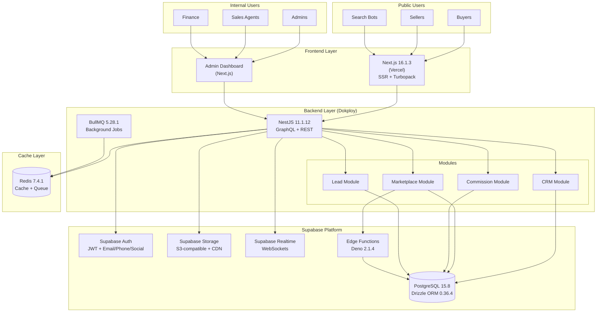

# PRD v2.0: Nền tảng Phân phối Bất động sản
## Full Supabase Stack Architecture

---

## 📋 Thông tin Tài liệu

- **Phiên bản**: 2.0
- **Ngày tạo**: 19/01/2026
- **Người tạo**: Luis (Dev Team) + Winston (Architect)
- **Trạng thái**: Draft - Full Supabase Architecture
- **Business Feasibility**: ✅ CONFIRMED (81/100 - Highly Feasible)
- **Dự án**: Real Estate Sales Distribution Platform + Public Marketplace
- **Kiến trúc**: Custom Build (NestJS + Next.js + Full Supabase Stack)

### Changelog v2.0

**MAJOR CHANGE: Full Supabase Stack Architecture**

**Architecture Decision**:
- ✅ **Custom Build** với NestJS + Next.js 16 + Full Supabase Ecosystem
- ✅ **Tận dụng tối đa Supabase**: Auth, Storage, Realtime, Edge Functions, Row Level Security
- ✅ **Drizzle ORM**: Lightweight, SQL-first, perfect for Supabase

**Tech Stack Updates (Latest Stable)**:
- ✅ **Frontend**: Next.js 16.1.3 + React 19 (Jan 2026)
- ✅ **Backend**: NestJS 11.1.12 (Jan 2026)
- ✅ **Database**: Supabase PostgreSQL 15.8
- ✅ **ORM**: Drizzle ORM 0.36.4 (lightweight, SQL-first)
- ✅ **Auth**: Supabase Auth (email/phone/social login)
- ✅ **Storage**: Supabase Storage (S3-compatible, CDN)
- ✅ **Realtime**: Supabase Realtime (WebSockets)
- ✅ **Edge Functions**: Supabase Edge Functions (Deno 2.1.4)
- ✅ **Queue**: BullMQ 5.28.1
- ✅ **Cache**: Redis 7.4.1

**Cost Impact**:
- Year 1: 1.8B VNĐ
- Savings: 700M VNĐ vs alternative approaches

**Timeline**:
- Development: 5-7 months
- Faster time to market

**Status**: **READY FOR DEVELOPMENT** ✅

---

## 1. Tổng quan Sản phẩm

### 1.1. Giới thiệu

Nền tảng Phân phối Bất động sản là một hệ thống **dual-purpose platform** được xây dựng từ đầu với kiến trúc **Full Supabase Stack**, bao gồm:

1. **Internal CRM** (Epic 1-7): Quản lý 1000+ sales agents, properties, deals, commissions
2. **Public Marketplace** (Epic 8): AI-powered platform cho buyers, sellers, brokers

**Tech Stack**:
- **Frontend**: Next.js 16.1.3 + React 19
- **Backend**: NestJS 11.1.12 (TypeScript)
- **Database**: Supabase PostgreSQL 15.8
- **ORM**: Drizzle ORM 0.36.4
- **Auth**: Supabase Auth
- **Storage**: Supabase Storage
- **Realtime**: Supabase Realtime
- **Edge Functions**: Supabase Edge Functions (Deno 2.1.4)
- **Queue**: BullMQ 5.28.1
- **Cache**: Redis 7.4.1
- **AI**: OpenAI GPT-4 + Perplexica API

### 1.2. Mục tiêu Kinh doanh

**Internal CRM**:
- Quản lý hiệu quả 1000+ sales agents làm việc bán thời gian
- Theo dõi real-time tồn kho bất động sản qua nhiều dự án
- Tự động hóa quy trình phân phối leads và tính toán hoa hồng
- Minh bạch hóa doanh số và thu nhập của từng sales agent

**Public Marketplace**:
- Generate 500 qualified leads/month by Month 12
- Attract 5,000 registered public users Year 1
- Achieve 10-15% lead conversion rate
- Break-even Month 8-10

### 1.3. Giá trị Cốt lõi

- **Transparency**: Mọi giao dịch và hoa hồng được theo dõi minh bạch
- **Automation**: AI-powered features (Research, Summary, Trust Score, Spam Filter)
- **Scalability**: Supabase auto-scaling, horizontal scaling
- **Performance**: Next.js 16 Turbopack, Supabase Realtime, Redis caching
- **SEO-First**: Native SSR cho public marketplace, Lighthouse score >90
- **Security**: Supabase Row Level Security (RLS) at database level

---

## 2. Bối cảnh Kinh doanh

### 2.1. Thị trường Mục tiêu

**Internal (Sales Agents)**:
- **Khu vực**: Long Thành, Đồng Nai
- **Sản phẩm**: Đất nền (land plots) trong các dự án phân lô
- **Quy mô**: 1000+ sales agents làm việc bán thời gian

**External (Public Marketplace)**:
- **Target**: Buyers, sellers, small brokers
- **Scope**: Toàn quốc (focus Đồng Nai, TP.HCM)
- **Users**: 5,000 Year 1, 50,000 Year 3

### 2.2. Vấn đề Cần Giải quyết

**Internal CRM**:
1. Quản lý tồn kho: Khó theo dõi real-time lô đất available/sold
2. Phân phối leads: Thủ công, không công bằng
3. Tính hoa hồng: Dễ nhầm lẫn, chậm thanh toán
4. Giữ chỗ (Reservation): Không có hệ thống tự động release sau 24h
5. Double-booking: Nguy cơ nhiều sales book cùng một lô

**Public Marketplace**:
1. Spam listings: Nhiều tin ảo, giá không thực
2. Scams: Khó verify tính xác thực của listings
3. Low trust: Buyers không tin tưởng sellers
4. Poor SEO: Khó tìm kiếm trên Google
5. No lead generation: Không có nguồn leads chất lượng

### 2.3. Giải pháp

**Full Supabase Stack Architecture**:

**Internal CRM**:
- NestJS backend với Drizzle ORM
- GraphQL API cho internal operations
- BullMQ cho background jobs (auto-release, lead assignment)
- Supabase Realtime cho live updates
- Supabase Row Level Security cho authorization

**Public Marketplace**:
- Next.js 16 với native SSR + Turbopack cho SEO
- Supabase Auth cho public user authentication
- Supabase Storage cho file uploads (images, documents)
- AI-powered features (Research, Summary, Trust Score, Spam Filter)
- Supabase Edge Functions cho serverless AI workloads

---

## 3. Người dùng & Personas

### 3.1. Sales Agent (Nhân viên Kinh doanh)

- **Vai trò**: Bán hàng bán thời gian
- **Số lượng**: 1000+ users
- **Nhiệm vụ**:
  - Xem danh sách projects và lô đất available
  - Giữ chỗ (reserve) lô đất cho khách hàng (tối đa 24h)
  - Quản lý leads được giao
  - Theo dõi doanh số và hoa hồng cá nhân
- **Quyền hạn**: Supabase RLS policies (chỉ xem/edit leads của mình)
- **Interface**: Admin dashboard (GraphQL API)

### 3.2. Admin (Quản trị Hệ thống)

- **Vai trò**: Quản lý toàn bộ hệ thống
- **Số lượng**: 5-10 users
- **Nhiệm vụ**:
  - Tạo và quản lý projects
  - Upload sơ đồ mặt bằng (Supabase Storage), thêm properties
  - Phê duyệt hoa hồng (commission approval)
  - Quản lý danh sách sales agents
  - Approve/reject public listings
- **Quyền hạn**: Full access (Supabase RLS admin role)
- **Interface**: Admin dashboard (GraphQL API)

### 3.3. Finance (Kế toán)

- **Vai trò**: Xử lý thanh toán hoa hồng
- **Số lượng**: 2-3 users
- **Nhiệm vụ**:
  - Xem danh sách hoa hồng đã được approve
  - Đánh dấu trạng thái Paid
  - Export CSV để chuyển khoản hàng loạt
- **Quyền hạn**: Supabase RLS (chỉ access Commission module)
- **Interface**: Admin dashboard (GraphQL API)

### 3.4. Customer/Buyer (Khách hàng Mua)

- **Vai trò**: Khách hàng mua bất động sản
- **Số lượng**: Unlimited (external users)
- **Tương tác**:
  - Được sales agent tạo Contact record trong hệ thống
  - KHÔNG có quyền truy cập trực tiếp vào hệ thống (Phase 1)
  - Thông tin được quản lý bởi sales agent
- **Thông tin lưu trữ**: Name, phone, email, ID number (encrypted), address, budget, timeline
- **Quyền hạn**: None (data subject only)

### 3.5. Public Buyer/Renter (Khách hàng Công khai) ⭐

- **Vai trò**: External user tìm kiếm bất động sản trên public marketplace
- **Số lượng**: Target 5,000 Year 1
- **Nhiệm vụ**:
  - Browse và search public listings
  - View listing details với AI summary
  - Send inquiries to sellers
  - Save favorite listings
  - View trust scores và verified badges
- **Quyền hạn**:
  - Browse listings (no auth required)
  - Post inquiries (no auth required)
  - Save favorites (requires Supabase Auth)
- **Interface**: Next.js public pages (REST API)
- **Authentication**: Supabase Auth (email/phone/social login)

### 3.6. Public Seller/Broker (Người bán Công khai) ⭐

- **Vai trò**: External user đăng tin bán/cho thuê bất động sản
- **Số lượng**: Target 500-1,000 active sellers Year 1
- **Nhiệm vụ**:
  - Register account (Supabase Auth: email + phone verification)
  - Post property listings (free tier: 3 listings)
  - Upload images (Supabase Storage)
  - Manage own listings
  - Receive và respond to inquiries
  - View performance analytics (views, contacts)
- **Quyền hạn**:
  - Create/edit/delete own listings (Supabase RLS)
  - View own inquiries
  - Access seller dashboard
  - Upgrade subscription tier
- **Interface**: Next.js seller dashboard (REST API)
- **Subscription Tiers**:
  - FREE: 3 listings, 30 days, 5 photos
  - BASIC (99k/month): 10 listings, 60 days, 10 photos
  - PRO (299k/month): Unlimited, 90 days, 20 photos, featured listings

### 3.7. Small Broker (Môi giới Nhỏ) ⭐

- **Vai trò**: Independent broker sử dụng platform để manage listings
- **Số lượng**: Target 100-200 brokers Year 1
- **Nhiệm vụ**:
  - Manage 5-20 property listings
  - Professional branding (verified badge)
  - Lead management tools
  - Performance tracking
- **Quyền hạn**: Same as Public Seller + Professional features
- **Subscription**: Typically PRO or ENTERPRISE tier
- **Interface**: Next.js broker dashboard (REST API)

---

## 4. Yêu cầu Chức năng

### 4.1. Module 1: Quản lý Dự án (Projects)

#### 4.1.1. Mô tả

Module quản lý các dự án bất động sản (Real Estate Projects). Mỗi project chứa nhiều lô đất (properties).

#### 4.1.2. Database Schema (Drizzle ORM)

```typescript
// schema/projects.ts
import { pgTable, uuid, varchar, text, integer, decimal, timestamp, pgEnum } from 'drizzle-orm/pg-core';

export const projectStatusEnum = pgEnum('project_status', [
  'PLANNING',
  'ACTIVE',
  'SOLD_OUT',
  'SUSPENDED'
]);

export const projects = pgTable('projects', {
  id: uuid('id').primaryKey().defaultRandom(),
  name: varchar('name', { length: 255 }).notNull(),
  developer: varchar('developer', { length: 255 }),
  location: varchar('location', { length: 500 }),
  area: varchar('area', { length: 255 }),
  totalPlots: integer('total_plots'),
  status: projectStatusEnum('status').notNull(),
  legalStatus: varchar('legal_status', { length: 255 }),
  description: text('description'),
  masterPlanImageUrl: varchar('master_plan_image_url', { length: 500 }),
  galleryUrls: text('gallery_urls').array(),
  startDate: timestamp('start_date'),
  completionDate: timestamp('completion_date'),
  priceMin: decimal('price_min', { precision: 15, scale: 2 }),
  priceMax: decimal('price_max', { precision: 15, scale: 2 }),
  commissionRate: decimal('commission_rate', { precision: 5, scale: 2 }),
  createdAt: timestamp('created_at').defaultNow().notNull(),
  updatedAt: timestamp('updated_at').defaultNow().notNull(),
});
```

#### 4.1.3. API Endpoints

**GraphQL (Internal)**:
```graphql
type Query {
  projects(filter: ProjectFilter, pagination: Pagination): ProjectConnection!
  project(id: ID!): Project
}

type Mutation {
  createProject(input: CreateProjectInput!): Project!
  updateProject(id: ID!, input: UpdateProjectInput!): Project!
  deleteProject(id: ID!): Boolean!
}
```

#### 4.1.4. Business Rules

1. **Computed Field**: `availablePlots` = COUNT(properties WHERE status = 'AVAILABLE')
2. **Auto-update**: Khi property status thay đổi → trigger update `availablePlots`
3. **Validation**: `priceMax` >= `priceMin`
4. **File Storage**: Supabase Storage cho masterPlanImage và gallery

#### 4.1.5. Supabase Storage Integration

```typescript
// Upload master plan image
const uploadMasterPlan = async (file: File, projectId: string) => {
  const { data, error } = await supabase.storage
    .from('project-images')
    .upload(`${projectId}/master-plan.png`, file, {
      cacheControl: '3600',
      upsert: true,
    });

  if (error) throw error;

  // Get public URL
  const { data: { publicUrl } } = supabase.storage
    .from('project-images')
    .getPublicUrl(data.path);

  return publicUrl;
};
```

---

### 4.2. Module 2: Quản lý Bất động sản (Properties)

#### 4.2.1. Mô tả

Module quản lý từng lô đất (land plot) trong các dự án. Đây là module quan trọng nhất với business logic phức tạp nhất.

#### 4.2.2. Database Schema (Drizzle ORM)

```typescript
// schema/properties.ts
import { pgTable, uuid, varchar, decimal, timestamp, pgEnum } from 'drizzle-orm/pg-core';
import { projects } from './projects';
import { users } from './users';
import { contacts } from './contacts';

export const propertyStatusEnum = pgEnum('property_status', [
  'AVAILABLE',
  'RESERVED',
  'DEPOSIT_PAID',
  'CONTRACTED',
  'SOLD'
]);

export const properties = pgTable('properties', {
  id: uuid('id').primaryKey().defaultRandom(),
  projectId: uuid('project_id').notNull().references(() => projects.id),
  plotNumber: varchar('plot_number', { length: 50 }).notNull(),
  area: decimal('area', { precision: 10, scale: 2 }).notNull(),
  price: decimal('price', { precision: 15, scale: 2 }).notNull(),
  pricePerSqm: decimal('price_per_sqm', { precision: 15, scale: 2 }),
  status: propertyStatusEnum('status').notNull().default('AVAILABLE'),
  direction: varchar('direction', { length: 50 }),
  roadWidth: decimal('road_width', { precision: 5, scale: 2 }),
  legalDoc: varchar('legal_doc', { length: 255 }),
  location: varchar('location', { length: 500 }),

  // Reservation
  reservedById: uuid('reserved_by_id').references(() => users.id),
  reservedUntil: timestamp('reserved_until'),

  // Sale
  soldToId: uuid('sold_to_id').references(() => contacts.id),
  soldDate: timestamp('sold_date'),

  notes: text('notes'),
  commissionAmount: decimal('commission_amount', { precision: 15, scale: 2 }),

  createdAt: timestamp('created_at').defaultNow().notNull(),
  updatedAt: timestamp('updated_at').defaultNow().notNull(),
});

// Unique constraint
export const propertyUniqueConstraint = unique('property_project_plot')
  .on(properties.projectId, properties.plotNumber);
```

#### 4.2.3. Business Rules

**Status Workflow**:
```
Available → Reserved (sales giữ chỗ) → Deposit Paid (khách đặt cọc) → Contracted → Sold
         ↓ (24h timeout)
      Available (auto-release)
```

**Reservation Logic**:
- Sales agent có thể reserve lô status = 'Available'
- Khi reserve: Set `reservedBy` = current user, `reservedUntil` = NOW + 24 hours
- Sau 24h nếu không chuyển sang Deposit Paid → tự động chuyển về 'Available' (BullMQ job)

**Double-booking Prevention**:
- Drizzle transaction với row-level locking
- Chỉ 1 sales có thể reserve 1 lô tại 1 thời điểm

#### 4.2.4. Implementation (NestJS + Drizzle)

```typescript
// properties.service.ts
import { Injectable } from '@nestjs/common';
import { db } from '@/db';
import { properties } from '@/schema';
import { eq, and } from 'drizzle-orm';
import { Queue } from 'bullmq';

@Injectable()
export class PropertiesService {
  constructor(private queue: Queue) {}

  async reserveProperty(propertyId: string, userId: string) {
    return db.transaction(async (tx) => {
      // Row-level lock
      const [property] = await tx
        .select()
        .from(properties)
        .where(eq(properties.id, propertyId))
        .for('update');

      if (!property) {
        throw new NotFoundException('Property not found');
      }

      if (property.status !== 'AVAILABLE') {
        throw new BadRequestException(
          `Property is ${property.status}, cannot reserve`,
        );
      }

      // Update property
      const [updated] = await tx
        .update(properties)
        .set({
          status: 'RESERVED',
          reservedById: userId,
          reservedUntil: new Date(Date.now() + 24 * 60 * 60 * 1000),
          updatedAt: new Date(),
        })
        .where(eq(properties.id, propertyId))
        .returning();

      // Schedule auto-release job (BullMQ)
      await this.queue.add(
        'release-reservation',
        { propertyId },
        {
          delay: 24 * 60 * 60 * 1000, // 24 hours
          jobId: `release-${propertyId}`,
        },
      );

      return updated;
    });
  }
}
```

#### 4.2.5. Supabase Realtime Integration

```typescript
// Listen to property status changes (Frontend)
const channel = supabase
  .channel('property-changes')
  .on(
    'postgres_changes',
    {
      event: 'UPDATE',
      schema: 'public',
      table: 'properties',
      filter: `project_id=eq.${projectId}`,
    },
    (payload) => {
      console.log('Property updated:', payload.new);
      // Update UI in real-time
      updatePropertyInUI(payload.new);
    },
  )
  .subscribe();
```

---

### 4.3. Module 2.5: Quản lý Khách hàng (Contact/Customer Management)

#### 4.3.1. Database Schema (Drizzle ORM)

```typescript
// schema/contacts.ts
export const contactStatusEnum = pgEnum('contact_status', [
  'LEAD',
  'PROSPECT',
  'CUSTOMER',
  'INACTIVE'
]);

export const contacts = pgTable('contacts', {
  id: uuid('id').primaryKey().defaultRandom(),
  name: varchar('name', { length: 255 }).notNull(),
  phone: varchar('phone', { length: 20 }).notNull(),
  email: varchar('email', { length: 255 }),
  idNumber: text('id_number'), // Encrypted
  idType: varchar('id_type', { length: 50 }),
  address: text('address'),
  occupation: varchar('occupation', { length: 255 }),
  budget: decimal('budget', { precision: 15, scale: 2 }),
  timeline: varchar('timeline', { length: 100 }),
  source: varchar('source', { length: 100 }),
  status: contactStatusEnum('status').notNull().default('LEAD'),
  notes: text('notes'),
  assignedSalesId: uuid('assigned_sales_id').references(() => users.id),
  createdAt: timestamp('created_at').defaultNow().notNull(),
  updatedAt: timestamp('updated_at').defaultNow().notNull(),
});
```

#### 4.3.2. Data Privacy với Supabase

- **Encryption**: `idNumber` (CCCD) encrypted at rest
- **Access Control**: Supabase RLS policies
- **Audit Log**: All access to sensitive fields logged

```sql
-- RLS Policy: Sales agents can only view their assigned contacts
CREATE POLICY "sales_view_own_contacts"
ON contacts FOR SELECT
USING (
  auth.uid() = assigned_sales_id
  OR
  EXISTS (
    SELECT 1 FROM users
    WHERE users.id = auth.uid()
    AND users.role IN ('ADMIN', 'MANAGER')
  )
);
```

---

### 4.4. Module 8: Public Marketplace (Thị trường Công khai) ⭐

#### 4.4.1. Tổng quan

**Vision**: "AI-Powered Real Estate Intelligence Platform That Generates Unlimited Quality Leads Through Trust & Automation"

**Architecture**: Next.js 16 + Full Supabase Stack

**Core Features**:
1. Public user management (Supabase Auth)
2. Public listing management (CRUD, approval workflow)
3. AI Research Agent (web scraping, price verification)
4. AI Summary Generation (GPT-4)
5. Trust Score Calculation
6. Smart Spam Filter
7. Inquiry system & lead conversion
8. Subscription tiers & monetization

#### 4.4.2. Database Schema (Drizzle ORM)

```typescript
// schema/public-users.ts
export const publicUserTypeEnum = pgEnum('public_user_type', [
  'BUYER',
  'SELLER',
  'BROKER'
]);

export const subscriptionTierEnum = pgEnum('subscription_tier', [
  'FREE',
  'BASIC',
  'PRO',
  'ENTERPRISE'
]);

export const publicUsers = pgTable('public_users', {
  id: uuid('id').primaryKey().defaultRandom(),
  email: varchar('email', { length: 255 }).notNull().unique(),
  phone: varchar('phone', { length: 20 }).notNull(),
  fullName: varchar('full_name', { length: 255 }).notNull(),
  userType: publicUserTypeEnum('user_type').notNull(),
  verified: boolean('verified').default(false),
  emailVerified: boolean('email_verified').default(false),
  phoneVerified: boolean('phone_verified').default(false),
  verifiedAt: timestamp('verified_at'),
  subscriptionTier: subscriptionTierEnum('subscription_tier').default('FREE'),
  subscriptionExpiresAt: timestamp('subscription_expires_at'),

  // Computed fields
  totalListings: integer('total_listings').default(0),
  activeListings: integer('active_listings').default(0),
  responseRate: decimal('response_rate', { precision: 5, scale: 2 }).default('0'),
  avgResponseTime: decimal('avg_response_time', { precision: 10, scale: 2 }).default('0'),

  createdAt: timestamp('created_at').defaultNow().notNull(),
  updatedAt: timestamp('updated_at').defaultNow().notNull(),
});

// schema/public-listings.ts
export const listingTypeEnum = pgEnum('listing_type', ['SALE', 'RENT']);
export const propertyTypeEnum = pgEnum('property_type', [
  'APARTMENT',
  'HOUSE',
  'LAND',
  'VILLA',
  'TOWNHOUSE',
  'OFFICE'
]);
export const listingStatusEnum = pgEnum('listing_status', [
  'DRAFT',
  'PENDING_REVIEW',
  'APPROVED',
  'REJECTED',
  'EXPIRED',
  'SOLD'
]);

export const publicListings = pgTable('public_listings', {
  id: uuid('id').primaryKey().defaultRandom(),
  ownerId: uuid('owner_id').notNull().references(() => publicUsers.id),
  propertyId: uuid('property_id').references(() => properties.id),

  // Basic info
  title: varchar('title', { length: 500 }).notNull(),
  description: text('description').notNull(),
  listingType: listingTypeEnum('listing_type').notNull(),
  propertyType: propertyTypeEnum('property_type').notNull(),
  price: decimal('price', { precision: 15, scale: 2 }).notNull(),
  area: decimal('area', { precision: 10, scale: 2 }).notNull(),

  // Location
  address: varchar('address', { length: 500 }).notNull(),
  province: varchar('province', { length: 100 }).notNull(),
  district: varchar('district', { length: 100 }).notNull(),
  ward: varchar('ward', { length: 100 }),
  latitude: decimal('latitude', { precision: 10, scale: 8 }),
  longitude: decimal('longitude', { precision: 11, scale: 8 }),

  // Property details
  bedrooms: integer('bedrooms'),
  bathrooms: integer('bathrooms'),
  floor: integer('floor'),
  orientation: varchar('orientation', { length: 50 }),

  // Status
  status: listingStatusEnum('status').notNull().default('DRAFT'),
  verified: boolean('verified').default(false),
  featured: boolean('featured').default(false),

  // Metrics
  viewCount: integer('view_count').default(0),
  contactCount: integer('contact_count').default(0),
  trustScore: decimal('trust_score', { precision: 5, scale: 2 }).default('0'),
  spamScore: decimal('spam_score', { precision: 5, scale: 2 }).default('0'),

  // Dates
  publishedAt: timestamp('published_at'),
  expiresAt: timestamp('expires_at'),
  approvedAt: timestamp('approved_at'),
  rejectedReason: text('rejected_reason'),

  // AI-generated
  aiSummary: text('ai_summary'),

  // Images (Supabase Storage URLs)
  imageUrls: text('image_urls').array(),

  createdAt: timestamp('created_at').defaultNow().notNull(),
  updatedAt: timestamp('updated_at').defaultNow().notNull(),
});
```

#### 4.4.3. Next.js 16 SSR Implementation

**Listing Detail Page với SSR**:

```typescript
// app/(public)/listings/[id]/page.tsx
import { Metadata } from 'next';
import { createClient } from '@/lib/supabase/server';
import { notFound } from 'next/navigation';

interface Props {
  params: Promise<{ id: string }>;
}

// Generate metadata for SEO
export async function generateMetadata({ params }: Props): Promise<Metadata> {
  const { id } = await params;
  const supabase = await createClient();

  const { data: listing } = await supabase
    .from('public_listings')
    .select('*')
    .eq('id', id)
    .single();

  if (!listing) {
    return { title: 'Listing Not Found' };
  }

  return {
    title: `${listing.title} - ${listing.province}`,
    description: listing.description.substring(0, 160),
    openGraph: {
      title: listing.title,
      description: listing.description,
      images: [listing.image_urls[0]],
      type: 'website',
    },
    twitter: {
      card: 'summary_large_image',
      title: listing.title,
      description: listing.description,
      images: [listing.image_urls[0]],
    },
  };
}

// Server-side rendering
export default async function ListingDetailPage({ params }: Props) {
  const { id } = await params;
  const supabase = await createClient();

  const { data: listing } = await supabase
    .from('public_listings')
    .select(`
      *,
      owner:public_users(*),
      research_result:ai_research_results(*)
    `)
    .eq('id', id)
    .eq('status', 'APPROVED')
    .single();

  if (!listing) {
    notFound();
  }

  return <ListingDetail listing={listing} />;
}
```

#### 4.4.4. Supabase Auth Integration

```typescript
// app/auth/register/page.tsx
'use client';

import { useState } from 'react';
import { createClient } from '@/lib/supabase/client';

export default function RegisterPage() {
  const [email, setEmail] = useState('');
  const [password, setPassword] = useState('');
  const [phone, setPhone] = useState('');
  const supabase = createClient();

  const handleRegister = async () => {
    // Sign up with Supabase Auth
    const { data, error } = await supabase.auth.signUp({
      email,
      password,
      phone,
      options: {
        emailRedirectTo: `${window.location.origin}/auth/callback`,
        data: {
          phone,
        },
      },
    });

    if (error) {
      console.error('Registration error:', error);
      return;
    }

    // Create public user record
    const { error: dbError } = await supabase
      .from('public_users')
      .insert({
        id: data.user!.id,
        email,
        phone,
        full_name: '',
        user_type: 'SELLER',
      });

    if (dbError) {
      console.error('DB error:', dbError);
    }
  };

  return (
    <form onSubmit={(e) => { e.preventDefault(); handleRegister(); }}>
      <input
        type="email"
        value={email}
        onChange={(e) => setEmail(e.target.value)}
        placeholder="Email"
      />
      <input
        type="password"
        value={password}
        onChange={(e) => setPassword(e.target.value)}
        placeholder="Password"
      />
      <input
        type="tel"
        value={phone}
        onChange={(e) => setPhone(e.target.value)}
        placeholder="Phone"
      />
      <button type="submit">Register</button>
    </form>
  );
}
```

#### 4.4.5. Supabase Storage cho Image Uploads

```typescript
// Upload listing images
const uploadListingImages = async (files: File[], listingId: string) => {
  const uploadPromises = files.map(async (file, index) => {
    const fileName = `${listingId}/${index}-${Date.now()}.${file.name.split('.').pop()}`;

    const { data, error } = await supabase.storage
      .from('listing-images')
      .upload(fileName, file, {
        cacheControl: '3600',
        upsert: false,
      });

    if (error) throw error;

    // Get public URL
    const { data: { publicUrl } } = supabase.storage
      .from('listing-images')
      .getPublicUrl(data.path);

    return publicUrl;
  });

  return Promise.all(uploadPromises);
};
```

#### 4.4.6. AI Research Agent (Supabase Edge Function)

```typescript
// supabase/functions/ai-research/index.ts
import { serve } from 'https://deno.land/std@0.168.0/http/server.ts';
import { createClient } from 'https://esm.sh/@supabase/supabase-js@2';

serve(async (req) => {
  const { listingId } = await req.json();

  const supabase = createClient(
    Deno.env.get('SUPABASE_URL')!,
    Deno.env.get('SUPABASE_SERVICE_ROLE_KEY')!,
  );

  // Fetch listing
  const { data: listing } = await supabase
    .from('public_listings')
    .select('*')
    .eq('id', listingId)
    .single();

  if (!listing) {
    return new Response(JSON.stringify({ error: 'Listing not found' }), {
      status: 404,
    });
  }

  // Research from multiple sources (Perplexica API)
  const results = await Promise.all([
    searchBatDongSan(listing),
    searchChoTot(listing),
    searchGoogle(listing),
  ]);

  // Calculate confidence score
  const similarListings = results.flat();
  const confidenceScore = calculateConfidence(similarListings, listing);

  // Save results
  const { error } = await supabase
    .from('ai_research_results')
    .upsert({
      listing_id: listingId,
      sources_checked: ['batdongsan', 'chotot', 'google'],
      similar_listings_found: similarListings,
      price_range: {
        min: Math.min(...similarListings.map((r) => r.price)),
        max: Math.max(...similarListings.map((r) => r.price)),
        avg: average(similarListings.map((r) => r.price)),
      },
      duplicate_detected: similarListings.some(
        (r) =>
          r.address === listing.address &&
          Math.abs(r.price - listing.price) < 1000000,
      ),
      confidence_score: confidenceScore,
      status: 'COMPLETED',
      completed_at: new Date().toISOString(),
    });

  if (error) throw error;

  return new Response(
    JSON.stringify({
      success: true,
      confidenceScore,
    }),
    {
      headers: { 'Content-Type': 'application/json' },
    },
  );
});
```

#### 4.4.7. Supabase Row Level Security (RLS)

```sql
-- Enable RLS on public_listings
ALTER TABLE public_listings ENABLE ROW LEVEL SECURITY;

-- Public can view approved listings
CREATE POLICY "view_approved_listings"
ON public_listings FOR SELECT
USING (status = 'APPROVED');

-- Owners can view own listings
CREATE POLICY "view_own_listings"
ON public_listings FOR SELECT
USING (auth.uid() = owner_id);

-- Owners can update own listings
CREATE POLICY "update_own_listings"
ON public_listings FOR UPDATE
USING (auth.uid() = owner_id);

-- Owners can insert own listings
CREATE POLICY "insert_own_listings"
ON public_listings FOR INSERT
WITH CHECK (auth.uid() = owner_id);

-- Admins can view all
CREATE POLICY "admins_view_all"
ON public_listings FOR SELECT
USING (
  EXISTS (
    SELECT 1 FROM users
    WHERE users.id = auth.uid()
    AND users.role = 'ADMIN'
  )
);

-- Admins can update all (for approval)
CREATE POLICY "admins_update_all"
ON public_listings FOR UPDATE
USING (
  EXISTS (
    SELECT 1 FROM users
    WHERE users.id = auth.uid()
    AND users.role = 'ADMIN'
  )
);
```

---

## 5. Yêu cầu Phi chức năng

### 5.1. Performance

- **API Response**: < 200ms (NestJS + Drizzle + Redis caching)
- **Page Load**: < 2s cho dashboard (Next.js 16 Turbopack)
- **SSR Render**: < 500ms cho public pages
- **Concurrent Users**: 1000+ (Supabase connection pooling)
- **Database**: Drizzle query optimization, indexes

### 5.2. Scalability

- **Horizontal Scaling**:
  - Next.js: Vercel Edge Network (auto-scaling)
  - NestJS: Docker containers on Dokploy (manual scaling)
- **Database**: Supabase (auto-scaling PostgreSQL)
- **Queue**: BullMQ với Redis cluster
- **CDN**: Vercel Edge + Supabase Storage CDN

### 5.3. Security

- **Authentication**:
  - Internal: JWT tokens (NestJS)
  - Public: Supabase Auth (email/phone/social verification)
- **Authorization**:
  - Internal: NestJS Guards + Decorators
  - Public: Supabase Row Level Security (RLS)
- **Data Encryption**:
  - Sensitive data (bank info, ID numbers) encrypted at rest
  - Supabase encryption at rest
- **Audit Log**: All critical actions logged (Supabase logging)

### 5.4. Availability

- **Uptime**: 99.9% (Supabase SLA + Vercel SLA)
- **Backup**:
  - Supabase: Daily automated backups (30 days retention)
  - Point-in-time recovery available
- **Disaster Recovery**: Restore within 4 hours

### 5.5. SEO Requirements (Public Marketplace)

- **Server-Side Rendering**: Next.js 16 native SSR + Turbopack
- **Meta Tags**: Dynamic per listing (generateMetadata)
- **Structured Data**: JSON-LD for rich snippets
- **Lighthouse Score**: > 90 (SEO, Performance, Accessibility)
- **Indexing Time**: < 48 hours (Google Search Console)
- **Sitemap**: Dynamic sitemap generation
- **Robots.txt**: Proper configuration

---

## 6. Kiến trúc Hệ thống

### 6.1. Tech Stack (Latest Stable Versions - Jan 2026)

#### Frontend

| Component | Technology | Version | Release Date |
|-----------|-----------|---------|--------------|
| **Framework** | Next.js | 16.1.3 | Jan 16, 2026 |
| **React** | React | 19.0.0 | Dec 2024 |
| **Runtime** | Node.js | 22.12.0 LTS | Dec 2025 |
| **Styling** | Tailwind CSS | 3.4.17 | Jan 2026 |
| **UI Library** | shadcn/ui | Latest | Jan 2026 |
| **State** | Zustand | 5.0.2 | Jan 2026 |
| **Forms** | React Hook Form | 7.54.0 | Jan 2026 |
| **Validation** | Zod | 3.24.1 | Jan 2026 |
| **Data Fetching** | TanStack Query | 5.62.7 | Jan 2026 |
| **GraphQL Client** | Apollo Client | 3.11.10 | Jan 2026 |

#### Backend

| Component | Technology | Version | Release Date |
|-----------|-----------|---------|--------------|
| **Framework** | NestJS | 11.1.12 | Jan 15, 2026 |
| **Runtime** | Node.js | 22.12.0 LTS | Dec 2025 |
| **ORM** | Drizzle ORM | 0.36.4 | Jan 2026 |
| **Queue** | BullMQ | 5.28.1 | Jan 2026 |
| **Cache** | Redis | 7.4.1 | Dec 2025 |
| **GraphQL** | Apollo Server | 4.11.2 | Dec 2025 |
| **Validation** | class-validator | 0.14.1 | Nov 2025 |
| **Validation** | Zod | 3.24.1 | Jan 2026 |

#### Supabase Stack

| Component | Technology | Version |
|-----------|-----------|---------|
| **Database** | Supabase PostgreSQL | 15.8 |
| **Auth** | Supabase Auth | Latest |
| **Storage** | Supabase Storage | Latest |
| **Realtime** | Supabase Realtime | Latest |
| **Edge Functions** | Supabase Edge Functions | Deno 2.1.4 |

#### Infrastructure

| Component | Technology | Version |
|-----------|-----------|---------|
| **Deployment (Frontend)** | Vercel | Latest |
| **Deployment (Backend)** | Dokploy | 0.18.1 |
| **CI/CD** | GitHub Actions | Latest |
| **Monitoring** | Sentry | 8.45.0 |

#### AI/ML

| Component | Technology | Version |
|-----------|-----------|---------|
| **LLM** | OpenAI GPT-4 | Latest API |
| **Web Scraping** | Perplexica | Self-hosted |

### 6.2. Architecture Diagram



### 6.3. Project Structure

```
real-estate-platform/
├── apps/
│   ├── backend/                    # NestJS 11.1.12
│   │   ├── src/
│   │   │   ├── modules/
│   │   │   │   ├── auth/
│   │   │   │   ├── crm/
│   │   │   │   │   ├── projects/
│   │   │   │   │   ├── properties/
│   │   │   │   │   ├── contacts/
│   │   │   │   │   ├── deals/
│   │   │   │   │   └── reservations/
│   │   │   │   ├── commission/
│   │   │   │   ├── lead/
│   │   │   │   └── marketplace/
│   │   │   │       ├── public-users/
│   │   │   │       ├── public-listings/
│   │   │   │       ├── inquiries/
│   │   │   │       └── subscriptions/
│   │   │   ├── common/
│   │   │   ├── config/
│   │   │   └── main.ts
│   │   ├── drizzle/
│   │   │   ├── schema/
│   │   │   │   ├── projects.ts
│   │   │   │   ├── properties.ts
│   │   │   │   ├── contacts.ts
│   │   │   │   ├── deals.ts
│   │   │   │   ├── commissions.ts
│   │   │   │   ├── public-users.ts
│   │   │   │   └── public-listings.ts
│   │   │   ├── migrations/
│   │   │   └── drizzle.config.ts
│   │   └── test/
│   │
│   └── frontend/                   # Next.js 16.1.3
│       ├── app/
│       │   ├── (public)/
│       │   │   ├── page.tsx
│       │   │   ├── listings/
│       │   │   │   ├── page.tsx
│       │   │   │   └── [id]/page.tsx
│       │   │   └── auth/
│       │   └── (admin)/
│       │       ├── admin/
│       │       └── agent/
│       ├── components/
│       │   ├── ui/              # shadcn/ui
│       │   ├── public/
│       │   └── admin/
│       └── lib/
│           ├── supabase/
│           │   ├── client.ts
│           │   └── server.ts
│           └── utils/
│
├── supabase/
│   ├── functions/               # Edge Functions
│   │   ├── ai-research/
│   │   ├── ai-summary/
│   │   ├── trust-score/
│   │   └── spam-filter/
│   ├── migrations/
│   └── config.toml
│
├── packages/
│   └── shared/
│       ├── types/
│       └── constants/
│
└── docs/
    └── real-estate-platform/
        ├── prd-v2.0.md         # This file
        ├── architecture-custom-build.md
        └── quick-start-custom-build.md
```

---

## 7. Implementation Roadmap

### Phase 1: Foundation (Month 1)

**Week 1-2**: Project Setup
- Setup Supabase project
- Initialize monorepo (NestJS + Next.js)
- Configure Drizzle ORM
- Setup development environment

**Week 3-4**: Core Infrastructure
- Authentication (Supabase Auth)
- RBAC implementation
- Database schema migration (Drizzle)
- GraphQL + REST API setup

### Phase 2: Internal CRM (Month 2-3)

**Month 2**: Epic 1-3
- Projects CRUD
- Properties CRUD + Reservation system
- Contacts CRUD
- Deals CRUD + auto-creation

**Month 3**: Epic 4-5
- Sales dashboard
- Commission management
- Lead assignment
- Background jobs (BullMQ)

### Phase 3: Public Marketplace (Month 4-6)

**Month 4**: Epic 8.1-8.3
- Next.js 16 SSR setup
- Public user management (Supabase Auth)
- Public listing management
- Supabase Storage integration
- Admin approval workflow

**Month 5**: Epic 8.4-8.6
- AI Research Agent (Edge Function)
- AI Summary Generation
- Trust Score Calculation
- Spam Filter
- Inquiry system

**Month 6**: Epic 8.7-8.8
- Lead conversion workflow
- Subscription tiers
- Payment integration (VNPay)
- Analytics dashboard

### Phase 4: Testing & Launch (Month 7)

- Integration testing
- E2E testing (Playwright)
- Performance optimization
- Security audit
- Pilot program (200 agents)
- Production deployment

---

## 8. Cost Breakdown

### 8.1. Development Cost

| Phase | Duration | Cost |
|-------|----------|------|
| Phase 1: Foundation | 1 month | 200M VNĐ |
| Phase 2: Internal CRM | 2 months | 500M VNĐ |
| Phase 3: Public Marketplace | 3 months | 800M VNĐ |
| Phase 4: Testing & Launch | 1 month | 200M VNĐ |
| **Total Development** | **7 months** | **1.7B VNĐ** |

### 8.2. Infrastructure Cost (Year 1)

| Service | Plan | Cost/Month | Cost/Year |
|---------|------|------------|-----------|
| Supabase | Pro | $25 | 7.5M VNĐ |
| Vercel | Pro | $20 | 6M VNĐ |
| Dokploy | VPS 8GB | $40 | 12M VNĐ |
| Redis Cloud | 1GB | $10 | 3M VNĐ |
| OpenAI API | Usage-based | ~$50 | 15M VNĐ |
| Monitoring (Sentry) | Team | $26 | 7.8M VNĐ |
| **Total Infrastructure** | | | **51.3M VNĐ/year** |

### 8.3. Total Cost Summary

**Year 1**:
- Development: 1.7B VNĐ
- Infrastructure: 51.3M VNĐ
- Maintenance: 150M VNĐ
- **Total Year 1**: **1.9B VNĐ**

**Recurring (Year 2+)**:
- Infrastructure: 51.3M VNĐ/year
- Maintenance: 150M VNĐ/year
- **Total Recurring**: **201.3M VNĐ/year**

---

## 9. Success Metrics

### 9.1. Technical Metrics

| Metric | Target | Tool |
|--------|--------|------|
| API Response Time | < 200ms | Sentry Performance |
| SSR Render Time | < 500ms | Vercel Analytics |
| Database Query Time | < 50ms | Drizzle Metrics |
| Cache Hit Rate | > 80% | Redis INFO |
| Error Rate | < 0.1% | Sentry |
| Uptime | > 99.9% | Supabase + Vercel |
| Lighthouse SEO Score | > 90 | Lighthouse CI |

### 9.2. Business Metrics

| Metric | Target | Timeline |
|--------|--------|----------|
| Qualified Leads/Month | 500 | Month 12 |
| Public Users | 5,000 | Year 1 |
| Active Listings | 8,000 | Year 1 |
| Lead Conversion Rate | 10-15% | Ongoing |
| AI Accuracy | > 90% | Ongoing |
| Spam Detection | > 95% | Ongoing |
| User Satisfaction | > 4.2/5 | Ongoing |

---

## 10. Appendix A: Version Verification

**Verification Date**: 19/01/2026

| Technology | Version | Status | Source |
|-----------|---------|--------|--------|
| Next.js | 16.1.3 | ✅ Stable LTS | endoflife.date |
| React | 19.0.0 | ✅ Stable | npmjs.com |
| NestJS | 11.1.12 | ✅ Stable | npmjs.com |
| Node.js | 22.12.0 LTS | ✅ LTS | nodejs.org |
| Drizzle ORM | 0.36.4 | ✅ Stable | drizzle.team |
| PostgreSQL | 15.8 | ✅ Stable | Supabase |
| BullMQ | 5.28.1 | ✅ Stable | npmjs.com |
| Redis | 7.4.1 | ✅ Stable | redis.io |
| Zustand | 5.0.2 | ✅ Stable | npmjs.com |
| TanStack Query | 5.62.7 | ✅ Stable | npmjs.com |
| Tailwind CSS | 3.4.17 | ✅ Stable | npmjs.com |

**Note**: Tất cả versions đều là latest stable releases tại thời điểm tạo PRD (19/01/2026).

---

## Appendix B: References

- **Architecture Document**: `/docs/real-estate-platform/architecture-custom-build.md`
- **Quick Start Guide**: `/docs/real-estate-platform/quick-start-custom-build.md`
- **Architecture Evaluation**: Brain artifacts (implementation_plan.md)

---

_Generated by Winston (BMAD Architect) for Luis_
_Date: 19/01/2026_
_Version: 2.0 (Full Supabase Stack Architecture)_
_Status: READY FOR DEVELOPMENT_ ✅
