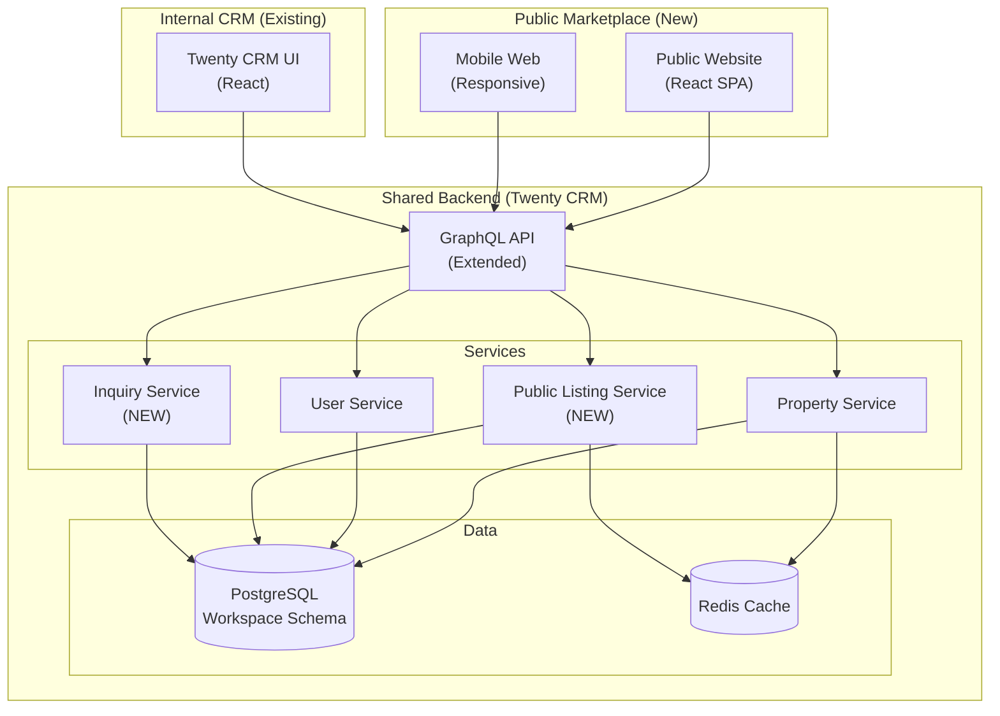
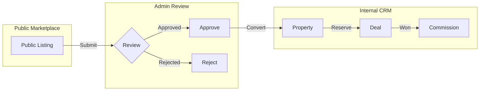

# Public Marketplace Module - Technical Specification

**Version**: 1.0
**Date**: 25/12/2025
**Author**: Mary (Business Analyst)
**Status**: Draft for Review
**Based on**: Research of batdongsan.com.vn + Twenty CRM Architecture

---

## 📋 Executive Summary

Đề xuất mở rộng Real Estate Platform với **Public Marketplace Module** - một trang rao vặt bất động sản công khai cho users bên ngoài công ty, tương tự batdongsan.com.vn.

**Key Objectives**:
- Tận dụng backend Twenty CRM có sẵn (Project, Property entities)
- Tạo public-facing website cho end-users (buyers/renters)
- Cho phép external users đăng tin bán/cho thuê
- Tích hợp với internal CRM workflow
- Tạo thêm revenue stream từ paid listings

**Architecture Approach**: **Dual-Frontend, Shared Backend**
- **Internal CRM**: Existing Twenty CRM UI (cho sales agents, admin, finance)
- **Public Marketplace**: New React SPA (cho public users)
- **Shared Backend**: Twenty CRM backend với API extensions

---

## 🔍 Research Findings: batdongsan.com.vn

### Core Features Analysis

| Feature Category | batdongsan.com.vn | Relevance to Our Project |
|-----------------|-------------------|--------------------------|
| **Property Listings** | Millions of listings (buy/sell/rent) | ✅ HIGH - Core feature |
| **Advanced Search** | Location, type, price, area, project filters | ✅ HIGH - Must have |
| **Map View** | Interactive map with nearby prices | ✅ MEDIUM - Phase 2 |
| **Price History** | 5-year historical data | ✅ MEDIUM - Nice to have |
| **Project Hub** | Aggregated project data + reviews | ✅ HIGH - Leverage existing Projects |
| **Verified Listings** | Verified address/price/legal status | ✅ HIGH - Trust & quality |
| **Professional Brokers** | Badge system for verified brokers | ✅ MEDIUM - Can use internal sales agents |
| **Seller CRM Tools** | Performance analytics, lead management | ✅ LOW - Already in internal CRM |
| **Mobile App** | Native iOS/Android apps | ✅ LOW - Phase 3, start with responsive web |
| **Market Reports** | Analytics, sentiment surveys | ✅ LOW - Phase 3 |

### User Roles Identified

1. **Public Buyers/Renters** (NEW)
   - Browse listings
   - Search & filter
   - Save favorites
   - Contact sellers
   - No posting rights

2. **Public Sellers** (NEW)
   - Register account
   - Post listings (free + paid tiers)
   - Manage listings
   - Receive inquiries
   - Basic analytics

3. **Internal Sales Agents** (EXISTING)
   - Post listings on behalf of company
   - Manage reservations
   - Track commissions
   - Access full CRM

4. **Admin** (EXISTING)
   - Approve public listings
   - Manage users
   - Configure pricing tiers

---

## 🏗️ Architecture Design

### High-Level Architecture



### Deployment Architecture

```
┌─────────────────────────────────────────────────────────┐
│                     Nginx (Reverse Proxy)                │
├─────────────────────────────────────────────────────────┤
│  marketplace.example.com  │  crm.example.com            │
│  (Public Site)             │  (Internal CRM)             │
└────────────┬───────────────┴──────────────┬──────────────┘
             │                               │
             v                               v
    ┌────────────────┐              ┌────────────────┐
    │ Public Frontend│              │ CRM Frontend   │
    │ (React SPA)    │              │ (Twenty UI)    │
    │ Port: 3001     │              │ Port: 3000     │
    └────────┬───────┘              └────────┬───────┘
             │                               │
             └───────────────┬───────────────┘
                             v
                    ┌─────────────────┐
                    │ Backend API     │
                    │ (NestJS)        │
                    │ Port: 3030      │
                    └────────┬────────┘
                             │
                    ┌────────┴────────┐
                    │  PostgreSQL     │
                    │  Redis          │
                    └─────────────────┘
```

**[ASSUMPTION]**: Sử dụng subdomain approach để tách biệt public marketplace và internal CRM, cùng share backend API.

---

## 📊 Data Model Extensions

### New Entities

#### 1. PublicUser (NEW)

```typescript
@WorkspaceEntity({
  standardId: REAL_ESTATE_OBJECT_IDS.publicUser,
  namePlural: 'publicUsers',
  labelSingular: msg`Public User`,
  labelPlural: msg`Public Users`,
  description: msg`External users who can browse and post listings`,
  icon: 'IconUser',
})
export class PublicUserWorkspaceEntity extends BaseWorkspaceEntity {
  @WorkspaceField({
    standardId: PUBLIC_USER_FIELD_IDS.email,
    type: FieldMetadataType.EMAIL,
    label: msg`Email`,
    description: msg`User email for login`,
  })
  email: string;

  @WorkspaceField({
    standardId: PUBLIC_USER_FIELD_IDS.phone,
    type: FieldMetadataType.PHONE,
    label: msg`Phone`,
    description: msg`Contact phone number`,
  })
  phone: string;

  @WorkspaceField({
    standardId: PUBLIC_USER_FIELD_IDS.fullName,
    type: FieldMetadataType.TEXT,
    label: msg`Full Name`,
  })
  fullName: string;

  @WorkspaceField({
    standardId: PUBLIC_USER_FIELD_IDS.userType,
    type: FieldMetadataType.SELECT,
    label: msg`User Type`,
    options: [
      { value: 'BUYER', label: 'Buyer/Renter', position: 0, color: 'blue' },
      { value: 'SELLER', label: 'Individual Seller', position: 1, color: 'green' },
      { value: 'BROKER', label: 'Broker', position: 2, color: 'purple' },
    ],
    defaultValue: "'BUYER'",
  })
  userType: string;

  @WorkspaceField({
    standardId: PUBLIC_USER_FIELD_IDS.verified,
    type: FieldMetadataType.BOOLEAN,
    label: msg`Verified`,
    description: msg`Phone/email verified`,
    defaultValue: false,
  })
  verified: boolean;

  @WorkspaceField({
    standardId: PUBLIC_USER_FIELD_IDS.subscriptionTier,
    type: FieldMetadataType.SELECT,
    label: msg`Subscription Tier`,
    options: [
      { value: 'FREE', label: 'Free', position: 0, color: 'gray' },
      { value: 'BASIC', label: 'Basic', position: 1, color: 'blue' },
      { value: 'PRO', label: 'Professional', position: 2, color: 'purple' },
      { value: 'ENTERPRISE', label: 'Enterprise', position: 3, color: 'gold' },
    ],
    defaultValue: "'FREE'",
  })
  subscriptionTier: string;

  @WorkspaceRelation({
    standardId: PUBLIC_USER_FIELD_IDS.listings,
    type: RelationType.ONE_TO_MANY,
    label: msg`Listings`,
    inverseSideTarget: () => PublicListingWorkspaceEntity,
  })
  listings: Relation<PublicListingWorkspaceEntity[]>;

  @WorkspaceRelation({
    standardId: PUBLIC_USER_FIELD_IDS.savedListings,
    type: RelationType.MANY_TO_MANY,
    label: msg`Saved Listings`,
    inverseSideTarget: () => PublicListingWorkspaceEntity,
  })
  savedListings: Relation<PublicListingWorkspaceEntity[]>;
}
```

#### 2. PublicListing (NEW)

Extends Property entity với public-specific fields:

```typescript
@WorkspaceEntity({
  standardId: REAL_ESTATE_OBJECT_IDS.publicListing,
  namePlural: 'publicListings',
  labelSingular: msg`Public Listing`,
  labelPlural: msg`Public Listings`,
  description: msg`Public property listing posted by external users`,
  icon: 'IconHome',
})
export class PublicListingWorkspaceEntity extends BaseWorkspaceEntity {
  // Link to Property entity (if approved and added to inventory)
  @WorkspaceRelation({
    standardId: PUBLIC_LISTING_FIELD_IDS.property,
    type: RelationType.MANY_TO_ONE,
    label: msg`Property`,
    inverseSideTarget: () => PropertyWorkspaceEntity,
  })
  @WorkspaceIsNullable()
  property: Relation<PropertyWorkspaceEntity> | null;

  // Owner (public user who posted)
  @WorkspaceRelation({
    standardId: PUBLIC_LISTING_FIELD_IDS.owner,
    type: RelationType.MANY_TO_ONE,
    label: msg`Owner`,
    inverseSideTarget: () => PublicUserWorkspaceEntity,
  })
  owner: Relation<PublicUserWorkspaceEntity>;

  @WorkspaceField({
    standardId: PUBLIC_LISTING_FIELD_IDS.title,
    type: FieldMetadataType.TEXT,
    label: msg`Title`,
    description: msg`Listing title`,
  })
  title: string;

  @WorkspaceField({
    standardId: PUBLIC_LISTING_FIELD_IDS.description,
    type: FieldMetadataType.RICH_TEXT,
    label: msg`Description`,
  })
  description: string;

  @WorkspaceField({
    standardId: PUBLIC_LISTING_FIELD_IDS.listingType,
    type: FieldMetadataType.SELECT,
    label: msg`Listing Type`,
    options: [
      { value: 'SALE', label: 'For Sale', position: 0, color: 'green' },
      { value: 'RENT', label: 'For Rent', position: 1, color: 'blue' },
    ],
    defaultValue: "'SALE'",
  })
  listingType: string;

  @WorkspaceField({
    standardId: PUBLIC_LISTING_FIELD_IDS.propertyType,
    type: FieldMetadataType.SELECT,
    label: msg`Property Type`,
    options: [
      { value: 'APARTMENT', label: 'Apartment', position: 0, color: 'blue' },
      { value: 'HOUSE', label: 'House', position: 1, color: 'green' },
      { value: 'LAND', label: 'Land', position: 2, color: 'orange' },
      { value: 'VILLA', label: 'Villa', position: 3, color: 'purple' },
      { value: 'TOWNHOUSE', label: 'Townhouse', position: 4, color: 'cyan' },
      { value: 'OFFICE', label: 'Office', position: 5, color: 'gray' },
    ],
  })
  propertyType: string;

  @WorkspaceField({
    standardId: PUBLIC_LISTING_FIELD_IDS.price,
    type: FieldMetadataType.NUMBER,
    label: msg`Price`,
    description: msg`Price in VND`,
  })
  price: number;

  @WorkspaceField({
    standardId: PUBLIC_LISTING_FIELD_IDS.area,
    type: FieldMetadataType.NUMBER,
    label: msg`Area`,
    description: msg`Area in m²`,
  })
  area: number;

  @WorkspaceField({
    standardId: PUBLIC_LISTING_FIELD_IDS.location,
    type: FieldMetadataType.ADDRESS,
    label: msg`Location`,
  })
  location: string;

  @WorkspaceField({
    standardId: PUBLIC_LISTING_FIELD_IDS.province,
    type: FieldMetadataType.TEXT,
    label: msg`Province`,
  })
  province: string;

  @WorkspaceField({
    standardId: PUBLIC_LISTING_FIELD_IDS.district,
    type: FieldMetadataType.TEXT,
    label: msg`District`,
  })
  district: string;

  @WorkspaceField({
    standardId: PUBLIC_LISTING_FIELD_IDS.ward,
    type: FieldMetadataType.TEXT,
    label: msg`Ward`,
  })
  @WorkspaceIsNullable()
  ward: string | null;

  @WorkspaceField({
    standardId: PUBLIC_LISTING_FIELD_IDS.bedrooms,
    type: FieldMetadataType.NUMBER,
    label: msg`Bedrooms`,
  })
  @WorkspaceIsNullable()
  bedrooms: number | null;

  @WorkspaceField({
    standardId: PUBLIC_LISTING_FIELD_IDS.bathrooms,
    type: FieldMetadataType.NUMBER,
    label: msg`Bathrooms`,
  })
  @WorkspaceIsNullable()
  bathrooms: number | null;

  @WorkspaceField({
    standardId: PUBLIC_LISTING_FIELD_IDS.status,
    type: FieldMetadataType.SELECT,
    label: msg`Status`,
    options: [
      { value: 'DRAFT', label: 'Draft', position: 0, color: 'gray' },
      { value: 'PENDING_REVIEW', label: 'Pending Review', position: 1, color: 'yellow' },
      { value: 'APPROVED', label: 'Approved', position: 2, color: 'green' },
      { value: 'REJECTED', label: 'Rejected', position: 3, color: 'red' },
      { value: 'EXPIRED', label: 'Expired', position: 4, color: 'orange' },
      { value: 'SOLD', label: 'Sold/Rented', position: 5, color: 'blue' },
    ],
    defaultValue: "'DRAFT'",
  })
  @WorkspaceFieldIndex()
  status: string;

  @WorkspaceField({
    standardId: PUBLIC_LISTING_FIELD_IDS.verified,
    type: FieldMetadataType.BOOLEAN,
    label: msg`Verified`,
    description: msg`Admin verified listing`,
    defaultValue: false,
  })
  verified: boolean;

  @WorkspaceField({
    standardId: PUBLIC_LISTING_FIELD_IDS.featured,
    type: FieldMetadataType.BOOLEAN,
    label: msg`Featured`,
    description: msg`Paid featured listing`,
    defaultValue: false,
  })
  featured: boolean;

  @WorkspaceField({
    standardId: PUBLIC_LISTING_FIELD_IDS.viewCount,
    type: FieldMetadataType.NUMBER,
    label: msg`View Count`,
    defaultValue: 0,
  })
  viewCount: number;

  @WorkspaceField({
    standardId: PUBLIC_LISTING_FIELD_IDS.contactCount,
    type: FieldMetadataType.NUMBER,
    label: msg`Contact Count`,
    defaultValue: 0,
  })
  contactCount: number;

  @WorkspaceField({
    standardId: PUBLIC_LISTING_FIELD_IDS.expiresAt,
    type: FieldMetadataType.DATE_TIME,
    label: msg`Expires At`,
    description: msg`Listing expiration date`,
  })
  @WorkspaceIsNullable()
  expiresAt: Date | null;

  @WorkspaceRelation({
    standardId: PUBLIC_LISTING_FIELD_IDS.inquiries,
    type: RelationType.ONE_TO_MANY,
    label: msg`Inquiries`,
    inverseSideTarget: () => InquiryWorkspaceEntity,
  })
  inquiries: Relation<InquiryWorkspaceEntity[]>;
}
```

#### 3. Inquiry (NEW)

Contact/inquiry system between buyers and sellers:

```typescript
@WorkspaceEntity({
  standardId: REAL_ESTATE_OBJECT_IDS.inquiry,
  namePlural: 'inquiries',
  labelSingular: msg`Inquiry`,
  labelPlural: msg`Inquiries`,
  description: msg`Buyer inquiry about a listing`,
  icon: 'IconMessage',
})
export class InquiryWorkspaceEntity extends BaseWorkspaceEntity {
  @WorkspaceRelation({
    standardId: INQUIRY_FIELD_IDS.listing,
    type: RelationType.MANY_TO_ONE,
    label: msg`Listing`,
    inverseSideTarget: () => PublicListingWorkspaceEntity,
  })
  listing: Relation<PublicListingWorkspaceEntity>;

  @WorkspaceRelation({
    standardId: INQUIRY_FIELD_IDS.inquirer,
    type: RelationType.MANY_TO_ONE,
    label: msg`Inquirer`,
    inverseSideTarget: () => PublicUserWorkspaceEntity,
  })
  inquirer: Relation<PublicUserWorkspaceEntity>;

  @WorkspaceField({
    standardId: INQUIRY_FIELD_IDS.message,
    type: FieldMetadataType.RICH_TEXT,
    label: msg`Message`,
  })
  message: string;

  @WorkspaceField({
    standardId: INQUIRY_FIELD_IDS.contactPhone,
    type: FieldMetadataType.PHONE,
    label: msg`Contact Phone`,
  })
  contactPhone: string;

  @WorkspaceField({
    standardId: INQUIRY_FIELD_IDS.contactEmail,
    type: FieldMetadataType.EMAIL,
    label: msg`Contact Email`,
  })
  @WorkspaceIsNullable()
  contactEmail: string | null;

  @WorkspaceField({
    standardId: INQUIRY_FIELD_IDS.status,
    type: FieldMetadataType.SELECT,
    label: msg`Status`,
    options: [
      { value: 'NEW', label: 'New', position: 0, color: 'blue' },
      { value: 'CONTACTED', label: 'Contacted', position: 1, color: 'yellow' },
      { value: 'CLOSED', label: 'Closed', position: 2, color: 'green' },
    ],
    defaultValue: "'NEW'",
  })
  status: string;
}
```

### Extensions to Existing Entities

#### Property Entity Extensions

Add field to link with public listings:

```typescript
// In property.workspace-entity.ts
@WorkspaceRelation({
  standardId: PROPERTY_FIELD_IDS.publicListing,
  type: RelationType.ONE_TO_ONE,
  label: msg`Public Listing`,
  description: msg`Associated public listing if any`,
  inverseSideTarget: () => PublicListingWorkspaceEntity,
})
@WorkspaceIsNullable()
publicListing: Relation<PublicListingWorkspaceEntity> | null;

@WorkspaceField({
  standardId: PROPERTY_FIELD_IDS.publiclyVisible,
  type: FieldMetadataType.BOOLEAN,
  label: msg`Publicly Visible`,
  description: msg`Show on public marketplace`,
  defaultValue: false,
})
publiclyVisible: boolean;
```

---

## 🔌 API Design

### Public API Endpoints (GraphQL)

#### Authentication

```graphql
type Mutation {
  # Public user registration
  registerPublicUser(input: RegisterPublicUserInput!): AuthPayload!

  # Login
  loginPublicUser(email: String!, password: String!): AuthPayload!

  # Verify phone/email
  verifyPhone(code: String!): Boolean!
  verifyEmail(token: String!): Boolean!
}

type AuthPayload {
  token: String!
  user: PublicUser!
}

input RegisterPublicUserInput {
  email: String!
  password: String!
  phone: String!
  fullName: String!
  userType: PublicUserType!
}
```

#### Listing Management

```graphql
type Query {
  # Public listing search (no auth required)
  searchPublicListings(
    filters: ListingFilters!
    pagination: PaginationInput!
    sort: ListingSortInput
  ): PublicListingConnection!

  # Get single listing detail
  getPublicListing(id: ID!): PublicListing!

  # Get my listings (auth required)
  myListings(status: ListingStatus): [PublicListing!]!

  # Get saved listings
  mySavedListings: [PublicListing!]!
}

type Mutation {
  # Create listing (auth required)
  createPublicListing(input: CreateListingInput!): PublicListing!

  # Update listing
  updatePublicListing(id: ID!, input: UpdateListingInput!): PublicListing!

  # Delete listing
  deletePublicListing(id: ID!): Boolean!

  # Save/unsave listing
  savePublicListing(id: ID!): Boolean!
  unsavePublicListing(id: ID!): Boolean!

  # Submit for review
  submitListingForReview(id: ID!): PublicListing!
}

input ListingFilters {
  listingType: ListingType
  propertyType: PropertyType
  province: String
  district: String
  ward: String
  priceMin: Float
  priceMax: Float
  areaMin: Float
  areaMax: Float
  bedrooms: Int
  bathrooms: Int
  verifiedOnly: Boolean
  featuredOnly: Boolean
}

input PaginationInput {
  page: Int!
  limit: Int!
}

input ListingSortInput {
  field: ListingSortField!
  direction: SortDirection!
}

enum ListingSortField {
  CREATED_AT
  PRICE
  AREA
  VIEW_COUNT
}

enum SortDirection {
  ASC
  DESC
}
```

#### Inquiry System

```graphql
type Mutation {
  # Send inquiry (auth optional - can be anonymous)
  sendInquiry(input: SendInquiryInput!): Inquiry!

  # Mark inquiry as contacted (seller only)
  markInquiryContacted(id: ID!): Inquiry!
}

type Query {
  # Get inquiries for my listings (seller)
  myInquiries(listingId: ID, status: InquiryStatus): [Inquiry!]!
}

input SendInquiryInput {
  listingId: ID!
  message: String!
  contactPhone: String!
  contactEmail: String
}
```

#### Admin Endpoints

```graphql
type Mutation {
  # Approve listing
  approvePublicListing(id: ID!): PublicListing!

  # Reject listing
  rejectPublicListing(id: ID!, reason: String!): PublicListing!

  # Verify listing
  verifyPublicListing(id: ID!): PublicListing!

  # Convert to internal property
  convertListingToProperty(listingId: ID!, projectId: ID): Property!
}

type Query {
  # Get pending listings for review
  pendingListings(pagination: PaginationInput!): PublicListingConnection!
}
```

### REST API (for SEO & Performance)

**[ASSUMPTION]**: Thêm REST endpoints cho public listings để optimize SEO và performance.

```
GET  /api/public/listings              # List with filters
GET  /api/public/listings/:id          # Detail
GET  /api/public/listings/:id/similar  # Similar listings
GET  /api/public/projects              # Public projects
GET  /api/public/projects/:id          # Project detail
POST /api/public/inquiries             # Send inquiry (no auth)
```

---

## 🎨 Frontend Architecture

### Public Marketplace Frontend

**Tech Stack**:
- **Framework**: React 18 + TypeScript
- **Routing**: React Router v6
- **State**: Recoil (same as Twenty)
- **Styling**: Emotion CSS-in-JS (same as Twenty)
- **GraphQL**: Apollo Client
- **SEO**: React Helmet, Server-Side Rendering (optional Phase 2)

**Project Structure**:

```
packages/twenty-marketplace/
├── src/
│   ├── pages/
│   │   ├── HomePage.tsx
│   │   ├── SearchPage.tsx
│   │   ├── ListingDetailPage.tsx
│   │   ├── ProjectsPage.tsx
│   │   ├── ProjectDetailPage.tsx
│   │   ├── MyListingsPage.tsx
│   │   ├── CreateListingPage.tsx
│   │   ├── SavedListingsPage.tsx
│   │   ├── LoginPage.tsx
│   │   └── RegisterPage.tsx
│   │
│   ├── components/
│   │   ├── layout/
│   │   │   ├── Header.tsx
│   │   │   ├── Footer.tsx
│   │   │   └── SearchBar.tsx
│   │   ├── listing/
│   │   │   ├── ListingCard.tsx
│   │   │   ├── ListingGrid.tsx
│   │   │   ├── ListingDetail.tsx
│   │   │   ├── ListingForm.tsx
│   │   │   └── InquiryForm.tsx
│   │   ├── filters/
│   │   │   ├── FilterPanel.tsx
│   │   │   ├── PriceFilter.tsx
│   │   │   ├── LocationFilter.tsx
│   │   │   └── PropertyTypeFilter.tsx
│   │   └── common/
│   │       ├── Button.tsx
│   │       ├── Card.tsx
│   │       └── Badge.tsx
│   │
│   ├── hooks/
│   │   ├── useListings.ts
│   │   ├── useAuth.ts
│   │   ├── useInquiry.ts
│   │   └── useSavedListings.ts
│   │
│   ├── graphql/
│   │   ├── queries/
│   │   └── mutations/
│   │
│   ├── utils/
│   │   ├── formatters.ts
│   │   └── validators.ts
│   │
│   └── App.tsx
│
├── public/
│   ├── index.html
│   └── robots.txt
│
├── package.json
└── tsconfig.json
```

### Key Pages

#### 1. Home Page

Features:
- Hero section with search bar
- Featured listings carousel
- Popular projects
- Recent listings
- Categories quick links

#### 2. Search/Listing Page

Features:
- Advanced filter panel (left sidebar)
- Listing grid/list view toggle
- Sort options (price, date, area)
- Pagination
- Map view toggle
- Save search functionality

#### 3. Listing Detail Page

Features:
- Image gallery
- Property details
- Location map
- Seller info
- Inquiry form
- Similar listings
- Share buttons
- Print-friendly view

#### 4. My Listings Page (Seller Dashboard)

Features:
- List of my listings
- Performance metrics (views, contacts)
- Edit/delete actions
- Status indicators
- Create new listing button

---

## 🔐 Security & Access Control

### Authentication Strategy

**Separate Auth Systems**:
1. **Internal Users** (Sales Agents, Admin): Twenty's existing JWT auth
2. **Public Users**: New JWT auth with separate secret

```typescript
// Auth service
export class PublicAuthService {
  async register(input: RegisterPublicUserInput): Promise<AuthPayload> {
    // Validate input
    // Hash password
    // Create public user
    // Send verification email/SMS
    // Generate JWT token
    return { token, user };
  }

  async login(email: string, password: string): Promise<AuthPayload> {
    // Validate credentials
    // Generate JWT token
    return { token, user };
  }

  async verifyToken(token: string): Promise<PublicUser> {
    // Verify JWT
    // Return user
  }
}
```

### Authorization Rules

| Action | Anonymous | Public User (Free) | Public User (Paid) | Internal Agent | Admin |
|--------|-----------|-------------------|-------------------|----------------|-------|
| Browse listings | ✅ | ✅ | ✅ | ✅ | ✅ |
| View listing detail | ✅ | ✅ | ✅ | ✅ | ✅ |
| Send inquiry | ✅ | ✅ | ✅ | ✅ | ✅ |
| Save listings | ❌ | ✅ | ✅ | ✅ | ✅ |
| Post listing | ❌ | ✅ (limited) | ✅ (unlimited) | ✅ | ✅ |
| Edit own listing | ❌ | ✅ | ✅ | ✅ | ✅ |
| Delete own listing | ❌ | ✅ | ✅ | ✅ | ✅ |
| View inquiries | ❌ | ✅ (own) | ✅ (own) | ✅ (all) | ✅ (all) |
| Approve listings | ❌ | ❌ | ❌ | ❌ | ✅ |
| Verify listings | ❌ | ❌ | ❌ | ❌ | ✅ |
| Convert to property | ❌ | ❌ | ❌ | ✅ | ✅ |

### Data Privacy

- Public listings: **Publicly visible** (no auth required)
- Seller contact info: **Hidden** until inquiry sent
- Inquiry details: **Private** (only seller + admin can see)
- User profiles: **Private** (only owner can see)
- Internal properties: **Not visible** on public site unless explicitly marked

---

## 💰 Monetization Strategy

### Subscription Tiers

| Feature | Free | Basic (99k/month) | Pro (299k/month) | Enterprise (Custom) |
|---------|------|-------------------|------------------|---------------------|
| Active listings | 3 | 10 | Unlimited | Unlimited |
| Listing duration | 30 days | 60 days | 90 days | Custom |
| Photos per listing | 5 | 10 | 20 | Unlimited |
| Featured placement | ❌ | 1/month | 5/month | Unlimited |
| Verified badge | ❌ | ✅ | ✅ | ✅ |
| Performance analytics | Basic | Advanced | Advanced | Advanced + API |
| Priority support | ❌ | ✅ | ✅ | ✅ + Dedicated |
| API access | ❌ | ❌ | ❌ | ✅ |

### Additional Revenue Streams

1. **Featured Listings**: 50k-200k per listing per week
2. **Banner Ads**: 500k-2M per month per position
3. **Project Promotions**: Custom packages for developers
4. **Lead Generation**: Commission on successful deals
5. **Premium Placement**: Top of search results

---

## 🚀 Implementation Roadmap

### Phase 1: MVP (2-3 months)

**Backend**:
- ✅ Create PublicUser, PublicListing, Inquiry entities
- ✅ Implement authentication service
- ✅ Create public GraphQL API
- ✅ Implement listing CRUD operations
- ✅ Implement inquiry system
- ✅ Admin approval workflow

**Frontend**:
- ✅ Setup marketplace frontend project
- ✅ Create home page
- ✅ Create search/listing page
- ✅ Create listing detail page
- ✅ Create registration/login
- ✅ Create listing form
- ✅ Responsive design

**Features**:
- Public listing browse (no auth)
- User registration & login
- Post listings (free tier)
- Send inquiries
- Admin approval
- Basic search & filters

### Phase 2: Enhanced Features (1-2 months)

**Backend**:
- ✅ Implement subscription tiers
- ✅ Payment integration (VNPay/MoMo)
- ✅ Featured listing system
- ✅ Analytics & tracking
- ✅ Email notifications
- ✅ SMS notifications (Zalo/Twilio)

**Frontend**:
- ✅ My listings dashboard
- ✅ Saved listings
- ✅ Map view
- ✅ Advanced filters
- ✅ Performance analytics
- ✅ Payment UI

**Features**:
- Paid subscriptions
- Featured listings
- Seller dashboard
- Email/SMS notifications
- Map-based search
- Save searches

### Phase 3: Advanced (2-3 months)

**Backend**:
- ✅ Price history tracking
- ✅ Market analytics
- ✅ Recommendation engine
- ✅ REST API for SEO
- ✅ Server-side rendering

**Frontend**:
- ✅ Mobile app (React Native)
- ✅ Price history charts
- ✅ Similar listings
- ✅ Comparison tool
- ✅ Virtual tours (360° photos)

**Features**:
- Mobile apps (iOS/Android)
- Price history & trends
- AI-powered recommendations
- Virtual property tours
- Market reports

---

## 🔄 Integration with Internal CRM

### Workflow Integration



### Conversion Flow

When admin converts public listing to internal property:

1. **Create Property** from PublicListing data
2. **Link** PublicListing.property = Property.id
3. **Update** PublicListing.status = 'CONVERTED'
4. **Assign** to internal sales agent (optional)
5. **Notify** public user (listing now managed internally)

### Data Sync

- Public listings **do not** automatically become properties
- Admin must **manually approve** and convert
- Once converted, public listing becomes **read-only**
- Updates to property **do not** sync back to public listing

---

## 📊 Success Metrics

### KPIs to Track

**User Metrics**:
- New user registrations per month
- Active users (MAU/DAU)
- User retention rate
- Conversion rate (visitor → registered user)

**Listing Metrics**:
- New listings posted per month
- Approved vs rejected listings
- Average listing duration
- Listing view count
- Inquiry rate (inquiries per listing)

**Revenue Metrics**:
- Subscription revenue (MRR)
- Featured listing revenue
- Average revenue per user (ARPU)
- Conversion rate (free → paid)

**Engagement Metrics**:
- Search queries per user
- Saved listings per user
- Inquiry response rate
- Time on site
- Pages per session

---

## 🎯 Competitive Advantages

### vs batdongsan.com.vn

| Feature | batdongsan.com.vn | Our Platform |
|---------|-------------------|--------------|
| **Target Market** | Nationwide | Long Thành focus (niche) |
| **Inventory** | User-generated only | User-generated + Internal verified |
| **Quality Control** | Automated + Manual | Manual approval + Internal validation |
| **Integration** | Standalone | Integrated with internal CRM |
| **Lead Quality** | Mixed | Higher (verified by internal team) |
| **Commission** | No direct commission | Can earn commission on conversions |
| **Pricing** | Competitive | Lower (local focus) |

### Unique Value Propositions

1. **Hybrid Model**: Combine public marketplace with internal CRM
2. **Quality Guarantee**: All listings reviewed by real estate professionals
3. **Local Expertise**: Focus on Long Thành area with deep knowledge
4. **Verified Inventory**: Mix of public + company-managed properties
5. **End-to-End**: From listing to deal closing with commission tracking
6. **Lower Fees**: Competitive pricing for local market

---

## ⚠️ Risks & Mitigation

### Technical Risks

| Risk | Impact | Probability | Mitigation |
|------|--------|-------------|------------|
| Performance issues with large listings | HIGH | MEDIUM | Implement caching, pagination, lazy loading |
| SEO challenges | HIGH | HIGH | Server-side rendering, REST API, sitemap |
| Security vulnerabilities | HIGH | MEDIUM | Regular audits, input validation, rate limiting |
| Data consistency issues | MEDIUM | MEDIUM | Transaction locks, event-driven updates |

### Business Risks

| Risk | Impact | Probability | Mitigation |
|------|--------|-------------|------------|
| Low user adoption | HIGH | MEDIUM | Marketing campaign, referral program |
| Spam/low-quality listings | MEDIUM | HIGH | Manual approval, verification system |
| Competition from batdongsan.com.vn | HIGH | HIGH | Focus on niche, quality, integration |
| Monetization challenges | MEDIUM | MEDIUM | Multiple revenue streams, flexible pricing |

---

## 📝 Next Steps

### Immediate Actions (Week 1-2)

1. ✅ **Review & Approve** this specification
2. ❌ **Create Epic 8**: Public Marketplace Module
3. ❌ **Break down** into user stories
4. ❌ **Setup** marketplace frontend project
5. ❌ **Create** database migrations for new entities

### Short Term (Month 1)

1. ❌ Implement backend entities (PublicUser, PublicListing, Inquiry)
2. ❌ Create authentication service
3. ❌ Build public GraphQL API
4. ❌ Setup marketplace frontend
5. ❌ Create home page & search page

### Medium Term (Month 2-3)

1. ❌ Complete MVP features
2. ❌ Admin approval workflow
3. ❌ Listing detail & inquiry system
4. ❌ User dashboard
5. ❌ Testing & QA

### Long Term (Month 4+)

1. ❌ Launch beta
2. ❌ Gather user feedback
3. ❌ Implement Phase 2 features
4. ❌ Marketing & user acquisition
5. ❌ Scale & optimize

---

## 📚 References

- Research: batdongsan.com.vn analysis
- Architecture: `@/docs/real-estate-platform/architecture.md`
- PRD: `@/docs/real-estate-platform/prd-v1.3.md`
- Twenty CRM Docs: https://twenty.com/developers

---

**Document Status**: ✅ Ready for Review
**Next Review Date**: After Luis approval
**Owner**: Mary (Business Analyst)
